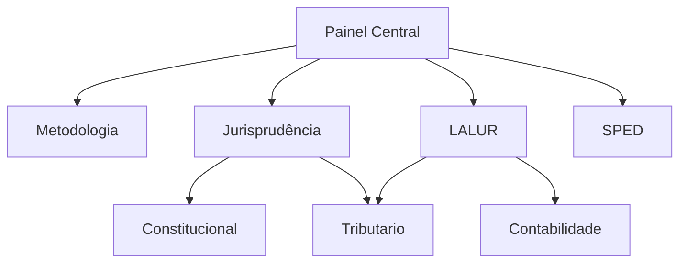

# Painel Central - Área Fiscal

> [!abstract] Status
> **Objetivo:** Aprovação na Área Fiscal
> **Bancas:** [[Metodologia de Guerra Fiscal|FGV, Cebraspe, FCC, VUNESP]]
> **Arquitetura:** Constituição Navegável e Cruzamento Contábil-Fiscal

---

## Estratégia e Fundamentos
- **[[Metodologia de Guerra Fiscal]]** (Análise por banca)
- **[[Jurisprudência Fiscal (STF e STJ)]]** (Súmulas e Teses)
- **[[Erros Clássicos da Área Fiscal]]** (Pontos de atenção)
- **[[Mapa Sistêmico Fiscal]]** (Visão de conjunto)

---

## Núcleo: Constituição Navegável
- **[[CF]] (Constituição Federal)**
- **[[CTN]] (Código Tributário Nacional)**
- **[[Pacto Federativo e Tributação]]**

## Notas-Ponte (Interdisciplinar)
- **Contabilidade / Tributário:** [[LALUR e Lucro Real]]
- **TI / Tributário:** [[SPED - Sistema Público de Escrituração Digital]]
- **Direito Público:** [[Conexões de Direito Público]]

---

## Módulos de Estudo

### Jurídico
- [[01 - Direito Tributário (MOC)|Direito Tributário]]
- [[02 - Direito Constitucional (MOC)|Direito Constitucional]]
- [[03 - Direito Administrativo (MOC)|Direito Administrativo]]
- [[07 - Legislação Tributária (MOC)|Legislação Tributária]]
- [[11 - Direito Civil (MOC)|Direito Civil]] | [[12 - Direito Empresarial (MOC)|Direito Empresarial]]

### Exatas e Contábeis
- [[04 - Contabilidade Geral (MOC)|Contabilidade Geral]]
- [[05 - Contabilidade Avançada (MOC)|Contabilidade Avançada]]
- [[06 - Auditoria (MOC)|Auditoria]]
- [[09 - Raciocínio Lógico (MOC)|Raciocínio Lógico]]

### Suporte
- [[10 - Tecnologia da Informação (MOC)|Tecnologia da Informação]]
- [[08 - Português (MOC)|Português]]
- [[99 - Conceitos Gerais (MOC)|Conceitos Gerais]]

---
[[Fiscal.md|Painel]] | [[../README.md|Home]]

## Grafo de Conexões
