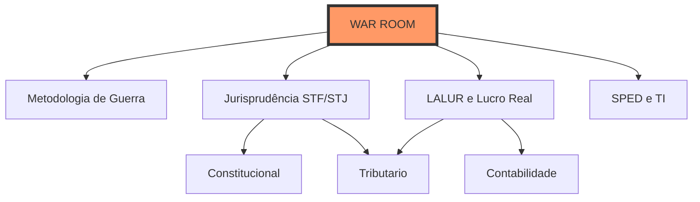

# 🏛️ WAR ROOM FISCAL 

> [!abstract] Status da Missão
> **Objetivo:** Aprovação nas Áreas Fiscais (SEFAZ/RFB/ISS)
> **Radar de Bancas:** [[Metodologia de Guerra Fiscal|FGV, Cebraspe, FCC, VUNESP]]
> **Arma Secreta:** Constituição Navegável + Cruzamento Contábil-Fiscal

---

## 🧠 Inteligência & Estratégia
*Antes de estudar, afie o machado.*
- **[[Metodologia de Guerra Fiscal]]** ⚔️ (Doutrina de combate por banca)
- **[[Jurisprudência Fiscal (STF e STJ)]]** ⚖️ (Súmulas e Teses que derrubam a lei seca)
- **[[Erros Clássicos da Área Fiscal]]** 🚫 (Onde 80% dos candidatos caem)
- **[[Mapa Sistêmico Fiscal]]** 🗺️ (Visão Holística)

---

## 🏛️ Constituição Navegável (Núcleo Duro)
*A lei interconectada com a teoria.*
- **[[CF]] (Constituição Federal)** - *Com links para doutrina*
- **[[CTN]] (Código Tributário Nacional)** - *Com links para CF e Súmulas*
- **[[Pacto Federativo e Tributação]]** - *A ponte entre CF e CTN*

## 🌉 Notas-Ponte de Elite (Diferencial Competitivo)
*Conceitos que unem disciplinas e garantem a aprovação na prova discursiva e questões complexas.*
- 💰 **Contabilidade ↔ Tributário:** [[LALUR e Lucro Real]] (O ajuste fiscal do lucro)
- 💻 **TI ↔ Tributário:** [[SPED - Sistema Público de Escrituração Digital]] (A fiscalização 4.0)
- ⚖️ **Adm ↔ Const ↔ Trib:** [[Conexões de Direito Público]] (A base do Estado Fiscal)

---

## 📚 Módulos de Estudo

### ⚖️ Jurídico
- **[[01 - Direito Tributário (MOC)|Direito Tributário]]**
- **[[02 - Direito Constitucional (MOC)|Direito Constitucional]]**
- **[[03 - Direito Administrativo (MOC)|Direito Administrativo]]**
- **[[07 - Legislação Tributária (MOC)|Legislação Tributária]]**
- **[[11 - Direito Civil (MOC)|Direito Civil]]** | **[[12 - Direito Empresarial (MOC)|Direito Empresarial]]**

### 🔢 Exatas & Contábeis
- **[[04 - Contabilidade Geral (MOC)|Contabilidade Geral]]**
- **[[05 - Contabilidade Avançada (MOC)|Contabilidade Avançada]]**
- **[[06 - Auditoria (MOC)|Auditoria]]**
- **[[09 - Raciocínio Lógico (MOC)|Raciocínio Lógico]]**

### 🛠️ Suporte
- **[[10 - Tecnologia da Informação (MOC)|Tecnologia da Informação]]**
- **[[08 - Português (MOC)|Português]]**
- **[[99 - Conceitos Gerais (MOC)|Base de Conceitos Gerais]]**

---
🔙 **[Painel Geral](./Fiscal.md)** | 🏠 **[Home](../README.md)**

## 🕸️ Grafo Tático
