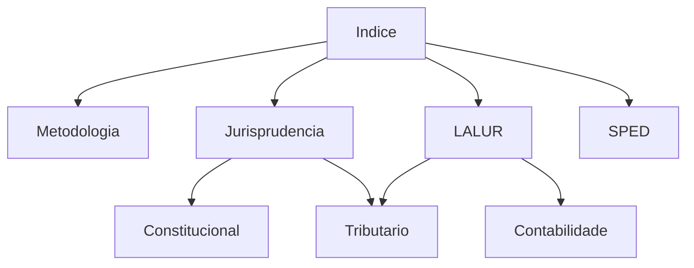

# Area Fiscal - Indice Geral

[Painel](00 - Painel Geral Fiscal/Fiscal.md) | [Home](../README.md)

---

## Estrategia e Fundamentos
- [Bancas](Bancas.md)
- [Jurisprudencia Fiscal (STF e STJ)](../99 - Conceitos Gerais/Jurisprudência Fiscal (STF e STJ).md)
- [Erros Classicos da Area Fiscal](Erros Clássicos da Área Fiscal.md)
- [Mapa Sistemico Fiscal](Mapa Sistêmico Fiscal.md)

---

## Constituicao Navegavel
- [Constituicao Federal](../07 - Legislação Tributária/CF.md)
- [Codigo Tributario Nacional](../07 - Legislação Tributária/CTN.md)
- [Pacto Federativo e Tributacao](../99 - Conceitos Gerais/Pacto Federativo e Tributação.md)

## Notas-Ponte
- [LALUR e Lucro Real](../99 - Conceitos Gerais/LALUR e Lucro Real.md)
- [SPED - Sistema Publico de Escrituracao Digital](../99 - Conceitos Gerais/SPED - Sistema Público de Escrituração Digital.md)
- [Conexoes de Direito Publico](../99 - Conceitos Gerais/Conexões de Direito Público.md)

---

## Modulos de Estudo

### Juridico
- [Direito Tributario](../01 - Direito Tributário/01 - Direito Tributário (MOC).md)
- [Direito Constitucional](../02 - Direito Constitucional/02 - Direito Constitucional (MOC).md)
- [Direito Administrativo](../03 - Direito Administrativo/03 - Direito Administrativo (MOC).md)
- [Legislacao Tributaria](../07 - Legislação Tributária/07 - Legislação Tributária (MOC).md)
- [Direito Civil](../11 - Direito Civil/11 - Direito Civil (MOC).md)
- [Direito Empresarial](../12 - Direito Empresarial/12 - Direito Empresarial (MOC).md)

### Exatas e Contabeis
- [Contabilidade Geral](../04 - Contabilidade Geral/04 - Contabilidade Geral (MOC).md)
- [Contabilidade Avancada](../05 - Contabilidade Avançada/05 - Contabilidade Avançada (MOC).md)
- [Auditoria](../06 - Auditoria/06 - Auditoria (MOC).md)
- [Raciocinio Logico](../09 - Raciocínio Lógico/09 - Raciocínio Lógico (MOC).md)

### Suporte
- [Tecnologia da Informacao](../10 - Tecnologia da Informação/10 - Tecnologia da Informação (MOC).md)
- [Portugues](../08 - Português/08 - Português (MOC).md)
- [Conceitos Gerais](../99 - Conceitos Gerais/99 - Conceitos Gerais (MOC).md)

---

## Dependencias

