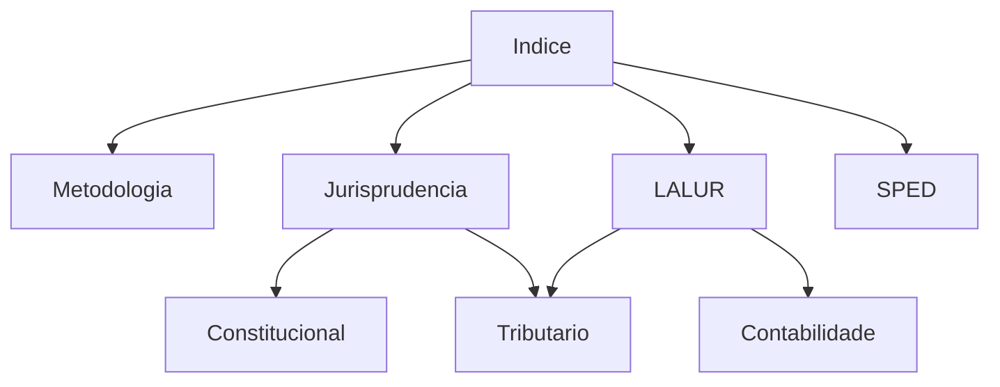

# Area Fiscal - Indice Geral

[[00 - Painel Geral Fiscal/Fiscal|Painel]] | [[../README|Home]]

---

## Estrategia e Fundamentos
- [[Bancas|Bancas]]
- [[../99 - Conceitos Gerais/Jurisprudência Fiscal (STF e STJ|Jurisprudencia Fiscal (STF e STJ)]].md)
- [[Erros Clássicos da Área Fiscal|Erros Classicos da Area Fiscal]]
- [[Mapa Sistêmico Fiscal|Mapa Sistemico Fiscal]]

---

## Constituicao Navegavel
- [[../07 - Legislação Tributária/CF|Constituicao Federal]]
- [[../07 - Legislação Tributária/CTN|Codigo Tributario Nacional]]
- [[../99 - Conceitos Gerais/Pacto Federativo e Tributação|Pacto Federativo e Tributacao]]

## Notas-Ponte
- [[../99 - Conceitos Gerais/LALUR e Lucro Real|LALUR e Lucro Real]]
- [[../99 - Conceitos Gerais/SPED - Sistema Público de Escrituração Digital|SPED - Sistema Publico de Escrituracao Digital]]
- [[../99 - Conceitos Gerais/Conexões de Direito Público|Conexoes de Direito Publico]]

---

## Modulos de Estudo

### Juridico
- [[../01 - Direito Tributário/01 - Direito Tributário (MOC|Direito Tributario]].md)
- [[../02 - Direito Constitucional/02 - Direito Constitucional (MOC|Direito Constitucional]].md)
- [[../03 - Direito Administrativo/03 - Direito Administrativo (MOC|Direito Administrativo]].md)
- [[../07 - Legislação Tributária/07 - Legislação Tributária (MOC|Legislacao Tributaria]].md)
- [[../11 - Direito Civil/11 - Direito Civil (MOC|Direito Civil]].md)
- [[../12 - Direito Empresarial/12 - Direito Empresarial (MOC|Direito Empresarial]].md)

### Exatas e Contabeis
- [[../04 - Contabilidade Geral/04 - Contabilidade Geral (MOC|Contabilidade Geral]].md)
- [[../05 - Contabilidade Avançada/05 - Contabilidade Avançada (MOC|Contabilidade Avancada]].md)
- [[../06 - Auditoria/06 - Auditoria (MOC|Auditoria]].md)
- [[../09 - Raciocínio Lógico/09 - Raciocínio Lógico (MOC|Raciocinio Logico]].md)

### Suporte
- [[../10 - Tecnologia da Informação/10 - Tecnologia da Informação (MOC|Tecnologia da Informacao]].md)
- [[../08 - Português/08 - Português (MOC|Portugues]].md)
- [[../99 - Conceitos Gerais/99 - Conceitos Gerais (MOC|Conceitos Gerais]].md)

---

## Dependencias

