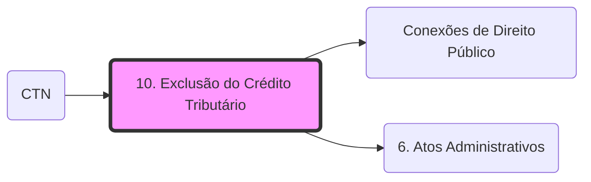

# **1. Exclusão do Crédito Tributário**

Para a visão integrada das isenções onerosas e o direito adquirido, consulte: **[Conexões de Direito Público](Conexões de Direito Público.md)**.

- Não há a constituição do Crédito Tributário;
- As normas que dispõem acerca da exclusão tributária devem ser interpretadas **LITERALMENTE**!
- ANISTIA e ISENÇÃO - devem ser concedidas por meio de **LEI ESPECÍFICA;**
- A **ANISTIA** alcança somente as penalidades;
- A **ISENÇÃO** abrange somente o crédito principal;
- Os tratados e convenções internacionais podem conceder isenções de impostos estaduais ou municipais (Isenção Heterônoma).
- Em caráter individual, a exclusão é efetivada por **[ato administrativo](6. Atos Administrativos.md)** vinculado.

_Art. 175. Excluem o crédito tributário:_

⚠️ **Atenção**

**_I - a isenção;_**

**_II - a anistia._**

_Parágrafo único._ **_A exclusão do crédito tributário_** **_não dispensa o cumprimento das obrigações acessórias_** _dependentes da obrigação principal cujo crédito seja excluído, ou dela conseqüente._

## **1.1. Isenção**

_Art. 176. A isenção,_ **ainda quando prevista em contrato**, **_é sempre decorrente de lei_** _que_ **_especifique as condições_** _e_ **_requisitos exigidos para a sua concessão_**_, os_ **_tributos a que se aplica e, sendo caso, o prazo de sua duração_**_._

_Parágrafo único. A isenção_ **_pode ser restrita a determinada região do território da entidade tributante_**_,_ _em_ **_função de condições a ela peculiares_**_._

⚠️ **Atenção - DECORE os casos em que não pode haver isenção!**

_Art. 177._ **_Salvo disposição de lei em contrário_**_,_ **_a_** **_<u>isenção não é extensiva</u>_**_:_

_I -_ **_às taxas e às contribuições de melhoria_**_;_

_II -_ **_aos tributos instituídos posteriormente à sua concessão_**_._

Fique atento!

- **Regra geral** - isenção não será extensiva às taxas e às contribuições de melhoria;
- **Exceção** - <u>caso previsto em lei</u>, poderá haver isenção para taxas e contribuições de melhoria. Por isso, não se pode afirmar que a isenção não abrange taxas e contribuições de melhoria, já que há essa hipótese. Portanto, questões que afirma isso (que não há isenção para taxas e contribuições de melhoria), podem ser consideradas erradas.

_Art. 178 - A isenção,_ **_salvo se concedida por prazo certo e em função de determinadas condições_**_,_ **_pode ser revogada ou modificada por lei, a qualquer tempo_**_, observado o disposto no inciso III do art. 104._

Se a isenção for concedida com algum tipo de contrapartida, ela <u>não pode ser suprimida livremente</u>. Caso contrário, o estado tem total liberdade para revogá-la a qualquer momento.

Vejamos o que diz o STF:

**Súmula 544, STF:** Isenções tributárias concedidas, **sob condição onerosa**, **não podem ser livremente suprimidas.**

⚠️ **Atenção - A isenção sob condição onerosa é bastante explorada em provas, na forma que o examinador dispõe de um caso prático e afirma que a isenção foi suprimida pela autoridade administrativa. Neste caso, você deve saber se a isenção foi concedida sob condição onerosa ou não. Caso tenha sido, ela não poderá ser livremente suprimida, no caso, o sujeito passivo tem direito à isenção pelo prazo certo que foi estabelecido. Agora, se a isenção não foi concedida sob condição onerosa, ela poderá ser livremente suprimida, independente do prazo.**

- **Regra** - isenção pode ser livremente suprimida;
- **Exceção** - isenções onerosas NÃO podem ser livremente suprimidas -> **DIREITO ADQUIRIDO.**

_Art. 179. A isenção,_ **_quando_** **_não concedida em caráter geral_**_, é efetivada, em cada caso, por_ **_despacho da autoridade administrativa_**_, em requerimento com o qual o interessado faça prova do preenchimento das condições e do cumprimento dos requisitos previstos em lei ou contrato para sua concessão._

### **Tipos de isenção:**

Caráter **Geral** **->** concedida a todos, portanto o sujeito passivo não precisa comprovar determinados requisitos.

Caráter **Individual** **>** depende da comprovação do sujeito passivo de que ele preenche os requisitos necessários em lei. Neste caso, a sua concessão fica condicionada ao **despacho da autoridade administrativa**.

Despachos que concedem isenção por período certo de tempo, devem ser renovados antes que o prazo da isenção expire.

Caso seja comprovado posteriormente que o contribuinte não cumpria de fato os requisitos, poderá ser cobrado o crédito acrescido de juros de mora e com possibilidade de imposição de penalidade em caso de dolo ou simulação do contribuinte.

## **1.2. Anistia**

_Art. 180. A anistia_ **_abrange exclusivamente as infrações cometidas anteriormente à vigência da lei que a concede_**_,_ **_não se aplicando_**_:_

⚠️ **Atenção - DECORE que a anistia** **APENAS** **PODE SER CONCEDIDA PARA INFRAÇÕES COMETIDAS ANTERIORMENTE À VIGÊNCIA DA LEI QUE A INSTITUI.**

Ora, se você conceder anistia para alguma penalidade que ainda não aconteceu, você estaria incentivando os contribuintes a cometerem a penalidade. Por isso, a lógica desse marco temporal.

⚠️ **Atenção - DECORE** os casos em que **A ANISTIA NÃO SE APLICARÁ**:

_I - aos_ **_atos qualificados em lei como crimes ou contravenções_** _e aos que,_ **_mesmo sem essa qualificação_**_, sejam_ **_praticados com dolo, fraude ou simulação_** _pelo sujeito passivo ou por terceiro em benefício daquele;_

- Crimes ou contravenções;
- Atos praticados com dolo, fraude ou simulação (não precisa ser crime ou contravenção);
- Pode ser feito tanto pelo sujeito passivo como também por terceiro.

_II -_ **_salvo disposição em contrário_**_, às_ **_infrações resultantes de conluio entre duas ou mais pessoas naturais ou jurídicas_**_._

⚠️ **Atenção!** Muito cuidado com essa ressalva no início!

Saiba que através de disposição legal, pode sim haver anistia para infrações que resultam de conluio entre duas ou mais pessoas.

_Art. 181. A anistia pode ser concedida:_

_I - em caráter geral;_

_II -_ **_limitadamente_**_:_

_a) às infrações da legislação relativa a_ **_determinado tributo_**_;_

_b) às infrações punidas com penalidades pecuniárias_ **_até determinado montante_**_,_ **_conjugadas ou não com penalidades de outra natureza_**_;_

_c) a determinada_ **_região do território_** _da entidade tributante, em função de condições a ela peculiares;_

_d) sob_ **_condição do pagamento de tributo no prazo_** _fixado pela lei que a conceder, ou cuja fixação seja atribuída pela mesma lei à autoridade administrativa._

## Grafo Local
