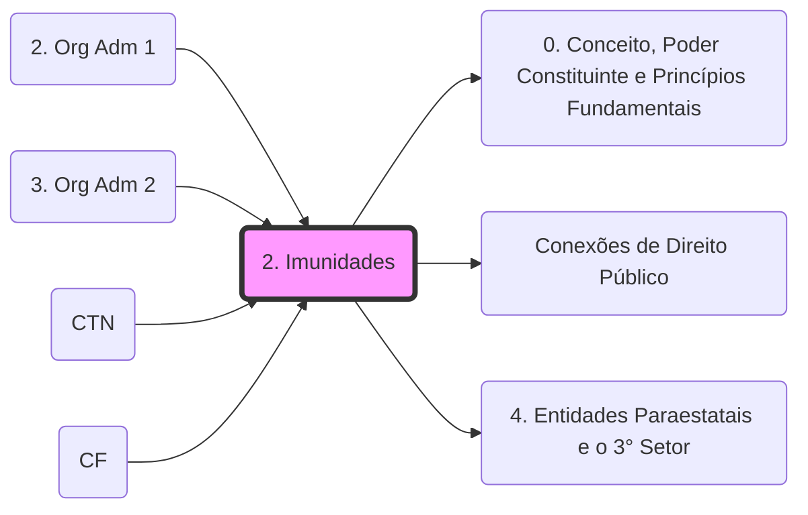

# **1. Imunidades Tributárias**

- **CF/88:** 
    - _**Art. 150, CF.** Sem prejuízo de outras garantias asseguradas ao contribuinte, é vedado à União, aos Estados, ao Distrito Federal e aos Municípios:_
        
        _VI - instituir impostos sobre:_ 

        _a.md) patrimônio, renda ou serviços, uns dos outros; (imunidade recíproca - protege o **[Pacto Federativo](0. Conceito, Poder Constituinte e Princípios Fundamentais.md)**.md). Para detalhes sobre a extensão às estatais, veja: **[Conexões de Direito Público](Conexões de Direito Público.md)**._

         _§ 3º - As vedações do inciso VI, "a", e do parágrafo anterior não se aplicam ao patrimônio, à renda e aos serviços, relacionados com exploração de atividades econômicas regidas pelas normas aplicáveis a empreendimentos privados, ou em que haja contraprestação ou pagamento de preços ou tarifas pelo usuário, nem exonera o promitente comprador da obrigação de pagar imposto relativamente ao bem imóvel._

         _b) entidades religiosas e templos de qualquer culto, inclusive suas organizações assistenciais e beneficentes ;_

        _c.md) patrimônio, renda ou serviços dos partidos políticos, inclusive suas fundações, das entidades sindicais dos trabalhadores, das instituições de educação e de assistência social, sem fins lucrativos [4. Entidades Paraestatais e o 3° Setor](4. Entidades Paraestatais e o 3° Setor.md),_ **_atendidos os requisitos da lei;_**

## Grafo Local
