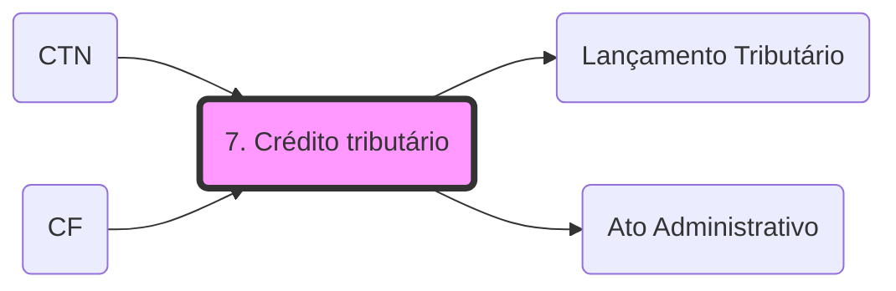

# **1. Crédito Tributário**  

Fato Gerador > Obrigação Principal > Crédito Tributário

⚠️ **Saiba que:**

- O **Crédito Tributário** decorre da **Obrigação Tributária!**

CTN Art 139. O crédito tributário decorre da obrigação principal e tem a mesma natureza desta._

- **Alterações no crédito tributário não modificam a obrigação tributária!**

Agora, vamos entender outro conceito. Para que você tenha o dever de pagar o tributo, temos a obrigação tributária, certo? Ela cria o crédito tributário. O Fisco realiza o **LANÇAMENTO,** que é a ação de tornar exigível a obrigação tributária, o valor que você deve a ele, constituindo o crédito tributário.

# **2. Lançamento do Crédito Tributário**

CTN Art. 142. Compete privativamente à autoridade administrativa constituir o crédito tributário via **[[Lançamento Tributário]]**, que é um **[[Ato Administrativo]]** vinculado., assim entendido o **procedimento administrativo** tendente a **verificar a ocorrência do fato gerador da obrigação correspondente, determinar a matéria tributável, calcular o montante do tributo devido, identificar o sujeito passivo e, sendo caso, propor a aplicação da penalidade cabível**._

⚠️ **Saiba que:**

- **APENAS** a **autoridade administrativa** pode realizar o lançamento;
- **Lançamento é um procedimento administrativo,** ou seja, é um conjunto de atos para:
    - Verificar a ocorrência do FG;
    - Determinar a matéria tributável;
    - Calcular o montante do tributo devido;
    - Identificar o sujeito passivo;
    - Propor a penalidade cabível - se for o caso.

**<mark style="background:rgba(240, 200, 0, 0.2)">LANÇAMENTO = TORNAR EXIGÍVEL O CRÉDITO TRIBUTÁRIO</mark>**

Lançamento possui natureza MISTA

- **DECLARA** - Obrigação Tributária;
- ** CONSTITUI** - Crédito Tributário.

## **Competência**

- A competência para realizar o lançamento é da **AUTORIDADE ADMINISTRATIVA.**

## **Legislação Aplicável**

⚠️ **Saiba que:**

- **Legislação material** - relativa aos fundamentos da obrigação tributária;
- **Legislação formal** - relativa aos procedimentos.

## **Legislação Material**

CTN Art. 144. O_ **lançamento reporta-se à data da ocorrência do fato gerador da obrigação_** _e_ **_rege-se pela lei então vigente_**_,_ _ainda que posteriormente modificada ou revogada._ **(REGRA GERAL)**

A legislação, que será aplicada ao lançamento, será a que estiver **vigente na data em que ocorrer o fato gerador da obrigação!** E, mesmo que a legislação seja modificada ou revogada, suas alterações não terão efeito no lançamento. As consequências disso para a sua prova será gravar os seguintes efeitos:

- Efeito **_ex tunc_** do lançamento;
- **Ultratividade** da lei tributária.

**Lei nova apenas será aplicada aos fatos futuros!**

⚠️ **ATENÇÃO EXCEÇÕES AO ARTIGO 144:**

_Art. 144, § 2ºCTN. O disposto neste artigo_ **_não se aplica aos impostos lançados por períodos certos de tempo_**_, desde que a respectiva <u>lei fixe expressamente a data em que o fato gerador se considera ocorrido._</u>

_Art. 106._ **_A lei aplica-se a ato ou fato pretérito_**_:_

_II - tratando-se de ato não definitivamente julgado:_

_a) quando deixe de defini-lo como infração;_

_b) quando deixe de tratá-lo como contrário a qualquer exigência de ação ou omissão, desde que não tenha sido fraudulento e não tenha implicado em falta de pagamento de tributo;_

_c) quando lhe comine penalidade menos severa que a prevista na lei vigente ao tempo da sua prática._

Caso a lei nova aplique penalidade menos severa do que a lei vigente, aquela(lei nova) irá vigorar.

## **Legislação Formal**

_Art. 144, § 1º, CTN._ **_<u>Aplica-se ao lançamento a legislação</u> que_**_,_ **_posteriormente à ocorrência do fato gerador da obrigação_**_, tenha_ **_instituído novos critérios de apuração ou processos de fiscalização, ampliado os poderes de investigação das autoridades administrativas, ou outorgado ao crédito maiores garantias ou privilégios,_** _exceto, neste último caso, para o efeito de atribuir responsabilidade tributária a terceiros._

A legislação posterior (vigente na data do lançamento) que tenha alterado **procedimentos** de fiscalização, com o intuito de ajudar na fiscalização tributária, incidirão sobre os fatos geradores pretéritos. Decore:

- Instituído novos critérios de apuração ou processos de fiscalização;
- Ampliado os poderes de investigação das autoridades administrativas;
- Outorgado aos créditos maiores garantias ou privilégios.

**ATENÇÃO**: a lei que atribui NOVOS CRITÉRIOS de fiscalização e de apuração do imposto (procedimentos formais) será a legislação adotada no momento do lançamento. Porém, ela **não poderá atribuir responsabilidade tributária a outras pessoas!**

⚠️ **Saiba que:**

- **Legislação material** - vigente na data do FATO GERADOR;
- **Legislação formal** - vigente na data do LANÇAMENTO.

  
**OBSERVAÇÃO:** **TAXA DE CÂMBIO**

_Art. 143, CTN. Salvo disposição de lei em contrário, quando o valor tributário esteja expresso em moeda estrangeira, no lançamento far-se-á sua conversão em moeda nacional ao câmbio do dia da ocorrência do fato gerador da obrigação._

Valor tributado expresso em moeda estrangeira -> **Câmbio do dia do FATO GERADOR.**

**Saiba que:**

- **Aspectos Formais ->** Legislação vigente na DATA DO LANÇAMENTO;
- **Aspectos Materiais ->** Legislação vigente na DATA DO FATO GERADOR;
- **Taxa de Câmbio ->** DATA DO FATO GERADOR.

# **3. Alteração do Lançamento**

O lançamento **<u>apenas</u>** **estará apto a produzir efeitos** após a **NOTIFICAÇÃO** do contribuinte.

**👉 Decore** - alta incidência em provas!

Súmula STJ 397 - O contribuinte do IPTU é notificado do lançamento pelo envio do carnê ao seu endereço.

STJ - A notificação poderá ser realizada por qualquer forma idônea!

**Antes de haver a notificação do lançamento,** este **poderá ser alterado pela Administração Pública.**

**Depois da notificação ao contribuinte**, o lançamento poderá ser alterado **apenas nos seguintes casos:**

_Art. 145, CTN. O lançamento_ **_regularmente notificado_** _ao sujeito passivo_ _só pode ser alterado em virtude de:_

_I - impugnação do sujeito passivo;_

_II - recurso de ofício;_

_III - iniciativa de ofício da autoridade administrativa, nos casos previstos no artigo 149_.

CUIDADO COM AS PEGADINHAS DAS BANCAS! Elas irão citar outras possibilidades nas alternativas. 

## **Impugnação do Sujeito Passivo**

- **Sujeito passivo não concorda com o lançamento**, neste caso ele poderá **impugnar o lançamento**, o que será decidido pela autoridade administrativa;
- Ainda, caso a autoridade administrativa não concorde com a impugnação, poderá o sujeito passivo entrar com **recurso voluntário, recorrendo da decisão desfavorável;**
- Tanto a impugnação, como o recurso voluntário permitem que a Administração altere o lançamento, podendo até aumentar o valor do crédito tributário.

## **Recurso de Ofício**

- Quando **o lançamento é impugnado e a decisão administrativa é desfavorável ao Fisco**, a Administração poderá valer-se do Recurso de Ofício e recorrer. Diferentemente do recurso voluntário, que é uma opção do contribuinte, a Administração Tributária é obrigada a entrar com recurso no caso de decisão desfavorável, há algumas exceções.

## **Iniciativa de Ofício da Autoridade Administrativa**

- No caso de alguma norma legal não ter sido seguida durante o lançamento do crédito tributário, a Administração terá a obrigação de modificar o lançamento;
- Independe de provocação do contribuinte;
- Lançamento de Ofício.

**🚨 DECORE!**

_Art. 149, CTN. O lançamento é efetuado e revisto de ofício pela autoridade administrativa nos seguintes casos:_

_I - quando a_ **_lei assim o determine;_**

_II - quando a_ **_declaração não seja prestada, por quem de direito,_** _no prazo e na forma da legislação tributária;_

_III - quando a_ **_pessoa legalmente obrigada_****_,_** _embora tenha prestado declaração nos termos do inciso anterior,_ **_deixe de atender_****_,_** _no prazo e na forma da legislação tributária, a_ **_pedido de esclarecimento formulado pela autoridade administrativa, recuse-se a prestá-lo ou não o preste satisfatoriamente,_** _a juízo daquela autoridade;_

_IV - quando se_ **_comprove falsidade, erro ou omissão_** _quanto a qualquer elemento definido na legislação tributária como sendo de declaração obrigatória;_

_V - quando se_ **_comprove omissão ou inexatidão, por parte da pessoa legalmente obrigada,_** _no exercício da atividade a que se refere o artigo seguinte;_

_VI - quando se_ **_comprove ação ou omissão_** _do sujeito passivo, ou de terceiro legalmente obrigado, que dê lugar à aplicação de penalidade pecuniária;_

_VII - quando se comprove que o sujeito passivo, ou terceiro em benefício daquele,_ **_agiu com dolo, fraude ou simulação_**_;_

_VIII - quando_ **_deva ser apreciado fato não conhecido ou não provado_** _por ocasião do lançamento anterior;_

_IX - quando se_ **_comprove que_**_, no lançamento anterior, ocorreu_ **_fraude ou falta funcional da autoridade que o efetuou_**_,_ **_ou omissão_**_,pela mesma autoridade, de ato ou formalidade especial._

## **Alteração do Lançamento decorrente de erro de direito e erro de fato**

_Art. 146, CTN. A_ **_modificação introduzida_**_,_ _de_ **_ofício ou em consequência de decisão administrativa ou judicial_**_, nos_ **_critérios jurídicos adotados pela autoridade administrativa_** _no_ **_exercício do lançamento_** <u>_somente pode ser efetivada</u>, em relação a um mesmo sujeito passivo,_ **_quanto a fato gerador ocorrido posteriormente à sua introdução._**

**ERRO DE DIREITO** - mudanças nos critérios jurídicos (na interpretação de situações jurídicas) - apenas pode ocorrer em relação aos fatos geradores futuros à **DATA DA SUA INTRODUÇÃO.**

- VEDADA REVISÃO por ERRO DE DIREITO! Não é possível mudar critério ou dar nova interpretação à lei após lançar o crédito;
- Evita que o contribuinte seja surpreendido por mudanças ocorridas depois que o fato gerador ocorreu;
- Preza pela segurança jurídica.

**ERRO DE FATO** - corresponde a um erro material, ao conhecimento da existência de determinada situação, como por exemplo na base de cálculo ou alíquota - deve ocorrer enquanto perdurar o **prazo decadencial**, depois deste, não haverá mais alterações no lançamento.

- Revisão por erro de FATO é possível. São fatos que não dependem de interpretação normativa.

# **4. Modalidades de Lançamento**

- Lançamento de **Ofício;**
- Lançamento por **D** **eclaração;**
- Lançamento por **H** **omologação.**

**A lei determinará o tipo de lançamento!**

## **LANÇAMENTO DE OFÍCIO - _ex officio_**

- A Autoridade Tributária irá realizar o lançamento **sem a participação do contribuinte.** **Sujeito passivo não participa da atividade;**
- Todos os tributos poderão ser lançados de ofício;
- Os tributos que não são lançados de ofício, de acordo com as hipóteses do artigo 149 do CTN, poderão ser lançados de ofício.

## **LANÇAMENTO POR DECLARAÇÃO - misto**

- O sujeito passivo prestará declaração com informações referentes ao lançamento, para que assim, este possa ser realizado. **Equilíbrio entre a participação do sujeito passivo e a atividade do sujeito ativo.**

Retificação do lançamento por declaração:

_Art. 147, § 1º, CTN. A_ **_retificação da declaração_** _por_ **_iniciativa do próprio declarante_**_, quando <u>vise a reduzir ou a excluir tributo</u>,_ **_só é admissível mediante_** **_comprovação do erro em que se funde_**_, e_ **_antes de notificado o lançamento._**

- Deve haver iniciativa do **DECLARANTE** (sujeito passivo);

- Deve haver **COMPROVAÇÃO DE ERRO;**

- Deve ser realizado **ANTES DO LANÇAMENTO** (para reduzir ou excluir o tributo)**.**

_§ 2º Os erros contidos na declaração e apuráveis pelo seu exame serão retificados de ofício pela autoridade administrativa a que competir a revisão daquela._

## **ARBITRAMENTO**

- Antes de tudo, grave que o arbitramento **NÃO É UMA MODALIDADE DE LANÇAMENTO!**

_Art. 148, CTN. Quando o cálculo do tributo tenha por base, ou tome em consideração, o valor ou o preço de bens, direitos, serviços ou atos jurídicos, a autoridade lançadora, <u>mediante processo regular,</u>_ **_arbitrará aquele valor ou preço_**_,_ **_sempre que sejam omissos ou não mereçam fé as declarações ou os esclarecimentos prestados_**_, ou os documentos expedidos pelo sujeito passivo ou pelo terceiro legalmente obrigado,_ **_ressalvada_**_,_ **_em caso de contestação, avaliação contraditória, administrativa ou judicial._**

- Quando as declarações ou documentos prestados pelo contribuinte forem **OMISSOS ou não mereçam fé;**
- Deve ser feita através de **processo regular (processo administrativo fiscal);**
- Se o sujeito passivo contestar o arbitramento, poderá haver avaliação contraditória - não tem presunção absoluta;
- Ocorre através das **pautas fiscais.**

Súmula STJ 431 - É ilegal a cobrança de ICMS com base no valor da mercadoria submetido ao regime de pauta fiscal.

## **LANÇAMENTO POR HOMOLOGAÇÃO**

- Neste caso, o **próprio sujeito passivo irá realizar** **quase todos os atos que compõem a atividade.**

_Art. 150, CTN. O_ **_lançamento por homologação_**_, que ocorre quanto aos tributos cuja_ **_legislação atribua ao sujeito passivo o dever de antecipar o pagamento sem prévio exame da autoridade administrativa,_** _opera-se pelo ato em que a referida autoridade, tomando conhecimento da atividade assim exercida pelo obrigado, expressamente a homologa._

- Com a realização do lançamento, a Administração Tributária deverá homologar o lançamento, retificando-o, caso seja preciso. Esta retificação ensejará o LANÇAMENTO DE OFÍCIO;
- O Fisco possui o prazo de 5 anos (contando da ocorrência do FATO GERADOR) PARA HOMOLOGAR o lançamento. Caso não o faça, o crédito será considerado extinto;
- No caso de haver dolo, simulação ou fraude, o lançamento poderá ser alterado a qualquer momento, até fora do prazo de 5 anos.

Súmula STJ 436 - A entrega de declaração pelo contribuinte reconhecendo débito fiscal constitui o crédito tributário, dispensada qualquer outra providência por parte do fisco.

## 🕸️ Grafo Local
