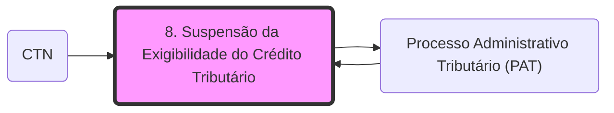

# **1. Suspensão da Exigibilidade do Crédito Tributário**

_Art. 151, CTN. **Suspendem a exigibilidade do crédito tributário**:_

_I - **moratória**;_

_II - o **depósito** do seu montante integral;_

_III - **as reclamações e os recursos**, nos termos das leis reguladoras do **[[Processo Administrativo Tributário (PAT)]]**;_

_IV - a **concessão de medida liminar** em **[[4. DDIC 2#2.3. MANDADO DE SEGURANÇA|Mandado de segurança]]**._

_V - a **concessão de medida liminar ou de tutela antecipada**, em outras espécies de ação judicial;_

_VI - o **parcelamento**._

_Parágrafo único. **O disposto neste artigo não dispensa o cumprimento das obrigações assessórios dependentes da obrigação principal** cujo crédito seja suspenso, ou dela consequentes._

⚠️ **Atenção**!

- **Depósito** - apenas suspende do crédito tributário se for realizado no **MONTANTE INTEGRAL DO CRÉDITO** (depositar apenas uma parte não provoca a suspensão);
- **Mandado de Segurança** é uma ação que apenas suspenderá o crédito através de **medida liminar** concedida;
- **Outras ações judiciais** podem suspender o crédito tanto por **concessão de liminar**, como de **TUTELA ANTECIPADA;**
- A suspensão do crédito tributário **NÃO** tem o condão de dispensar o cumprimento das obrigações acessórias relacionadas ao crédito suspenso;
- Mesmo a exigibilidade do crédito estando suspensa, a Administração Tributária **poderá realizar a CONSTITUIÇÃO DO LANÇAMENTO** (apenas não poderá exigir o crédito, mas poderá constituí-lo).

**LEMBRE**: deve-se interpretar **LITERALMENTE** as normas relacionadas à suspensão do crédito tributário!

Macete:

- **SUSPENDEM o crédito tributário (art. 151, CTN): "MORDER e LIMPAR"**
    - **MO**: moratória;
    - **R**: reclamações ou recursos;
    - **DE**: depósito do montante integral;
    - **LIM**: liminar em MS ou ação judicial;
    - **PAR**: parcelamento.

## **1.1. MORATÓRIA**

- Corresponde a uma **dilação do prazo para pagamento do tributo** - o Fisco dá mais tempo para que o sujeito passivo realize o pagamento do tributo - nesse intervalo de tempo, não pode haver a cobrança do valor do tributo;
- Deve ser implantada apenas **ATRAVÉS DE LEI;**
- **Caráter Geral;**
- **Caráter Individual.**

**Moratória em caráter geral*** - abrange **vários sujeitos passivos**, não há a necessidade de comprovação de requisitos específicos estabelecidos em lei.

- **Gera direito adquirido!**

Há dois tipos:

- **Moratória autônoma** - estabelecida pelo **ente político que possui competência** para instituir o tributo referente;
- **Moratória heterônoma** - estabelecida por **outro ente federativo** **que não é o competente** para instituir o tributo referente (já estudamos os tipos em atividades passadas).

**DECORE:**

_Art. 152, CTN: (...)_

_Parágrafo único. A_ **_lei concessiva de moratória pode circunscrever expressamente a sua aplicabilidade à determinada região_** **_do território da pessoa jurídica de direito público que a expedir_**_, ou a determinada classe ou categoria de sujeitos passivos._

O dispositivo acima trata da moratória concedida de forma parcial e é cobrado de forma literal em provas.

⚠️ **Atenção**!  

_Art. 154, CTN. Salvo disposição de lei em contrário, a_ **_moratória somente abrange os créditos definitivamente constituídos à data da lei ou do despacho que a conceder,_** _ou cujo_ _lançamento já tenha sido iniciado àquela data por ato regularmente notificado ao sujeito passivo__._

_Parágrafo único. A_ **_moratória não aproveita aos casos de dolo, fraude ou simulação do sujeito passivo_** _ou do terceiro em benefício daquele_.

Saiba que a moratória apenas atinge os créditos tributários que foram constituídos **ANTES** da data da lei que a conceder, salvo disposição em contrário, ou seja, pode haver casos expressos em lei que a moratória poderá atingir créditos concedidos após a instituição da lei concessiva. **No entanto, grave para sua prova**:

- Moratória apenas atinge créditos **já constituídos** até o momento da instituição da lei concessiva;
- Não será concedida moratória para os casos de: dolo, fraude ou simulação!

_Art. 153, CTN. A lei que conceda moratória em caráter geral ou autorize sua concessão em caráter individual especificará, sem prejuízo de outros **requisitos**:_

_I - o **prazo de duração** do favor;_

_II - as **condições** da concessão do favor em caráter individual;_

_III - sendo caso:_

_a) os **tributos a que se aplica;**_

_b) o **número de prestações e seus vencimentos,** dentro do prazo a que se refere o inciso I, podendo atribuir a fixação de uns e de outros à autoridade administrativa, para cada caso de concessão em caráter individual;_

OBS.: caso de **moratória parcelada,** não confunda com parcelamento, não é o mesmo instituto! Há a exclusão de juros e multas, diferentemente do que ocorre no parcelamento!

_c) as **garantias que devem ser fornecidas** pelo beneficiado no caso de concessão em caráter individual__._  

**Moratória em caráter individual** - abrange os **sujeitos passivos** que **comprovem os requisitos estipulados em lei.**  

- **Não gera direito adquirido!**

⚠️ **Atenção**! O artigo 155 do CTN abrange outros tipos de benefícios: **m**oratória, **a**nistia, **r**emissão, **i**senção e **p**arcelamento = **MARIPA**

_Art. 155, CTN. A concessão da moratória em **caráter individual** **não gera direito adquirido e será revogado de ofício**, s<u>empre que se apure que o beneficiado não satisfazia ou deixou de satisfazer as condições ou não cumprira ou deixou de cumprir os requisitos para a concessão do favor, cobrando-se o crédito acrescido de juros de mora</u>:_

_I - **com imposição da penalidade cabível**, nos casos de **dolo ou simulação do beneficiado**, ou de terceiro em benefício daquele;_

_II - **sem imposição de penalidade****,** nos **demais casos.**_

_Parágrafo único. No caso do **inciso I** deste artigo, **o tempo decorrido entre a concessão da moratória e sua revogação não se computa para efeito da prescrição do direito à cobrança do crédito**; no caso do **inciso II deste artigo, a revogação só pode ocorrer antes de prescrito o referido direito.**_

**Caso haja dolo, fraude ou simulação:** haverá imposição de penalidades + o prazo decorrido da concessão da moratória até sua revogação não contará para tempo de prescrição!

**Nos demais casos** (sem dolo, fraude ou simulação): não haverá a imposição de penalidade + o prazo decorrido será computado para efeito de prescrição, ou seja, o crédito apenas poderá ser exigido se não estiver prescrito!

## **1.2. PARCELAMENTO**

- Concedido por **lei específica;**
- **NÃO** exclui a incidência de juros e multas;
- Aplicam-se as regras da moratória - **SUBSIDIARIAMENTE.**  
    

STJ - parcelamento não é equivalente ao pagamento do tributo!

_Art. 155-A, § 4o, CTN. A **inexistência da lei específica** a que se refere o § 3o deste artigo **importa na aplicação das leis gerais de parcelamento do ente da Federação** ao devedor em <u>recuperação judicial</u>, não podendo, neste caso, ser o prazo de parcelamento inferior ao concedido pela lei federal específica._

Em relação à recuperação judicial (deve haver uma lei específica acerca do parcelamento), caso o ente não tenha instituído lei específica, serão aplicadas as regras genéricas de parcelamento do ente. No entanto, **o número de parcelas não poderá ser inferior ao número expresso em lei federal específica para o parcelamento em recuperação judicial.**

## **1.3. LIMINAR EM MANDADO DE SEGURANÇA OU LIMINARES (OU TUTELA ANTECIPADA) EM OUTRAS AÇÕES JUDICIAIS**

**Requisitos**:  

- _Periculum in mora **e** fumus boni juris_.

Crédito ficará suspenso até a decisão judicial final.

Decisão judicial final **a favor do contribuinte**: crédito tributário será extinto;

Decisão judicial final **contra o contribuinte**: crédito tributário será exigido novamente.

## **1.4. RECLAMAÇÕES E RECURSOS NO ÂMBITO DO PROCESSO ADMINISTRATIVO FISCAL**

Súmula Vinculante 21 - É inconstitucional a exigência de depósito ou arrolamento prévios de dinheiro ou bens para admissibilidade de recurso administrativo.

Súmula STJ 373 - É ilegítima a exigência de depósito prévio para admissibilidade de recurso administrativo.

Decisão final do processo administrativo **a favor do contribuinte**: crédito tributário será extinto.

Decisão final do processo administrativo **contra o contribuinte**: crédito tributário será exigido novamente e poderão ser exigidos possíveis encargos moratórios. Ainda, poderá o contribuinte ingressar com ação judicial.

## **1.5. DEPÓSITO DO MONTANTE INTEGRAL**

Súmula Vinculante 28 - É inconstitucional a exigência de depósito prévio como requisito de admissibilidade de ação judicial na qual se pretenda discutir a exigibilidade de crédito tributário.

Este caso ocorre quando o **sujeito passivo opta por ingressar com ação judicial.** Salientamos que o mero ajuizamento da ação não suspende a exigibilidade do crédito. Para isso é necessária a concessão de liminar ou de tutela antecipada. Caso não ocorra tal concessão, o contribuinte pode depositar o montante integral do crédito, para, assim, haver a suspensão da exigibilidade do crédito.

**Não confunda!** Os recursos e reclamações no âmbito do processo administrativo suspendem a exigibilidade do crédito, não havendo a necessidade de depósito.

Súmula STJ 112 - O depósito somente suspende a exigibilidade do crédito tributário se for integral e em dinheiro.

Decisão final **a favor do contribuinte**: este poderá reaver o valor do depósito.

Decisão final **contra o contribuinte**: o depósito será convertido em renda e, consequentemente, o crédito será extinto.

Por fim, saiba que:

- Depósito do montante integral em processo administrativo - evita a configuração de juros de mora (por conta do atraso no pagamento);
- Depósito do montante integral em processos judiciais - suspende a exigibilidade do crédito tributário.

## Grafo Local
