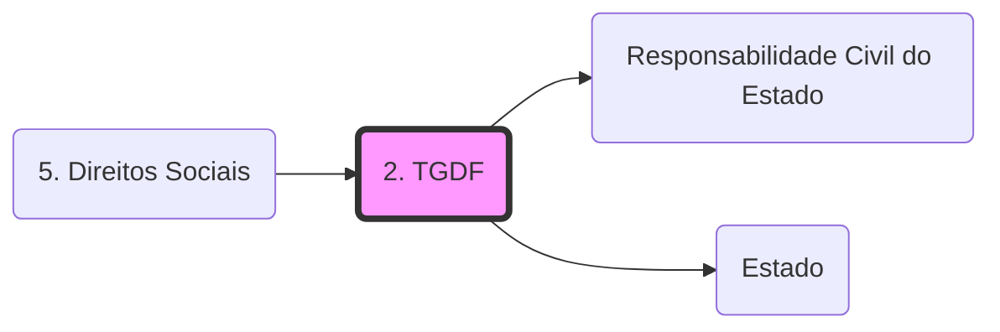

# **1. Geração dos Direitos Fundamentais**

|                                                                                                                                                                                                                                                                                                                              |                                                                                                                                                                                                                                                                                                                                                                                                                                                                                  |                                                                                                                                                                                                                                                                                                                                                                                      |
| ---------------------------------------------------------------------------------------------------------------------------------------------------------------------------------------------------------------------------------------------------------------------------------------------------------------------------- | -------------------------------------------------------------------------------------------------------------------------------------------------------------------------------------------------------------------------------------------------------------------------------------------------------------------------------------------------------------------------------------------------------------------------------------------------------------------------------- | ------------------------------------------------------------------------------------------------------------------------------------------------------------------------------------------------------------------------------------------------------------------------------------------------------------------------------------------------------------------------------------ |
| **1ª Geração = Liberdade**  **Direitos/liberdades Negativos**  **Direitos de Defesa**                                                                                                                                                                  | **2ª Geração = Igualdade**  **Direitos/Liberdades Positivas**  **Direitos Sociais**                                                                                                                                                                                                                                                                                           | **3ª Geração = Fraternidade**  **Direitos Difusos e Coletivos**                                                                                                                                                                                                                                                      |
| - Final do século XVIII - Estado **Liberal** - O foco principal são as **liberdades individuais** - Direitos **Negativos** - Exemplos:     - Vida     - Liberdade     - Propriedade | - Início do século XX - Estado **Social** - O foco principal são os **direitos sociais** - Direitos **Positivos**, ou seja, o Estado deve intervir para garantir direitos básicos - Promoção da **Igualdade** Material - Direitos Sociais, Econômicos e Culturais - Exemplos:     - Saúde     - Educação     - Previdência Social | - Ao longo do século XX - **Direitos** que são de **todos** (Meio Ambiente, Paz, Desenvolvimento) - Princípio da **Solidariedade** - Busca a **coletividade** - Exemplos:     - Defesa do Consumidor     - Autodeterminação dos Povos     - Desenvolvimento     - Paz |

✅É importante ressaltar que os direitos de todas as gerações não possuem uma data exata para surgirem e, o mais comum, é que sejam **encontrados nas sociedades convivendo em equilíbrio**. Por exemplo, na **CF/88**, temos o **art. 5°** abrangendo as liberdades negativas, direitos de **1ª geração**. E o **art. 6˚**, os direitos sociais, de **2ª geração**. 

✅Normalmente os direitos de **1ª geração** são veiculados por normas de eficácia plena. Já os direitos de **2ª geração** são veiculados, via de regra, por normas de eficácia limitada de princípio programático.

Ah, e por fim, saiba que há classificações ligeiramente diferentes a depender do autor. Assim, ao mesmo tempo que uma alternativa pode ser correta afirmando que o Direito a Paz é de terceira geração, também pode haver outra correta dizendo que é de quinta geração. Mas não se preocupe com isso, saiba sobre o assunto e ficará fácil de você ponderar qual a melhor assertiva diante do caso concreto e das demais

# **2. Características dos Direitos Fundamentais**

- Universalidade
- Historicidade
- Indivisibilidade
- Inalienabilidade
- Imprescritibilidade
- Irrenunciabilidade
- Relatividade ou Limitabilidade - **não há direito fundamental absoluto!** Vamos gravar isso, ok? ⚠️
- Complementaridade
- Concorrência
- Efetividade
- Proibição do retrocesso

# **3. Limites dos Direitos Fundamentais**

- **Teoria dos Limites Internos** → Um direito fundamental só encontra limitações nele mesmo; ou seja, só a norma que o cria pode limitá-lo. São **mandamentos definitivos**.
    - Aqui, como apenas **a própria norma que institui o direito pode limitá-lo**, entendem que **direitos e restrições** formam uma **única individualidade**
- **Teoria dos Limites Externos** → Pode haver limitação externa, desde que para concretizar outros direitos tão fundamentais quanto, em caso de colisão
    - Incidência ampla, e vistos **_prima facie_**, ou seja, "à primeira vista". Isso significa dizer que, de início, os direitos fundamentais são **mandamentos de otimização**, sujeitos a **restrições** legislativas e ponderações do Judiciário. O **direito definitivo** só é possível analisar em **casos concretos**, após essa ponderação de princípios colidentes ou regras de proporcionalidade. Por isso, diz que "**direito e restrição formam individualidades distintas**"
- **Teoria dos Limites dos Limites** → Para quem adora a **teoria externa**; diz respeito sobre **até que ponto pode-se limitar um direito fundamental** (limites da limitação).
    - Ou seja, a **Teoria Externa** diz que há um **conteúdo essencial** em cada direito fundamental

# **4. ️Eficácia e Dimensões dos Direitos Fundamentais**

- **Dimensão Objetiva** dos Direitos Fundamentais → **Eficácia irradiante**. Capacidade de alcançar os Poderes Públicos, **estabelecer diretrizes** para sua atuação e para a relação entre particulares
    - Tem um caráter programático, diretivo. Atua em um plano mais de longo prazo
    - Ex: Normas de eficácia limitada, um julgamento com alcance geral, etc
    - **Alta carga valorativa**

- **Dimensão Subjetiva** dos Direitos Fundamentais → Relativa ao sujeito: Direitos de **proteção (negativos) e de exigência (positivos)**
    - São os direitos em si, os que inibem a atuação do Estado e os que obrigam o Estado a fazer algo (1ª geração, 2ª e 3ª)

## **4.1 Tipos de eficácia**:

- Eficácia **Jurídica**: capacidade da norma de produzir algum tipo de efeito (aplicabilidade da norma)
- Eficácia **Técnica**: Exige que a norma cumpra todos os requisitos técnicos
- Eficácia **social**: Quando a sociedade a introduza espontaneamente, diz respeito à **efetividade**, ou seja, a **observação** da norma

**▶️** Eficácia Horizontal x Eficácia Vertical

- Eficácia **Horizontal** dos Direitos → Aplicação na relação **entre pessoas privadas** (aquilo que não for público)
    - Pode ser aplicada também entre Entidade Associativa Civil e associados
- **Eficácia [[Responsabilidade Civil do Estado|Vertical]]** dos Direitos → Aplicação no confronto entre [[Estado|Estado]] e particular.
- **Eficácia Diagonal** → **particular x particular**, porém **com muita desigualdade entre as partes**
    - Ex: relação de **consumo**, **trabalhista**, etc

⚠️ **Aplicação** da norma é **dirigida à autoridade**; **observação** é para seus **destinatários**.

Se os destinatários a observam completamente, a autoridade sequer precisará aplicar a norma

## Grafo Local
