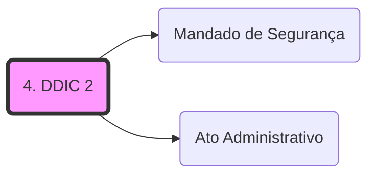

# **1. Direitos Individuais e Coletivos**

## **1.1 Defesa do consumidor**

- O inciso XXXII é uma norma de eficácia limitada, ou seja, precisa ser regulamentada por outra norma, mas ela já foi criada, e é o Código de Defesa do Consumidor.

## **1.2 Direito à informação**

- Vamos gravar as palavras mais importantes do inciso: **órgãos públicos**, **interesse particular ou coletivo;**
- O direito à informação pode abranger, excepcionalmente, os **órgãos privados**, desde que estes prestem serviços públicos;
- Ainda, não pode o indivíduo requisitar informações de outra pessoa, apenas as suas ou as de interesse coletivo;
- Tal inciso obriga todos os órgãos e entidades da Administração Pública;
- O direito à informação é a regra, o sigilo é a exceção e ocorre apenas quando imprescindível à segurança da sociedade e do Estado;
- Caso haja **negativa ao direito à informação**, caberá ajuizar **[[Mandado de Segurança|Mandado de Segurança]]**

**<u>STF</u>: pode haver a publicação da remuneraçião, cargos, funções e órgãos de lotação dos servidores públicos.** 💣

**ATENÇÃO!** **Todas as pessoas, físicas e jurídicas, assim como, nacionais e estrangeiras, são titulares do direito à informação.**

## **1.3 Direito de petição e de obtenção de certidões**

- **Todas as pessoas, físicas e jurídicas, assim como, nacionais e estrangeiras, são titulares** do direito de petição e da obtenção de certidões;
- Esse princípio objetiva o **exercício da cidadania**, por isso **não haverá o pagamento de taxas** frente aos órgãos públicos, entidade públicas e entidades privadas que exercem serviços públicos;
- <u>Direito de petição</u>: defesa de direitos, contra ilegalidade e abuso de poder;
- <u>Obtenção de certidão</u>: defesa de direitos e esclarecimentos de situações de interesse particular;
- <u>Caso haja negativa na expedição de certidões</u>, caberá ajuizar **mandado de segurança**.

**ATENÇÃO! Não podemos confundir** **o remédio constitucional** <u>**mandado de segurança</u> que é previsto na negativa do direito de obtenção de certidão, com o <u>_habeas data_</u>. O examinador pode tentar te confundir!**

- O _habeas data_ é o remédio constitucional para os casos em que o indivíduo <u>requisita informações</u> **pessoais** frente aos órgãos públicos. A certidão não trata de uma informação, mas sim de um documento que prova algo. Então, quando se requisita uma certidão, está exercitando o direito a obter a prova de uma situação jurídica e não a informação propriamente dita. Isso vai fazer mais sentido quando estudarmos os remédios constitucionais. Por enquanto grave que o mandado de segurança é previsto em casos de recusa ao direito de obtenção de certidão!.

**Grave:**

- **O direito de petição e o direito à obtenção de certidões são gratuitos a todas as pessoas**, físicas ou jurídicas, nacionais ou estrangeiras.
- Tais direitos estão ligados ao **exercício da cidadania**. Portanto, <u>não vamos cair em pegadinhas</u> que afirmam que tanto o direito à petição, como o de obtenção de certidão, ~~são gratuitos apenas para os reconhecidamente pobres,~~ porque eles são gratuitos a todas as pessoas!

## **1.4 Inafastabilidade de jurisdição**

- O Brasil adota o **sistema inglês de jurisdição**,** o que significa que apenas o **Poder Judiciário** poderá fazer coisa julgada material, também chamada de <u>jurisdição una;</u>
- Alguns examinadores tentam trocar qual tipo de jurisdição o Brasil adota. <u>**Tenhamos atenção</u>,** o Brasil adotou o <u>**sistema inglês de jurisdição**</u>. <u>**Não confunda**</u> com o **sistema francês**, em que não só o judiciário poderá fazer coisa julgada material, mas o administrativo também, havendo duas cortes.
- O que temos que entender é que todas as decisões tomadas, mesmo na seara de outros Poderes, poderão ser encaminhadas ao Poder Judiciário, a qualquer momento. E, apenas o Poder Judiciário ensejará a coisa julgada material, aquela que não pode ser mais recorrida e contestada. Entretanto, há algumas **exceções**:

- - **Habeas Data** - <u>deve haver a negativa ou omissão do Poder Público em fornecer a informação requisitada</u>, antes que a lide seja levada ao Judiciário.
    - **Controvérsias Desportivas** - apenas poderá ser admitida no Judiciário, <u>após o esgotamento de todas as instâncias da Justiça Desportivas</u>;
    - **Reclamação contra o descumprimento de Súmula Vinculante** - caso uma súmula vinculante seja descumprida, poderá haver reclamação direcionada ao STF, mas antes devem ser esgotadas as vias administrativas de resolução;
    - **Requerimento judicial de benefício previdenciário** - antes de acionar o Judiciário, deve-se elaborar requerimento administrativo de solicitação do benefício ao INSS.

**STF** - **não pode** haver **taxa judicial** calculada **sem limite** sobre o valor da causa. Súmula nº 667 do STF.

**STF** - é **inconstitucional** o **depósito prévio** para que a ação judicial que irá discutir a exigibilidade do crédito tributário seja admitida. Este é um entendimento sumulado, súmula nº 28 do STF, e muito, mas muito, importante para a sua prova. ⚠️

**STF** - o <u>duplo grau de jurisdição </u>não é garantia e não é obrigatório.

## **1.5 Direito adquirido, ato jurídico perfeito e coisa julgada**

- Estes instrumentos impedem que situações jurídicas já consolidadas possam ser alteradas.

**Aqui, temos que saber os seguintes conceitos:**

- **Direito Adquirido** - é o ato consumado(finalizado) que foi incorporado ao patrimônio ou personalidade do titular pelo fato do direito ter sido exercido e cumprido seus efeitos. Como consequência de ter cumprido todos os requisitos exigidos por lei vigente na época, não pode mais ser alterado!

**STF** - o direito adquirido se aplica a <u>todos os atos normativos, de direito público ou privado.</u>

- Há situações em que **não se podem alegar direito adquirido**, são elas:

- - Normas constitucionais <u>originárias</u>
    - Mudança de <u>moeda</u>
    - Criação ou aumento de <u>tributos</u>💡
    - Mudança de <u>regime estatutário</u>
    
- **Ato Jurídico Perfeito** - o direito foi exercido de acordo com as regras da lei vigente ao tempo da execução do ato. A situação jurídica foi consolidada e não poderá ser desconstituída (alterada) se houver mudança na lei. Não confundir com a expectativa de direito, aqui não houve o cumprimento de todos os requisitos exigidos em lei, há uma mera expectativa de consolidação da situação.
-  **Coisa julgada** - não há mais a possibilidade de recurso, há uma decisão final irrecorrível.

## **1.6 Princípio do juiz natural**

- Não pode haver tribunal ou juízo de exceção, apenas as pessoas **com competência** <u>prevista constitucionalmente</u> poderão ser juízes ou órgãos julgadores. Ou seja, não se pode escolher aleatoriamente, fora dos requisitos constitucionais, quem será o julgador de um determinado processo. Você não pode chegar no fórum e escolher qual juiz irá julgar seu processo, não é?

**ATENÇÃO! Tal princípio abrange todas as pessoas, físicas e jurídicas, assim como, nacionais e estrangeiras.**

**STF** - o princípio do **juiz natural** não está limitado apenas ao Judiciário, mas a todos os julgadores previstos na CF/88.

**STF** - há o **princípio do promotor natural** que é aquele escolhido através de requisitos legais para atuar no processo.

## **1.7 Júri popular**

- É importante que saibamos as **principais características** do tribunal do júri, quais são:

-  **plenitude de defesa;**
- **sigilo das votações;**
- **soberania dos vereditos; e** 
-  **competência para o julgamento dos crimes dolosos contra a vida.**

**STF** - não pode a **legislação estadual** criar órgão que invada a competência do tribunal do júri.

**STF** - o **crime de latrocínio** (roubo seguido de morte) é de competência do **juiz singular.**

- Quando houver **foro especial** delimitado pela **CF/88**, a competência do tribunal do júri não subsistirá. Mas, se o foro for delimitado pela **Constituição Estadual,** a competência do tribunal do júri prevalecerá.

**STF** - **vereadores** que cometerem crimes dolosos contra a vida serão julgados pelo **tribunal do júri**, mesmo que haja foro especial decorrente da Constituição Estadual.

**STF** - a soberania do tribunal do júri não afasta a recorribilidade das suas decisões, quando for manifestamente contrária às provas dos autos.

## **1.8 Princípio da legalidade**

- **Princípio da reserva legal** - apenas **lei em sentido estrito** (editada pelo Poder Legislativo) poderá definir crimes e comutar penas. Não pode ser criado crime através de medida provisória (espécie normativa elaborada pelo Presidente da República) e nem comutar penas.
- **Anterioridade da lei penal** - apenas será considerado crime se a conduta for tipificada por lei **anterior à ação.**

## **1.9 Irretroatividade da lei**

- As leis penais incriminadoras **não podem atingir fatos pretéritos (que já ocorreram)**, ou seja, não podem considerar condutas que ocorreram **antes da sua entrada em vigência como crimes.**
- **Lei que for benéfica** **poderá retroagir** e, assim, atingir condutas que ocorreram antes da sua entrada em vigor. Ex: Se alguém estiver preso por ter cometido uma conduta que era considerada como crime por uma lei e, no caso, for criada outra lei que desconsidere tal conduta como criminosa, então, a pessoa será imediatamente solta (a lei que desconsiderou tal conduta como crime irá retroagirá).

**Grave:**

- **lei penal incriminadora - não pode retroagir;**
- **lei penal benéfica - pode retroagir.**

<u>**STF** - não pode</u> haver a **combinação de leis no tempo** <u>mesmo que</u> para beneficiar o réu.

## **1.11 Imprescritibilidade e inafiançabilidade** 

- São <u>**crimes inafiançáveis**</u>:

	-  **racismo;**
    - **ação de grupos armados;**
    - **tráfico, terrorismo, tortura; e** 
    - **crimes hediondos.**

**<u>Muito importante</u>:**

- **Imprescritíveis** (RAÇÃO)

	- RAcismo;
    - AÇÃO de grupos armados.

<u></u>
-  **Insuscetíveis de graça** (3TH não tem graça)

	- Tráfico;
    - Terrorismo;
    - Tortura;
    - Hediondos.

**<u>STF</u>** - reconheceu que houve omissão por parte do Poder Legislativo quanto à tipificação dos crimes de **homofobia e transfobia**. E até que sejam tipificados, tais condutas terão as **mesmas penas dadas ao crime de racismo.**

**<u>STF</u>** - o crime de **injúria racial** foi considerado uma espécie do crime de racismo, também sendo **imprescritível**.

## **1.12 Intranscendência das penas**

- Os **efeitos penais <u>não poderão ser transmitidos para outras pessoas</u> que não sejam as que cometeram a conduta criminosa;**  
- **<u>A reparação de danos</u> poderão ser transmitidas para os sucessores** de quem causou o dano, mas **<u>no limite do patrimônio transferido.</u>**

## **1.13 Individualização da pena**

- As **características pessoais** do agente devem ser consideradas quando houver a **individualização das penas.** Por exemplo, crianças, mulheres e idosos ficam em estabelecimento prisional diferente dos demais. A execução das penas deve ser feita em locais adequados a cada indivíduo, **considerando-se a idade, gênero e o delito do apenado.**

**<u>STF</u>** - é **inconstitucional** a <u>proibição</u> da progressão de regime aos <u>crimes hediondos.</u>

**<u>STF</u>** - não havendo estabelecimento prisional adequado ao cumprimento da pena pelo agente, este não poderá permanecer em estabelecimento prisional mais gravoso.

**ATENÇÃO! Fique ligado:**

- **pena de morte**, esta é permitida nos casos de **guerra declarada;**
- <u>**pena de banimento**</u> não foi aceita pela **CF/88.**

Tenha atenção às <u>**hipóteses de extradição</u>:**

- **Brasileiros natos** não serão extraditados!!
- **Brasileiros naturalizados** poderão ser extraditados <u>apenas em duas hipóteses</u>:
- praticou **crime comum** **antes da naturalização;**
- teve envolvimento comprovado em **tráfico ilícito de entorpecentes e drogas afins**, **a qualquer momento.**

### **1.13.1 Tipos de extradição:**

- Extradição **ativa** - governo brasileiro **solicita** a entrega de um indivíduo a outro país.
- Extradição **passiva** - **é solicitado** ao governo brasileiro a extradição de um indivíduo.
- Não é admitida a extradição por crime político ou de opinião.
- Cabe ao STF definir um crime como político.

## **1.14 Devido processo legal/contraditório e ampla defesa**

- O **devido processo legal** significa que nenhum indivíduo será condenado, independentemente do tipo de condenação (judicial ou administrativa), sem o devido processo legal (sem ter chance de ser julgado por uma autoridade competente e poder se defender);
- A **ampla defesa** assegura ao indivíduo fazer uso durante o processo de todos os meios lícitos que puderem comprovar a sua verdade;
- O **contraditório** assegura que o acusado possa contradizer o que foi levantado contra ele.

**STF** - a ampla defesa e o contraditório **não serão aplicados durante o inquérito policial**, afinal, nessa fase não há acusação, a investigação ainda está em andamento. E é por isso que não é possível sentenciar um indivíduo apenas com base nas provas colhidas durante o inquérito policial, afinal, não foi dado ao acusado a chance do contraditório e da ampla defesa durante a colheita de tais provas

**STF** - durante a **sindicância preparatória (procedimento administrativo) que resulta em abertura do processo administrativo disciplinar**, **não há obrigação** de haver ampla defesa e contraditório. Mas, se a sindicância não resultar em processo administrativo disciplinar e for encerrada com a aplicação de alguma pena, deve sim haver ampla defesa e contraditório.

- - A sindicância preparatória é semelhante ao inquérito policial, é uma investigação acerca do servidor público, para que saibamos se sua conduta foi considerada ilícita em serviço. Mas, diferente do inquérito, após a sindicância, o servidor já poderá ser apenado (advertência ou suspensão). Ou, poderá ser levado o que foi colhido através da sindicância para abrir um processo administrativo contra o servidor.

**STF** - não há a obrigatoriedade de presença de advogado durante o **processo administrativo disciplinar.**

**STF** - as provas **já documentadas** nos autos do inquérito policial devem ser de **acesso ao defensor.**

**STF** - é **inconstitucional** a exigência de **depósito ou arrolamento de bens** para a **aceitação do recurso administrativo.**

**STF** - Tanto nos processos judiciais, como nos administrativos, é **proibido** o uso de provas obtidas por **meios ilícitos**. Tais provas serão retiradas do processo.

- - As provas **derivadas** das provas ilícitas deverão ser retiradas do processo também. A doutrina denomina esse fato de **"teoria dos frutos da árvore envenenada".** De vez em quando, o examinador usa esse termo, vamos ficar atentos.

**ATENÇÃO! Segundo o entendimento do STF:**

- São ilícitas:
    - interceptação telefônica sem autorização judicial;
    - interceptação telefônica determinada a partir apenas de denúncia anônima;
    - gravação do acusado sem observar as formalidades legais;
    - confissão durante prisão ilegal.

- São lícitas:

- - gravação telefônica feita por um dos interlocutores, no caso de investida criminosa;
    - gravação de conversa telefônica feita por um dos interlocutores, sem conhecimento do outro, **ausente causa legal de sigilo** **ou de reserva da conversação;**
    - gravação ambiental feita por um dos interlocutores, sem que o outro tenha conhecimento. 

## **1.15 Presunção da inocência**

- Ninguém será considerado culpado **antes do trânsito em julgado**, ainda, será o acusador que deverá arcar com a produção das provas acusatórias. Se ele acusa, ele que demonstre que foi feito algo ilícito, nada mais justo, não é?!

**STF** - No caso das **prisões cautelares**, aquelas em que o acusado é preso temporariamente durante o processo e antes da sentença, **elas não violam o princípio da presunção da inocência.**

**STF** - apenas a partir do trânsito em julgado da condenação criminal, ou seja, quando não houver mais recursos a serem impostos, é que a pena começará a ser cumprida. Lembrando que o entendimento anterior era que a pena poderia ser cumprida logo com a sentença de segunda instância, mas tal entendimento foi superado pela Corte. ⚠️

## **1.16 Publicidade dos atos processuais**

- Apesar de a regra ser a publicidade dos atos processuais, **há duas exceções: quando a defesa da intimidade ou quando o interesse social exigirem.**

## **1.17 Direito a liberdade**

- A prisão apenas ocorrerá:

- - **Sem a necessidade de ordem judicial**: flagrante delito ou nos crimes militares tratados em legislação própria;
    - **Por ordem escrita e fundamentada** de autoridade judicial competente nos **demais casos.**

## **1.18 Direitos assegurados ao preso**

**STF** - caso não seja comunicado ao preso o seu **direito de permanecer em silêncio**, o depoimento dado será **considerado nulo**. O silêncio em nada prejudicará o réu.

**STF** - tendo em vista o direito à defesa, poderá o réu negar, ainda que falsamente, a prática da conduta criminosa. Mas tal direito não possibilita que o réu possa mentir sobre os outros fatos e atrapalhar a ação da justiça.

**STF** - apenas em casos especiais o acusado será algemado, por exemplo, quando demonstrar risco de fuga ou perigo a si mesmo.

**STF** - as audiências de custódia, quando o preso é levado à autoridade judicial após sua prisão, devem ser realizadas no **prazo máximo de 24 horas da prisão**.

## **1.19 Prisão civil por dívida**

**STF** - é **ilícita** a prisão civil do **depositário infiel**, em qualquer modalidade de depósito.

**STF** - é **lícita** a prisão civil do **devedor de alimentos.**

- No caso do **devedor de alimentos**, a prisão ocorrerá **apenas quando** houver o **inadimplemento for voluntário e inescusável** da obrigação de alimentos. **Esse é o único caso de prisão civil adotado no Brasil.** ⚠️
-  Algumas provas ainda cobram a literalidade do inciso LXVII: _não haverá prisão civil por dívida, salvo a do responsável pelo inadimplemento voluntário e inescusável de obrigação alimentícia e a do depositário infiel;_

**IMPORTANTE!** Saibamos que o Brasil assinou o **Pacto de San Jose da Costa Rica**, este possui efeito supralegal (essa norma está abaixo da CF/88, mas acima das normas infraconstitucionais, portanto deve ser respeitada pelas demais normas do ordenamento). O que significa que, apenas a prisão civil por alimentos poderá ocorrer. Apesar da norma constitucional do inciso LXVII ainda existir e não ter sido modificada, não poderá haver a produção de normas que regeriam a prisão civil do depositário infiel.

**Então, devemos levar para a prova** que a literalidade do inciso LXVII subsiste, mas apenas é válida para a prisão por dívida alimentícia (voluntária e inescusável). **A prisão do depositário infiel não é mais aceita no ordenamento brasileiro.**

## **1.20 Documentos gratuitos para a defesa do cidadão**

- Apenas aos reconhecidamente pobres, serão gratuitos: **registro civil de nascimento e certidão de óbito**. Porém, o STF pacificou entendimento que a **todos os cidadãos serão disponibilizados, gratuitamente, tais documentos, assim como a primeira certidão;**
- Dentre os **remédios constitucionais**, o _habeas corpus e o habeas data_ são gratuitos a todos os cidadãos;
- Ações necessárias ao <u>exercício da cidadania</u>;
- Aos que comprovarem insuficiência de recursos: **assistência jurídica gratuita**.

**STF** - os **estrangeiros hipossuficientes** estão imunes ao pagamento de taxas para o registro de <u>regularização migratória</u>.

## **1.21 Tratados internacionais**

- Os **tratados internacionais** sobre <u>**direitos humanos**</u>, quando aprovados por **3/5** dos membros **de cada Casa do Congresso Nacional**, em **dois turnos** de votação, **serão internalizados pelo ordenamento com equivalência de** ****emendas constitucionais.****

**Mas há um ponto de extrema atenção!** 📢

- Caso o tratado discuta sobre **direitos humanos**, mas não passe pelo rito das **emendas constitucionais,** eles terão **_status supralegal_**, ou seja, abaixo da Constituição e acima das demais leis. Porém, **se não tratar de direitos humanos**, o _status_ será de **lei ordinária.**

# **2. Remédios Constitucionais**

## 2.1. _**HABEAS CORPUS**_

- - LXVIII - conceder-se-á "**habeas-corpus**" sempre que alguém **sofrer ou se achar ameaçado de sofrer** v<u>iolência ou coação em sua liberdade de locomoção, por ilegalidade ou abuso de poder</u>;
    - Finalidade: **Proteger a liberdade locomoção;**
    - Formas: **repressivo** (a violência ou coação está ocorrendo); ou **preventivo** (a violência ou coação não ocorrem ainda, há uma ameaça);
    - Tem **natureza penal;**
    - **Legitimidade ativa** **(quem impetra - entra com a ação)**: qualquer pessoa física ou jurídica, Ministério Público, Defensoria Pública - **legitimidade universal;**
    - **Legitimidade Passiva** - é impetrado contra **autoridade pública ou privada** que determinou a violência ou a coação;
    - **Sujeito paciente** **(aquele que sofre violência ou coação contra a sua liberdade de locomoção): <u>apenas pessoa física</u>;**
    - **Não pode o _habeas corpus_ ser impetrado em favor de pessoa jurídica!** Mas, poderá a pessoa jurídica impetrar _habeas corpus_ em favor de pessoa física;
    - **Juiz pode concedê-lo de <u>ofício</u>, ou seja, o magistrado não está subordinado à causa de pedir e aos pedidos formulados;**
    - **Inadmissível impetração sucessiva -** é preciso julgar o 1º para dar entrada no 2º, **salvo ilegalidade flagrante;**
    - **Não é necessário advogado** (único remédio que dispensa) **e é gratuito;**
    - **Incabível contra**:

- - - decisões do STF;
        - suspensão direitos políticos;
        - pena em processo administrativo disciplinar;
        - quebra de sigilo que não resulte em prisão;
        - pena de multa, se já extinta a pena de liberdade;
        - para discutir as punições disciplinares militares;
        - para pleitear visita íntima.

**STF** - em caso de **quebra de sigilo bancário** que possa causar a prisão da pessoa, cabe _habeas corpus_. Mas se a quebra de sigilo ocorrer em processo administrativo, não caberá _habeas corpus_, afinal, não poderá uma sentença administrativa levar à prisão.

**STF** - pode haver _habeas corpus em relação às **medidas cautelares** que se forem violadas podem resultar em prisão.

**STF** - admite-se o _habeas corpus_ **_coletivo_**.  

**STJ** - pode haver _habeas corpus_ quanto às **medidas protetivas** às mulheres relacionadas na Lei Maria da Penha.

## **2.2. HABEAS DATA**

- - para assegurar o conhecimento de **informações relativas<u> à pessoa do impetrante**</u>, constantes de registros ou bancos de dados de entidades governamentais ou de caráter público;
    - para a **retificação de dados**, quando não se prefira fazê-lo por processo sigiloso, judicial ou administrativo;
    - Finalidade: **conhecimento de informações ou retificação de dados** relativas à pessoa do impetrante, constante de banco de dados público ou de caráter público (instituições privadas que sejam detentoras de bancos de dados públicos);
    - Tem **natureza civil;**
    - **Legitimidade ativa** **(quem impetra - entra com a ação)**: qualquer pessoa física ou jurídica, nacional ou estrangeira;
    - **Legitimidade passiva -** impetrado contra **autoridade pública ou privada** que <u>detém banco de dados de caráter público</u>;
    - **É gratuito;**
    - **Não serve para pleitear acesso a autos de processo administrativo;**
    - **Não poderá** ser ajuizado para o conhecimento de informações <u>que não sejam relativas ao impetrante</u>;
    - <u>Deve **haver a negativa da instituição em fornecer** as informações ao impetrante.</u>

**<u>STF</u>** - **cônjuge** sobrevivente poderá impetrar _habeas data_ em prol do cônjuge falecido.

**<u>STF</u>** - o contribuinte poderá impetrar _habeas data_ para obter informações acerca do **pagamento de tributos.** ⚠️💣

## **2.3. MANDADO DE SEGURANÇA**  
    

- -  LXIX – conceder-se-á **mandado de segurança** para **proteger direito líquido e certo**, <u>não amparado por “habeas corpus” ou habeas data</u>, quando o <u>responsável pela ilegalidade ou abuso de poder for autoridade pública ou agente de pessoa jurídica no exercício de atribuições do Poder Público</u>;
    - Finalidade: **proteger direito líquido e certo**, <u>não amparado por “habeas corpus” ou habeas data</u>;
    - Tem **natureza civil;**
    - **Prova pré-constituída;**
    - **Direito líquido e certo** é o que resulta de fato certo, ou seja, é aquele capaz de ser comprovado, de plano, por documentação inequívoca e sem **necessidade de nenhum tipo de instrução probatória (prova pré-constituída);**
    - **Legitimidade ativa** (**quem pode impetrar** - **entra com a ação**): qualquer pessoa física ou jurídica, nacional ou estrangeira, universalidade (espólio, massa falida), alguns órgãos públicos, MP;
    - **Legitimidade passiva:** é impetrado contra qualquer autoridade pública, representantes/órgãos de partidos políticos; administradores de autarquias; _particulares no exercício de função pública -_ **somente no que disser respeito a estas atribuições.**

**Importante destacar** que o prazo para impetrar mandado de segurança é de **120 dias contados da data de conhecimento do fato** que obstou o direito líquido e certo. Se já houver passado 120 dias, não se fala mais em mandado de segurança, mas a pessoa poderá entrar com ação na justiça pelos trâmites normais.

**<u>STF</u>** - é possível a desistência do mandado de segurança <u>mesmo se este já tiver sido impetrado ou se já houver tipo decisão de mérito.</u>

- **Não cabe mandado de segurança** quando:

- -  contra ato judicial <u>passível de recurso</u> ou correição;
    - contra ato administrativo em que caiba <u>recurso com efeito suspensivo</u>;
    - contra <u>decisão transitada em julgado</u>;
    - contra <u>lei em tese</u>;
    - contra <u>ato de natureza jurisdicional</u>;
    - contra <u>decisões jurisdicionais do STF</u>;
    - <u>contra</u> a submissão a certa <u>modalidade de tributação</u>;
    - <u>atos de gestão comercial</u>, são os atos praticados por pessoas jurídicas de direito privado, sem a natureza de ato do poder público;

 **<u>STF</u>** - **Controvérsia sobre matéria de direito** <u>não impede</u> concessão de mandado de segurança.

- O mandado de segurança é uma ação **onerosa**, mas não há condenação ao pagamento dos honorários advocatícios pela parte que foi vencida.

## **2.4 MANDADO DE SEGURANÇA COLETIVO**

- - LXX - o **mandado de segurança coletivo** pode ser impetrado por:

- - - **partido político** com <u>representação no Congresso Nacional</u>;
        - **organização sindical,** **entidade de classe** ou associação legalmente constituída e em funcionamento há pelo menos um ano, em defesa dos interesses de seus membros ou associados;

- -  As associações, apenas elas, devem ter sido constituídas e devem estar em funcionamento há pelo menos 1 ano.
    - Natureza civil;
    - Oneroso;
    - Legitimados ativos estão elencados no inciso acima.

- O mandado de segurança coletivo trata de um remédio constitucional para defender o direito líquido e certo de uma coletividade. O instituto da **substituição processual** marca essa defesa, por isso, não há a necessidade de as entidades pedirem autorização específica para cada membro dela. ⚠️

**<u>STF</u>** - **ente político** <u>não pode</u> impetrar mandado de segurança coletivo.

**<u>STF</u>** - **partido político** <u>não pode</u> impetrar mandado de segurança coletivo para <u>impugnar a majoração de tributos</u>.

**<u>STF</u>** - mandado de segurança coletivo pode referir-se a **apenas uma parte dos membros da entidade que o impetrará.**

## **2.5 MANDADO DE INJUNÇÃO**

- - LXXI - conceder-se-á **mandado de injunção** sempre que a falta de norma regulamentadora torne inviável o exercício dos direitos e liberdades constitucionais e das prerrogativas inerentes à nacionalidade, à soberania e à cidadania;
    - O mandado de injunção objetiva a regulamentação de normas constitucionais de **<u>eficácia limitada, quando a ausência de regulamentação dessas normas impossibilita o exercício de direitos constitucionais.</u>**

**ATENÇÃO!** As normas de <u>eficácia contida não serão reguladas pelo mandado de injunção</u> por já possuírem aplicabilidade direta e imediata. Elas não dependem de regulamentação normativa para produzirem seus efeitos.

- - A omissão poderá ser total ou parcial;
    - **Legitimados ativos (quem impetra - entra com a ação):** qualquer pessoa física ou jurídica que esteja inviabilizada de exercer direito previsto constitucionalmente por falta de norma reguladora;
    - **Legitimados passiva:** a entidade responsável pela elaboração da norma omitida;

## **2.6 MANDADO DE INJUNÇÃO COLETIVO**

- - O **mandado de injunção coletivo** representará uma coletividade (classe, grupo ou categoria), poderá ser impetrado por:

- - - partido pol[[|[]]](.md)ítico com representação no Congresso Nacional;
        - organização sindical, entidade de classe ou <u>associação legalmente constituída e em funcionamento há pelo menos um ano</u>, em defesa dos interesses de seus membros ou associados;
        - <u>Ministério Público</u>;
        - <u>Defensoria pública.</u>

- -  Observe que os legitimados ao mandado de injunção coletivo são os mesmos do mandado de segurança coletivo, com o acréscimo do Ministério Público e da Defensoria Pública;
    - É uma ação onerosa e que necessita de assistência de advogado;
    - **Pressupostos do mandado de injunção coletivo:**

- - - **ausência** de norma regulamentadora de uma **norma constitucional;**
        - deve haver um **nexo de causalidade** entre a omissão normativa e a impossibilidade de exercer um direito constitucional;
        - e deve ter havido um prazo longo que confira um **retardamento da produção da norma.**

- -  **Não poderá ser impetrado o mandado de injunção nos casos de:**

- - - já houver a norma reguladora;
        - se a falta da norma seja em relação a uma norma infraconstitucional;
        - a falta de regulamentação for em medida provisória, sendo que esta não havia sido convertida em lei;
        - não ter obrigação de regulamentação.

**STF** - adota a **posição concretista**, ou seja, no caso de julgar a omissão de norma constitucional, a Corte poderá possibilitar a concretização do direito constitucional. De tal forma que, determinará prazo para a elaboração da norma pela entidade competente e estabelecerá forma de que o direito constitucional seja exercido até a elaboração da norma reguladora.

- - A decisão proferida pelo STF poderá ter efeito apenas entre as partes (_inter partes_) que impetraram com a ação, ou para todos os titulares do direito constitucional omitido (_erga omnes_).

- - A competência para julgar o mandado de injunção dependerá da entidade que provocou a omissão legislativa. Por exemplo, ser for a Câmara dos Deputados que ocasionou a omissão legislativa, o STF será competente para tal julgamento.

## **2.7 AÇÃO POPULAR**

- - LXXIII - qualquer cidadão é parte legítima para propor **ação popular** que vise a anular [[Ato Administrativo|ato lesivo]] ao patrimônio público ou de entidade de que o Estado participe, à moralidade administrativa, ao meio ambiente e ao patrimônio histórico e cultural, ficando o autor, salvo comprovada má-fé, isento de custas judiciais e do ônus da sucumbência;
    - **Finalidades** da ação popular:

- - - Anular ato lesivo que ofenda:  
            
        - ao patrimônio público (administração direta ou indireta);  
            
        - à moralidade administrativa;  
            
        - ao meio ambiente; e  
            
        - ao patrimônio histórico e cultural.

- -  **Legitimados ativos** **(quem impetra - entra com a ação)**: todos os cidadãos brasileiros possuem legitimidade para ingressar com uma ação desse tipo;
    - **Legitimados passiva****:** administração pública, beneficiários do ato lesivo, e pessoas jurídicas cujo nome o ato lesivo foi praticado;
    - A competência de julgamento da Ação Popular é do **juízo de primeiro grau da Justiça Federal ou Estadual**, dependendo da esfera administrativa que realizou o ato contrário ao direito ou sua omissão. Em ambos os casos a ação é acompanhada pelo Ministério Público;
    - O Ministério Público possui importante papel na ação popular, mas antes vamos gravar que ele não poderá impetrar uma ação popular, apenas os cidadãos poderão fazê-lo. Mas o MP poderá agir como substituto processual, no caso de omissão do autor, ou como sucessor do autor, no caso de desistência desse da ação.

**STF** - não há a necessidade de dano pecuniário para que possa haver a impetração de ação popular, basta que haja o dano decorrente do ato lesivo.

## **2.8 AÇÃO CIVIL PÚBLICA**

- - Finalidade: (mais ampla que Ação Popular);
    - Proteger os interesses sociais:
    - Difusos de coletividade indeterminada de pessoas; e
    - Coletivos de grupo determinado;
    - **Legitimados ativos****:** Ministério Público, pela Defensoria Pública, pela União, os estados, municípios, autarquias, empresas públicas, fundações, sociedades de economia mista e associações interessadas, desde que constituídas há pelo menos um ano;
    - **Legitimados passivos****:** qualquer pessoa física ou jurídica que cause danos ao meio ambiente, aos consumidores em geral, a bens e direitos de valor artístico, estético, histórico, turístico e paisagístico;
    - A competência da ação civil pública, assim como nos casos da Ação Popular, é da Justiça Estadual ou Federal, e em ambas as Ações, em caso de improcedência do pedido em primeira instância, permite-se recurso à instância de segundo grau.

**STF** - O Ministério Público possui legitimidade para impetrar ação civil pública no caso de **reajuste de mensalidades escolares**, no caso do **preço de passagens em transporte público**, no caso de **contratação de serviços hospitalares** privados sem haver licitação e que possa resultar em lesão ao patrimônio público.

**STF** - **O Ministério Público não possui legitimidade para impetrar ação civil pública que objetive a impugnação da cobrança de tributos.**

## Grafo Local
