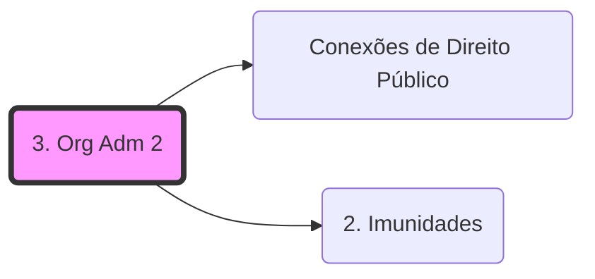

# Empresas Públicas, Sociedades de Economia Mista e Fundações Públicas

## 1️⃣ EMPRESAS PÚBLICAS (EP) E SOCIEDADES DE ECONOMIA MISTA (SEM)

### 📌 FUNDAMENTO CONSTITUCIONAL
> CF, art. 173 — a atuação direta do Estado na atividade econômica **é exceção**, admitida apenas:
- por **imperativo de segurança nacional**; ou
- por **relevante interesse coletivo**.

**DECORE**  
> A **função social** da EP e da SEM é definida **no ato autorizativo de sua criação**.

---

## 1.1. NATUREZA JURÍDICA E CRIAÇÃO

✔️ Integram a **Administração Indireta**  
✔️ Possuem **personalidade jurídica de direito privado**  
✔️ **Criação AUTORIZADA por lei** (CF, art. 37, XIX)  
✔️ Nascem **com o registro do ato constitutivo**

**Pegadinha clássica**  
> Lei **NÃO cria** EP ou SEM → apenas **autoriza**.

---

## 1.2. REGIME JURÍDICO — ⚠️ PONTO CENTRAL DE PROVA

> <mark>Regime jurídico HÍBRIDO (público + privado)</mark>

### Doutrina (Di Pietro / Carvalho Filho)
- Derrogação **parcial** do regime:
  - normas de **direito público** (licitação, concurso, princípios do art. 37)
  - normas de **direito privado** (civil, comercial, trabalhista, tributário)

**DECORE A LÓGICA**
- **Explora atividade econômica** → predomínio do **direito privado**
- **Presta serviço público** → predomínio do **direito público**
- **Serviço público em regime não concorrencial/monopólio** → regime **ainda mais público**  
  (fenômeno da *autarquização das estatais*)

---

## 1.3. ATIVIDADES DESEMPENHADAS

✔️ Podem:
- **Explorar atividade econômica**
- **Prestar serviços públicos** (sentido amplo)

❌ Regra:
- **Não exercem atividade típica de Estado**

⚠️ **Exceção (STF)**  
> EP/SEM **prestadoras de serviço público próprio do Estado**,  
> **em regime não concorrencial**, **podem exercer poder de polícia** (inclusive sancionatório).

---

## 1.4. CONTROLE E SUPERVISÃO

✔️ Vinculação ao ente instituidor  
✔️ **Controle finalístico (tutela)** — sem hierarquia  
✔️ **Fiscalização pelo Tribunal de Contas**  
✔️ Controle interno e externo

**Jurisprudência STF**
> EP e SEM **DEVEM prestar contas** aos Tribunais de Contas.

---

## 1.5. RESPONSABILIDADE CIVIL — ⚠️ MUITO COBRADO

- **Prestadora de serviço público**  
  → <mark>responsabilidade OBJETIVA</mark> (teoria do risco administrativo)

- **Exploradora de atividade econômica**  
  → <mark>responsabilidade SUBJETIVA</mark> (regra do direito privado)

---

## 1.6. BENS

### 🔹 Regra geral
> Bens das EP e SEM são **BENS PRIVADOS**

❌ Não possuem, em regra:
- impenhorabilidade
- imprescritibilidade

### 🔹 Exceção
> Bens **afetados à prestação de serviço público**  
> → recebem **atributos dos bens públicos** (princípio da continuidade)

**Caso clássico**
- Correios (ECT) → bens impenhoráveis + precatórios

---

## 1.7. FALÊNCIA E PRESCRIÇÃO

❌ **Não se submetem à falência** (Lei 11.101/2005, art. 2º, I)

⚠️ **Prescrição**
- Regra: **não gozam do prazo quinquenal**
- Aplica-se o **Código Civil**, salvo exceções jurisprudenciais

---

## 1.8. PRIVILÉGIOS FISCAIS E IMUNIDADE TRIBUTÁRIA

### 🔹 Regra (CF, art. 173, §2º)
> EP e SEM **NÃO podem** gozar de privilégios fiscais **não extensivos ao setor privado**

### 🔹 Exceções relevantes (STF)

#### Imunidade tributária recíproca — POSSÍVEL SE:
✔️ Prestação de **serviço público**  
✔️ **Ausência de finalidade lucrativa**  
✔️ Atuação em **regime não concorrencial / monopólio**

Para detalhes sobre a extensão desta imunidade às estatais, consulte: **[[Conexões de Direito Público]]** e **[[2. Imunidades]]**.

---

## 1.9. DIFERENÇAS ENTRE EP E SEM — ⚠️ DECORE

| Critério | Empresa Pública | Sociedade de Economia Mista |
|--------|----------------|-----------------------------|
| Capital | <mark>100% público</mark> | <mark>Público + privado</mark> |
| Forma jurídica | Qualquer | <mark>Obrigatoriamente S/A</mark> |
| Controle | Total estatal | Estatal (maioria votante) |
| Criação | Autorizada por lei | Autorizada por lei |
| Personalidade | Direito privado | Direito privado |
| Foro (federal) | Justiça Federal (regra) | Justiça Estadual (regra) |

---

## 2️⃣ FUNDAÇÕES PÚBLICAS — ⚠️ FOCO DE PROVA

### 📌 CONCEITO
> <mark>Personificação de um patrimônio</mark> destinado à realização de **finalidades de interesse social**,  
> **SEM finalidade lucrativa**.

📌 Atuam, em regra, em:
- saúde
- educação
- pesquisa
- cultura
- previdência

---

## 2.1. NATUREZA JURÍDICA — ⚠️ PONTO CRÍTICO

### 🔹 Fundação Pública de Direito Público
> <mark>Autarquia fundacional</mark>

✔️ Criada por **lei**  
✔️ Personalidade de **direito público**  
✔️ Mesmo regime das autarquias

---

### 🔹 Fundação Pública de Direito Privado

✔️ **Autorizada por lei**  
✔️ Personalidade de **direito privado**  
✔️ Regime híbrido

**DECORE**
> Fundação pública **pode ser** de direito público **OU** privado.

---

## 2.2. REGIME JURÍDICO DAS FUNDAÇÕES PÚBLICAS

| Aspecto | Direito Público | Direito Privado |
|------|---------------|----------------|
| Imunidade tributária | Sim | Sim |
| Prerrogativas processuais | Sim | Não |
| Regime de precatórios | Sim | Não |
| Patrimônio | Bens públicos | Bens privados (proteção funcional) |
| Licitação | Sim | Sim |
| Pessoal | Estatutário | Celetista |

---

## 2.3. BENS DAS FUNDAÇÕES

- **Direito público** → bens públicos
- **Direito privado** → bens privados  
  (com proteção quando afetados à finalidade)

---

## 2.4. PESSOAL

✔️ Concurso público (CF, art. 37, II)

- Fundação de direito público → **regime estatutário**
- Fundação de direito privado → **regime celetista**

---

## RESUMO FINAL – DECORE PARA A PROVA

- EP e SEM → **direito privado + regime híbrido**
- Exploração econômica → **direito privado**
- Serviço público → **direito público**
- Serviço público não concorrencial → **autarquização**
- EP ≠ SEM → diferença está no **capital** e na **forma societária**
- Fundação pública pode ser:
  - **autárquica** (direito público)
  - **direito privado**

## Grafo Local
