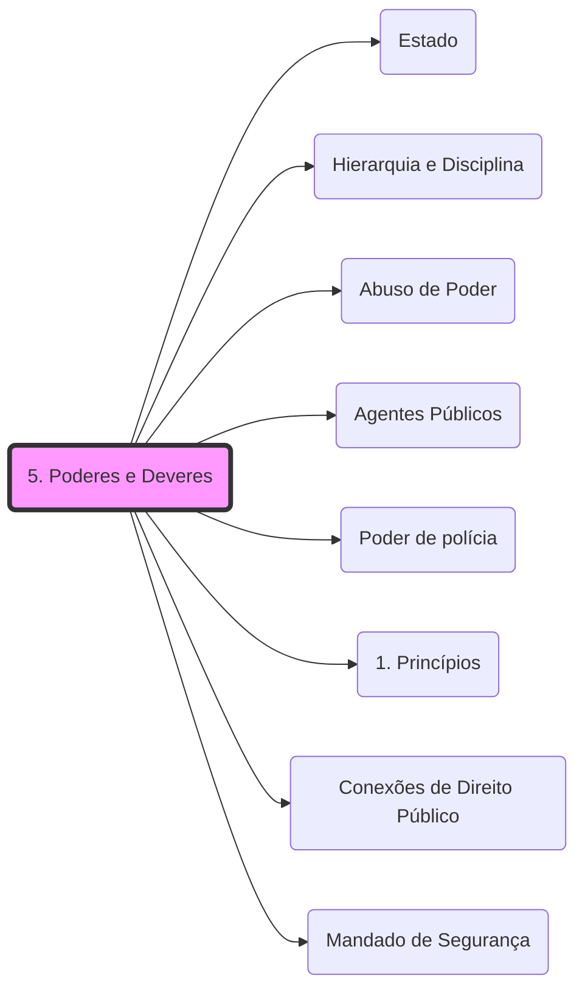

# **1. Definições:**

- **José dos Santos Carvalho Filho:**
    - **"Conjunto de prerrogativas de direito público que a ordem jurídica confere aos agentes administrativos para o fim de permitir que o [[Estado]] alcance seus fins."**
- **Poderes instrumentais**;
- **Irrenunciáveis**;
- **Omissão ilegal** do agente público pode ocasionar **responsabilização** nas esferas **penal, civil e administrativa**.
- **Dever de eficiência - atuação administrativa:**
    - **Qualidade**;
    - **Celeridade;**  
    - **Economicidade**;
    - **Atuação técnica**
    - **Controle**;
    - etc.

- ## **1.1 Dever de probidade:**
    - **Improbidade** (imoralidade, desonestidade e ilegalidade) trata de um conceito **mais amplo e preciso** do que **imoralidade;**
    - **Atos de improbidade administrativa:**
        - **Enriquecimento ilícito;**
        - **Prejuízo ao erário;**
        - **Atentam contra os princípios da Administração Pública.**
        
- ## **1.2 Dever de prestar contas:**
    - Todos os **atos de governo e de administração;**
    -  **Lei 12.527/2011 (Lei de Acesso à Informação):**
        - Observância da **publicidade como preceito geral e do sigilo como exceção**; 
        - **Divulgação** de **informações de interesse público,** independentemente de solicitações; 
        - Utilização de **meios de comunicação** viabilizados pela tecnologia da informação; 
        - Fomento ao desenvolvimento da **cultura de transparência** na administração pública; 
        - Desenvolvimento do **controle social** da administração pública.

# **2. Poder vinculado e poder discricionário:**

## **2.1. Poder vinculado:**

- - **Não deixa margem de liberdade** para o seu exercício;
- **Ato vinculado** é uma **manifestação do poder vinculado**:
    - - **Competência**;
        - **Finalidade**;
        - **Forma**;
        - **Motivo**;
        - **Objeto**.

## **2.2 . Poder discricionário:**

- - **Margem de liberdade** de atuação  dentro dos **limites da lei e da razoabilidade e proporcionalidade;**
        - **Expressa liberdade concedida pelo legislador;**
        - **Conceitos jurídicos indeterminados.**
    - **Conveniência e oportunidade;**
    - **Mérito administrativo:**
        - **Motivo**;
        - **Objeto**.

💡**_Se liga!_  Poderes discricionário e vinculado não existem como poderes autônomos,** são atributos de outros poderes ou competências da Administração.

# **3. [[Hierarquia e Disciplina|Poder Hierárquico]]:**

- Hely Lopes Meirelles: o poder hierárquico “é o de que dispõe o Executivo para distribuir e escalonar as funções de seus órgãos, ordenar e rever a atuação de seus agentes, estabelecendo a relação de subordinação entre os servidores do seu quadro de pessoal”.
- O poder hierárquico tem por objetivo:
    - → dar ordens;
    - → editar atos normativos internos para ordenar a atuação dos subordinados;
    - → fiscalizar a atuação e rever atos;
    - → delegar competências;
    - → avocar atribuições; e
    - → aplicar sanções. 

**Bora bizurar um pouco mais?**

- **Deveres do administrador (PEPA):**
    - Dever de **Prestar contas;**
    - Dever de **Eficiência;**
    - Dever de **[[99 - Conceitos Gerais/Abuso de Poder|Abuso de Poder]]** (evitar o desvio de finalidade)
    - Dever de **P**robidade
    - Dever de **Agir.**

# **4. [[Hierarquia e Disciplina|Poder disciplinar]]:**

- - Incide sobre:
        - **Servidores públicos;**
        - Particulares com **vínculo especial** com o poder público**.**
- Em parte **vinculado:**
    - **Poder-dever** de  **instaurar o procedimento administrativo**;
    - **Responsabilizar** o [[Agentes Públicos|agente]] faltoso (exercício do **[[Hierarquia e Disciplina|Poder Disciplinar]])**
- Em parte **discricionário:**
    - **Tipificação** da falta;
    - **Escolha e gradação** da penalidade.
- **Direito de defesa**:
    - **Contraditório** e a **ampla defesa**;
- **Motivação** dos atos de aplicação de penalidades

**Atenção:**

- **Diferença principal**:
    - **Poder Disciplinar**: Aplica-se a quem tem **vínculo específico** com a Administração.
    - **[[99 - Conceitos Gerais/Poder de polícia|Poder de Polícia]]**: Aplica-se a **todos os cidadãos**, independentemente de vínculo.

**💡** _**Se liga!**_  Há divergência sobre a discricionaridade, alguns autores entendem que **esse poder é sempre vinculado.**

# **5. Poder regulamentar ou normativo:**

- - **Prerrogativa** conferida à Administração Pública **para editar atos gerais** **APENAS** para **complementar as leis** e **permitir a sua efetiva aplicação**.
    - **Poder conferido ao chefe do Poder Executivo** para a edição de normas complementares à lei (decretos), permitindo a sua fiel execução.  
          
        
- **Decretos regulamentares/executivos:**
    - Competência **indelegável**;
    - Somente sobre **leis administrativas**;
    - Para **garantir isonomia** dos procedimentos administrativos.  
          
        
- Decretos **autônomos**:
    - **Previsão constitucional**;
    - Tratam de **matérias não disciplinadas em lei;**
    - **Organização e funcionamento** da administração, **ressalvados os casos**:
        - que impliquem **aumento de despesa;**
        - **criação ou extinção** de **órgãos públicos**; ou
        - **extinção** de **cargo/função vago**.
    - **Delegáveis** p/ Ministros de Estado, PGR, AGU.  
          
        
## 5.1: **Decretos Autônomos:** 
  → não se trata de uma autorização genérica para edição de regulamentos autônomos, pois só se aplica nos casos das alíneas “a” e “b” do inc. VI, art. 84, da Constituição Federal.
    - → por decorrerem diretamente da Constituição Federal, essas são hipóteses restritas de decretos como atos normativos primários;

# **6. Poder de polícia:**

- **Finalidade**:
        - **Condicionar e restringir** o **uso e gozo** de **bens, atividades, e direitos individuais**, _em benefício da coletividade_ _OU do próprio Estado._
    - **Sentido amplo**: 
        
        - **Toda e qualquer ação restritiva do Estado** em relação aos direitos individuais **(Legislativo/Executivo)**.
            
    - **Sentido estrito:**
        
        - **Apenas atividade da Administração Pública**, que regulamenta as leis de polícia ou que exerce atividades concretos de limitação e condicionamento. 
            
- **Regulamentação** das leis;
    
- **Controle preventivo** (ordens, notificações, licenças, autorizações);
    
- **Controle repressivo** (medidas coercitivas).
    
- **Aplicação de penalidades** contra as pessoas sem vínculo específico com a Administração.
    

## **6.1 Atributos do poder de polícia**:

- **Discricionariedade** (momento da fiscalização; escolha de sanção);
- **Autoexecutoriedade** (decidir e executar diretamente  sua decisão por seus próprios meios, sem intervenção do Judiciário)  
    - **Exigibilidade**:
        - **Meios indiretos** de coação (ex.: multas)**;**
        - **Sempre presente!**
    - **Executoriedade**: **meios diretos** de coação (ex.: apreensão de mercadorias)
- **Coercibilidade** (obrigatório, independe da vontade do administrado).

## **6.2 Caráter do poder de polícia**:

- **Normativo**: geral, abstrato, caráter preventivo;  
    
- **Concreto**: atingem pessoas determinadas;  
    
- **Preventivo**: atos de consentimento (licença-vinculado; autorização-discricionário);  
    
- **Repressivo**: consequência de uma infração (ex.: multa);  
    
- **Fiscalização**: verificar o cumprimento das normas.

## **6.3 Ciclo ou fases de polícia:**

- **legislação** ou **ordem** de polícia;
- **consentimento** de polícia;
- **fiscalização** de polícia;
- **sanção** de polícia.

## **6.4 Poder de polícia: Jurisprudências**

⚠️ **ATENÇÃO!** "Nova" posição jurisprudencial:

- O **STF**, por meio do Tema 532, decidiu: "É **CONSTITUCIONAL** a **DELEGAÇÃO DO PODER DE POLÍCIA**, por meio de **LEI,** a pessoas jurídicas de **DIREITO PRIVADO** INTEGRANTES da Administração Pública **INDIRETA** de capital social MAJORITARIAMENTE **PÚBLICO** que prestem **EXCLUSIVAMENTE SERVIÇO PÚBLICO** de atuação própria do Estado e em regime **NÃO CONCORRENCIAL**".  
      
    
- O voto DELIMITA: a delegação APENAS pode ocorrer para atividades de **<mark style="background:rgba(240, 200, 0, 0.2)">CONSENTIMENTO, FISCALIZAÇÃO e SANÇÃO</mark>**. **NÃO** pode haver de qualquer forma a delegação de atividade de **ORDEM**.Empresas estatais que praticam atividades **<mark style="background:rgba(240, 200, 0, 0.2)">ECONÔMICAS</mark>** **NÃO** podem ter o poder de polícia delegado a elas.
- 📓**JÁ CAIU!** ver conceito completo em **[[Poder de polícia]]**. Lembre-se: é o fato gerador de taxas no Direito Tributário: "_Art. 78. Considera-se **<mark style="background:rgba(240, 200, 0, 0.2)">poder de polícia</mark>** atividade da administração pública que,<u> limitando ou disciplinando direito, interêsse ou liberdade, regula a prática de ato ou abstenção de fato, em razão de intêresse público</u> concernente à segurança, à higiene, à ordem, aos costumes, à disciplina da produção e do mercado, ao exercício de atividades econômicas dependentes de concessão ou autorização do Poder Público, à tranqüilidade pública ou ao respeito à propriedade e aos direitos individuais ou coletivos.  Parágrafo único. Considera-se regular o exercício do poder de polícia quando desempenhado pelo órgão competente nos limites da lei aplicável, com observância do processo legal e, tratando-se de atividade que a lei tenha como discricionária, sem abuso ou desvio de poder."_
- É <u>ADMITIDA</u> a **DELEGAÇÃO** do exercício de **PODER de** **POLÍCIA** de TRÂNSITO às **GUARDAS MUNICIPAIS**, **INCLUSIVE** no que se refere a atos decorrentes de **<mark style="background:rgba(240, 200, 0, 0.2)">consentimento e fiscalização</mark>.**
- A DEMOLIÇÃO de CASA HABITADA determinada por força de ato de polícia administrativa DEPENDE de prévia **AUTORIZAÇÃO JUDICIAL.**
- **Multas** **NÃO** são dotadas de **<mark style="background:rgba(240, 200, 0, 0.2)">AUTOEXECUTORIEDADE</mark>**.  
    💭**TENHA EM MENTE!** Diferença entre <u>Polícia Judiciária e Polícia Administrativa</u>:
    - - - **Polícia judiciária:** incide sobre **pessoas**, privativa de corporações especializadas, previne ou reprime **ilícitos penais;**
            - **Polícia administrativa:** incide sobre **bens/direitos/atividades,** diversos órgãos da Administração e inclusive corporações especializadas, previne ou reprime **ilícitos administrativos.**

É constitucional a delegação do poder de polícia, por meio de lei, **a pessoas jurídicas de direito privado integrantes da Administração Pública indireta de capital social majoritariamente público que prestem exclusivamente serviço público de atuação própria do Estado e em regime não concorrencial.**

(STF. Plenário. RE 633782/MG, Rel. Min. Luiz Fux, julgado em 23/10/2020 - repercussão geral – tema 532).

Além disso, <mark style="background:rgba(205, 244, 105, 0.55)">**o STF recentemente decidiu que as guardas municipais podem exercer ações de segurança urbana</mark>, incluindo o policiamento ostensivo comunitário, desde que respeitadas as atribuições dos demais órgãos de segurança pública e excluídas atividades de polícia judiciária.**

- Pode delegar o **CONSENTIMENTO**, A **FISCALIZAÇÃO** e A **SANÇÃO** (ANTES A SANÇÃO NÃO ERA DELEGADA).  
    - BIZU:  **CONFISCA o SANÇÃO**
    - **Desde que**  a entidade tenha **capital majoritariamente público**, que **preste exclusivamente serviço público de atuação própria do poder público e em regime não concorrencial**, a **SANÇÃO** pode ser **DELEGADA.**

- **O Estado pode cobrar [[1. Princípios|TAXAS]] em razão de exercer o Poder de Polícia (memorize isso).  
    Atenção! Somente TAXAS. Não pode ser imposto, tarifa ou contribuição  
      
    **
- **️Atributos do Poder de Polícia** (**[[Conexões de Direito Público|CDA]] -** associe à Certidão de Dívida Ativa ou qualquer outra coisa de seu cotidiano).
    - **Coercibilidade**
    - **Discricionariedade**
    - **Autoexecutoriedade**

## **6.5 Poderes administrativos:** 

- **Delegação do poder de polícia:** 
    - Para as entidades administrativas de direito público (autarquias e fundações autárquicas), em todas as suas fases;
    - Para entidades de direito privado (empresas públicas, sociedades de economia mista e fundações públicas de direito privado):  **consentimento, fiscalização e sanção.**

    **🚫NÃO é possível delegar o poder de polícia a particulares!**

### **6.5.1 Entendimento do STF:** 
É constitucional a delegação do poder de polícia, **por meio de lei**, a pessoas jurídicas de **direito  privado**  <u>**integrantes da Administração Pública indireta**</u> de <mark style="background:#ff4d4f">**capital social majoritariamente público**</mark> que **prestem  exclusivamente serviço público** de atuação própria do Estado e em **regime não concorrencial.**

- **Sanções de polícia e seus limites:**
    - Princípio da **legalidade**;
    - **Devido processo lega**l;
    - Princípios da **razoabilidade** e da **proporcionalidade**;
    - **Prescreve em cinco anos** a ação punitiva da Administração Pública federal:
        - inicia-se da **data** em que o **ato** foi **praticado**;
        - para a **instauração** do **processo de apuração.**

### 6.5.2 Súmula 467 - STJ: 
**  “Prescreve em cinco anos, **contados do término do processo administrativo,** a **pretensão** da Administração Pública **de promover a execução** da multa por infração ambiental.” 

- **Taxa de polícia:**
    - Para **custeio** do exercício do poder de polícia;
    - Basta a **existência de órgão e estrutura** competente para realizar a fiscalização.  
        
- **Abuso de Poder:**
    - **Excesso de poder:**   
        - **Extrapola** suas competências;
        - **Vício** de **competência**;
        - **Sanável**, em regra.
    - **Desvio de poder:**  
        - **Fim diverso** da lei ou do interesse público;
        - **Vício** de **finalidade**;
        - **Insanável**.

# ** 7. Abuso de Poder:** 

_“O abuso de poder se divide em <u>duas espécies</u>:_

_a) **Excesso de poder:** quando a autoridade atua extrapolando os limites da sua **competência;**_

_b) **Desvio de poder (ou desvio de finalidade):** quando a autoridade pratica um ato que é de sua competência, mas o utiliza para uma **finalidade diversa** da prevista ou contrária ao interesse público.”_ _(ALEXANDRE, Ricardo; DEUS, João de. Direito Administrativo Esquematizado.1ª ed. São Paulo: Método, 2015.E-book. P.246)_ 

- **Uso do Poder Administrativo**: Deve ser exercido **apenas na medida necessária** para atingir os fins públicos, sempre respeitando os princípios da legalidade, impessoalidade, moralidade, publicidade e eficiência.
    
- **[[Abuso de Poder]]**: Ocorre quando há desvio na atuação do agente público, sendo uma **espécie de ilegalidade**. Pode se manifestar de duas formas principais:
    
    1. **Excesso de Poder**: Quando o agente público atua **fora dos limites** da sua competência.
    2. **Desvio de Poder (ou de Finalidade)**: Quando o agente age **dentro da sua competência**, mas de forma **contrária à finalidade pública** estabelecida na lei.
- **Exemplos de Excesso de Poder:**
    
    - Aplicação de sanção por autoridade **sem competência** para isso.
    - Concessão de licença a um servidor por autoridade **não autorizada**.
- **Exemplos de Desvio de Poder:**
    
    - Remover um servidor **com objetivo punitivo** e não por necessidade administrativa.
    - Desapropriação de um bem **para favorecer um particular**, e não para interesse público legítimo.
- **Manifestações do Abuso de Poder:**
    
    - **Por condutas comissivas (fazer)**: Ação indevida do agente público.
    - **Por condutas omissivas (não fazer)**: Quando a autoridade se omite no dever de agir.
- **Consequências do Abuso de Poder:**
    
    - O ato será considerado **arbitrário, ilícito e passível de responsabilização** civil, penal e administrativa.
    - A vítima pode recorrer ao **direito de petição** (art. 5º, XXXIV, CF) para contestar o abuso.
    - **[[Mandado de Segurança]]** pode ser utilizado para corrigir ilegalidades praticadas por abuso de poder (art. 5º, LXIX, CF).
    
- **FDP** tem **CEP**
    - **F**inalidade **D**esvio de **P**oder
    - **C**ompetência **E**xcesso de **P**oder

## 🕸️ Grafo Local
