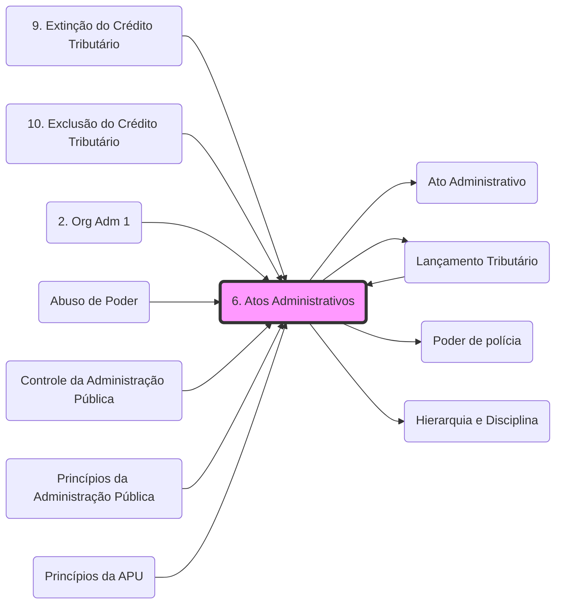

# **[[Ato Administrativo|Ato Administrativo]]:**

- Manifestar a **vontade do Estado**;
- Espécie de **ato jurídico**;
- Depende da vontade;
- Produção de com **efeitos jurídicos** com **fim público**;
- Predomínio do **direito público**;
- Manifestação/declaração **unilateral**;
- **Controle** do poder judiciário. **(ver [[4. DDIC 2#1.4 Inafastabilidade de jurisdição|Inafastabilidade da Jurisdição]].md)**
- **Exemplo Fiscal**: O **[[99 - Conceitos Gerais/Lançamento Tributário|Lançamento Tributário]]** é um ato administrativo vinculado.

## **1. Atos da administração:**

- - Mais amplo;
    - Diversas espécies:
        - **atos administrativos**;
        - atos do direito privado;
        - atos materiais;
        - atos de conhecimento, opinião, juízo ou valor;
        - atos políticos;
        - contratos, convênios administrativos;
        - atos normativos.  
              
            

## **2. Fatos administrativos:** 

- - Três sentidos:
        - **atividade material** decorrente de um **ato administrativo**;
        - **atuação administrativa** que produz **efeitos** **jurídicos indiretamente**;
        - **evento da natureza** que produz **efeitos jurídicos**.
    - **Não possuem** como **finalidade** a produção de **efeitos jurídicos** (conquanto, eventualmente, possam decorrer efeitos jurídicos deles);
    - **Não há manifestação ou declaração de vontade**, com conteúdo jurídico, da administração   
        pública;
    - **Não** faz sentido falar em “**presunção de legitimidade**” de fatos administrativos;
    - **Não existe revogação ou anulação** de fatos administrativos;
    - **Não** faz sentido falar em **fatos administrativos discricionários e vinculados.**  
          
        

## **3. Silêncio administrativo:**

- - **Omissão da administração** quando há o **dever de se pronunciar**;
- Dependem de **previsão legal**;
    -  a lei prescreve que o **silêncio significa manifestação positiva** (anuência tácita);
    -  a lei dispõe que a **omissão significa manifestação denegatória** (pedido negado).
- **Omissão da lei quanto aos resultados do silêncio:**
    - <u>_após o decurso do prazo_ o juiz</u>:
        - **ato vinculado:**  **defere o pedido** ou **manda** a administração **deferir**;
        - **ato discricionário**: **prazo para a manifestação** da administração.

## **4. Atributos:**

- **Presunção de legitimidade ou veracidade** (presente em todos os atos administrativos);
- **Imperatividade;**
- **Autoexecutoriedade;**
- **Tipicidade (presente em todos os atos administrativos).**

### **4.1 Presunção de legitimidade ou veracidade:**

- **Legitimidade:** ato em conformidade com a lei;
- **Veracidade:** fatos verdadeiros;
- **Fundamentos:**
    - Necessidade de **celeridade**;
    - **Legalidade;**
    - **Fé de ofício** aos documentos;
- **Consequências**:
    - **Produção de efeitos** enquanto não decretada a invalidade do ato;
    - **Autoexecutoriedade**;
    - **Inversão do ônus da prova**;
    - **Presunção relativa**;
    - **Controle judicial**.

### **4.2 Imperatividade:**

- **Imposição** de **obrigações a terceiros;**
- **Poder extroverso;**
- **Depende** de **previsão legal;**
- **Fundamento:**
    -  **Supremacia do interesse público;**
- **Atos que impõem obrigações/restrições decorrentes do [[Poder de polícia|Poder de polícia]]
- **Ausentes:**
    - **Atos negociais;**
    - **Atos enunciativos.**

### <mark style="background:#4b422d">**4.3 Autoexecutoriedade:</mark>**

- **Execução imediata e direta** pela administração, **sem necessidade de ordem judicial;**
- Uso da força permitido;
- **Controle judicial**;
- Poderes:
	- **de Polícia;**
    - **disciplinar;**
- **Fundamentos**:
    - **Presunção de legitimidade**;
    - **Supremacia do interesse público**;
    - **Urgência.**
- **Exigibilidade:**
    -  Meios **indiretos** de coação;
    - O **administrado** executa a medida.
- **Executoriedade:**
    - Coação **direta** ou **material;**
    - **Uso da força;**
    - A **administração** executa a medida.

### <mark style="background:#4b422d">**4.4 Tipicidade:</mark>**

- Previsão **legal**;
- **Finalidade** do ato;
- **Não existe** ato **totalmente discricionário**;
- **Não existe** ato **inominado** **unilateral**

# **<mark style="background:#4b422d">5. Elementos de formação:</mark>**

- Requisitos ou aspectos de **validade**;
- **Elementos ESSENCIAIS**: _**(BIZU! Com Fi For M Ob)**_  
    - **Competência**;
    - **Finalidade;**
    - **Forma;**
    - **Motivo;**
    - **Objeto.** 
- **Elementos ACESSÓRIOS/ACIDENTAIS**:
    - **Ampliam** ou **restringem** os efeitos jurídicos do ato;
    - Referem-se ao **OBJETO** do <mark style="background:#4b422d">**ato discricionário**;</mark>
    - **Termo**;
    - **Condição**:
    - **Modo** ou **encargo**.

## **5.1 Competência (sujeito)**:

- **Poder legal** conferido ao agente para o **desempenho de suas atribuições**;
- Elemento **vinculado;**
- Exercício **obrigatório;**
- **Irrenunciáveis;**
- **Intransferíveis/inderrogáveis;**
- **Imodificáveis;**
- **Imprescritíveis;**
- **Improrrogável;**
- **Critérios de distribuição:**
    - matéria;
    - território;
    - grau hierárquico;
    - tempo;
    - fracionamento.
- **Delegação:**
    - quando **não houver impedimento legal**, para órgãos ou agentes, **subordinados ou não;**
    - presente a **hierarquia:**
        - ato **unilateral**; 
        - ordem superior **independente da anuência** do delegado;
        - **vertical.**
    - **ausência** de **hierarquia**:
        - **depende** da **concordância** do delegado;
        - ato **bilateral;**
        - **horizontal.**
- **Avocação:**
    - atrair para si **competência do subordinado**;
    - existência de **[[Hierarquia e Disciplina|hierarquia]]** (possibilidade de delegação e avocação.md).
    - **excepcional;**
    - **motivos relevantes;**
    - **temporária;**
    - **vedada** para **competência exclusiva** do subordinado.

**_Se liga!_**  **Não podem ser objeto de delegação: (_Bizu! 🥕 CE  NO_** u **_RA_)**

- Edição de **atos de caráter NOrmativo;**
- Decisão de **Recursos Administrativos;**
- Matérias de **Competência Exclusiva** do órgão ou autoridade**.**

## **5.2 Finalidade**: 

- **Geral**: **interesse público**;
- **Específica**: objetivo diretamente **previsto na lei;**
- Elemento **vinculado.**

## **5.3 Forma**:

- Sentido **estrito**:
    - modo de **exteriorização** do ato.
- Sentido **amplo**:
    - **formalidades** do processo de formação da vontade;
    - princípio do **devido processo legal.**
- Elemento **vinculado;**
- **Princípio da Solenidade:**

## Grafo Local
