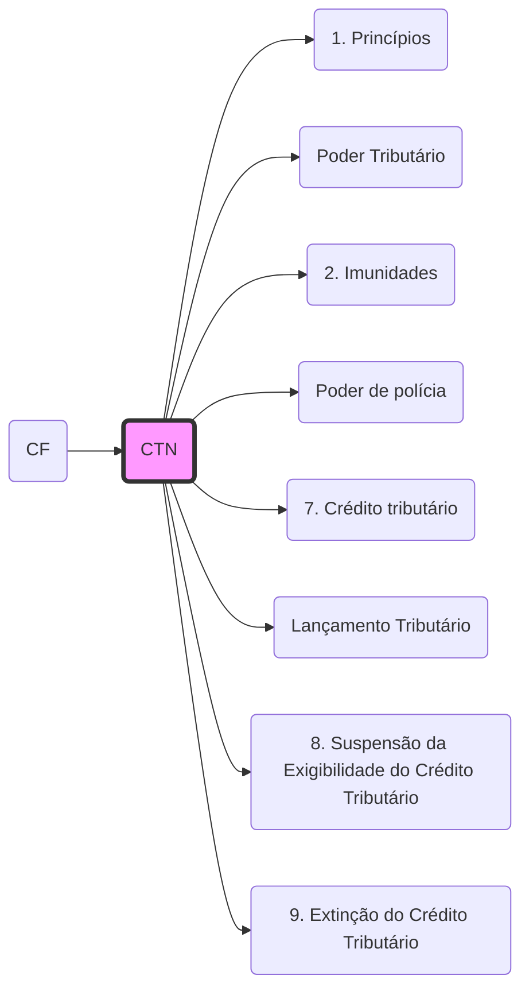

# Código Tributário Nacional (CTN)

> [!abstract] Informações Gerais
> **Fonte:** Lei nº 5.172/1966  
> **Natureza:** Norma geral de direito tributário ([[CF#^art146|CF/88, art. 146]]  
> **MOC Pai:** [[01 - Direito Tributário (MOC)|Direito Tributário]].md  
> **Conexões:** [[Conexões de Direito Público|Conexões de Direito Público]], [[Poder Tributário|Poder Tributário]]
> **Jurisprudência:** [[Jurisprudência Fiscal (STF e STJ|Jurisprudência Fiscal (STF e STJ.md)]] (O CTN é antigo, cuidado com artigos não recepcionados.md).

> [!danger] ☢️ Radar de Bancas (Mapa de Calor)
> **FGV/Cebraspe:** Amam **[[CTN#^ctn113|Art. 113]]** (Obrigação Principal x Acessória.md), **[[CTN#^ctn121|Art. 121]]** (Sujeito Passivo.md) e **[[CTN#^ctn135|Art. 135]]** (Responsabilidade de Sócios.md).
> **FCC/Vunesp:** Decoreba de **Prazos** (Prescrição e Decadência - Arts. 173 e 174) e **Causas de Suspensão/Extinção** (Arts. 151 e 156).
> **Pegadinha Clássica:** A multa não paga vira Dívida Ativa, mas não vira Tributo (Art. 3º).

---

# DISPOSIÇÃO PRELIMINAR

* Art. 1º Esta Lei regula, com fundamento na Emenda Constitucional nº 18, de 1º de dezembro de 1965, o sistema tributário nacional e estabelece, com fundamento no art. 5º, inciso XV, alínea b, da Constituição Federal, as normas gerais de direito tributário aplicáveis à União, aos Estados, ao Distrito Federal e aos Municípios, sem prejuízo da respectiva legislação complementar, supletiva ou regulamentar. ^ctn1

---

# LIVRO PRIMEIRO – SISTEMA TRIBUTÁRIO NACIONAL

---

# TÍTULO I – DISPOSIÇÕES GERAIS

* Art. 2º O sistema tributário nacional é regido pelo disposto na Emenda Constitucional nº 18, de 1º de dezembro de 1965, em leis complementares, em resoluções do Senado Federal e, nos limites das respectivas competências, em leis federais, nas Constituições e em leis estaduais, e em leis municipais. ^ctn2

* Art. 3º Tributo é toda prestação pecuniária compulsória, em moeda ou cujo valor nela se possa exprimir, que não constitua sanção de ato ilícito, instituída em lei e cobrada mediante atividade administrativa plenamente vinculada. ^ctn3  
	> Ver: [[01 - Direito Tributário/1. Princípios|Conceito de Tributo e Princípios]]

* Art. 4º A natureza jurídica específica do tributo é determinada pelo fato gerador da respectiva obrigação, sendo irrelevantes para qualificá-la: ^ctn4
	* I – a denominação e demais características formais adotadas pela lei; ^ctn4i
	* II – a destinação legal do produto da sua arrecadação. ^ctn4ii

* Art. 5º Os tributos são impostos, taxas e contribuições de melhoria. ^ctn5

---

# TÍTULO II – COMPETÊNCIA TRIBUTÁRIA

## CAPÍTULO I – DISPOSIÇÕES GERAIS

* Art. 6º A atribuição constitucional de competência tributária compreende a competência legislativa plena, ressalvadas as limitações contidas na Constituição Federal, nas Constituições dos Estados e nas Leis Orgânicas do Distrito Federal e dos Municípios, e observado o disposto nesta Lei. ^ctn6  
	> Ver: [[99 - Conceitos Gerais/Poder Tributário|Poder e Competência Tributária]]

	* Parágrafo único. Os tributos cuja receita seja distribuída, no todo ou em parte, a outras pessoas jurídicas de direito público pertencerá à competência legislativa daquela a que tenham sido atribuídos. ^ctn6p

* Art. 7º A competência tributária é indelegável, salvo atribuição das funções de arrecadar ou fiscalizar tributos, ou de executar leis, serviços, atos ou decisões administrativas em matéria tributária, conferida por uma pessoa jurídica de direito público a outra. ^ctn7

	* § 1º A atribuição compreende as garantias e os privilégios processuais que competem à pessoa jurídica de direito público que a conferir. ^ctn7p1
	* § 2º A atribuição pode ser revogada, a qualquer tempo, por ato unilateral da pessoa jurídica de direito público que a tenha conferido. ^ctn7p2
	* § 3º Não constitui delegação de competência o cometimento, a pessoas de direito público, do encargo ou da função de arrecadar tributos. ^ctn7p3

* Art. 8º O não-exercício da competência tributária não a defere a pessoa jurídica de direito público diversa daquela a que a Constituição a tenha atribuído. ^ctn8

---

## CAPÍTULO II – LIMITAÇÕES DA COMPETÊNCIA TRIBUTÁRIA

### Seção I – Disposições Gerais

* Art. 9º É vedado à União, aos Estados, ao Distrito Federal e aos Municípios: ^ctn9  
	> Ver: [[01 - Direito Tributário/2. Imunidades|Imunidades Tributárias]]

	* I – instituir ou majorar tributo sem que a lei o estabeleça, ressalvado, quanto à majoração, o disposto nos arts. [[#^ctn21|#^ctn21]] , [[#^ctn26|#^ctn26]] e [[#^ctn65|#^ctn65]];  
	* II – cobrar imposto sobre o patrimônio e a renda com base em lei posterior à data inicial do exercício financeiro a que corresponda;  
	* III – estabelecer limitações ao tráfego, no território nacional, de pessoas ou mercadorias, por meio de tributos interestaduais ou intermunicipais;  
	* IV – cobrar impostos sobre:
		* a) o patrimônio, a renda ou os serviços uns dos outros;  
		* b) templos de qualquer culto;  
		* c) o patrimônio, a renda ou serviços dos partidos políticos, inclusive suas fundações, das entidades sindicais dos trabalhadores, das instituições de educação e de assistência social, sem fins lucrativos, observados os requisitos fixados na Seção II deste Capítulo;  
		* d) papel destinado exclusivamente à impressão de jornais, periódicos e livros.

	* § 1º O disposto no inciso IV não exclui a atribuição, por lei, às entidades nele referidas, da condição de responsáveis pelos tributos que lhes caiba reter na fonte. ^ctn9p1
	* § 2º O disposto na alínea a do inciso IV aplica-se exclusivamente aos serviços próprios das pessoas jurídicas de direito público. ^ctn9p2

* Art. 10. É vedado à União instituir tributo que não seja uniforme em todo o território nacional, ou que importe distinção ou preferência em favor de determinado Estado ou Município. ^ctn10

* Art. 11. É vedado aos Estados, ao Distrito Federal e aos Municípios estabelecer diferença tributária entre bens de qualquer natureza, em razão da sua procedência ou do seu destino. ^ctn11

---

### Seção II – Disposições Especiais

* Art. 12. O disposto na alínea a do inciso IV do [[#^ctn9|#^ctn9]], observado o disposto nos seus §§ 1º e 2º, é extensivo às autarquias criadas pela União, pelos Estados, pelo Distrito Federal ou pelos Municípios, tão-somente no que se refere ao patrimônio, à renda ou aos serviços vinculados às suas finalidades essenciais, ou delas decorrentes. ^ctn12

* Art. 13. O disposto na alínea a do inciso IV do [[#^ctn9|#^ctn9]] não se aplica aos serviços públicos concedidos, cujo tratamento tributário é estabelecido pelo poder concedente, no que se refere aos tributos de sua competência, ressalvado o que dispõe o parágrafo único. ^ctn13

	* Parágrafo único. Mediante lei especial e tendo em vista o interesse comum, a União pode instituir isenção de tributos federais, estaduais e municipais para os serviços públicos que conceder, observado o disposto no § 1º do [[#^ctn9|#^ctn9]]. ^ctn13p

* Art. 14. O disposto na alínea c do inciso IV do [[#^ctn9|#^ctn9]] é subordinado à observância dos seguintes requisitos pelas entidades nele referidas: ^ctn14

	* I – não distribuírem qualquer parcela de seu patrimônio ou de suas rendas, a qualquer título; ^ctn14i
	* II – aplicarem integralmente, no País, os seus recursos na manutenção dos seus objetivos institucionais; ^ctn14ii
	* III – manterem escrituração de suas receitas e despesas em livros revestidos de formalidades capazes de assegurar sua exatidão. ^ctn14iii

	* § 1º Na falta de cumprimento do disposto neste artigo, ou no § 1º do [[#^ctn9|#^ctn9]], a autoridade competente pode suspender a aplicação do benefício. ^ctn14p1
	* § 2º Os serviços a que se refere a alínea c do inciso IV do [[#^ctn9|#^ctn9]] são exclusivamente os diretamente relacionados com os objetivos institucionais das entidades de que trata este artigo. ^ctn14p2

* Art. 15. Somente a União, nos seguintes casos excepcionais, pode instituir empréstimos compulsórios: ^ctn15

	* I – guerra externa, ou sua iminência; ^ctn15i
	* II – calamidade pública que exija auxílio federal impossível de atender com os recursos orçamentários disponíveis; ^ctn15ii
	* III – conjuntura que exija a absorção temporária de poder aquisitivo. ^ctn15iii

	* Parágrafo único. A lei fixará obrigatoriamente o prazo do empréstimo e as condições de seu resgate, observando, no que for aplicável, o disposto nesta Lei. ^ctn15p

---

# TÍTULO III – IMPOSTOS

## CAPÍTULO I – DISPOSIÇÕES GERAIS

* Art. 16. Imposto é o tributo cuja obrigação tem por fato gerador uma situation independente de qualquer atividade estatal específica, relativa ao contribuinte. ^ctn16

* Art. 17. Os impostos componentes do sistema tributário nacional são exclusivamente os que constam deste Título, com as competências e limitações nele previstas. ^ctn17

* Art. 18. Compete: ^ctn18

	* I – à União, instituir, nos Territórios Federais, os impostos atribuídos aos Estados e, se aqueles não forem divididos em Municípios, cumulativamente, os atribuídos a estes; ^ctn18i
	* II – ao Distrito Federal e aos Estados não divididos em Municípios, instituir, cumulativamente, os impostos atribuídos aos Estados e aos Municípios. ^ctn18ii

---

## CAPÍTULO II – IMPOSTOS SOBRE O COMÉRCIO EXTERIOR

### Seção I – Imposto sobre a Importação

* Art. 19. O imposto, de competência da União, sobre a importação de produtos estrangeiros tem como fato gerador a entrada destes no território nacional. ^ctn19

* Art. 20. A base de cálculo do imposto é: ^ctn20

	* I – quando a alíquota seja específica, a unidade de medida adotada pela lei tributária; ^ctn20i
	* II – quando a alíquota seja ad valorem, o preço normal que o produto, ou seu similar, alcançaria, ao tempo da importação, em uma venda em condições de livre concorrência; ^ctn20ii
	* III – quando se trate de produto apreendido ou abandonado, levado a leilão, o preço da arrematação. ^ctn20iii

* Art. 21. O Poder Executivo pode, nas condições e nos limites estabelecidos em lei, alterar as alíquotas ou as bases de cálculo do imposto, a fim de ajustá-lo aos objetivos da política cambial e do comércio exterior. ^ctn21

* Art. 22. Contribuinte do imposto é: ^ctn22

	* I – o importador ou quem a lei a ele equiparar; ^ctn22i
	* II – o arrematante de produtos apreendidos ou abandonados. ^ctn22ii

---

### Seção II – Imposto sobre a Exportação

* Art. 23. O imposto, de competência da União, sobre a exportação, para o estrangeiro, de produtos nacionais ou nacionalizados tem como fato gerador a saída destes do território nacional. ^ctn23

* Art. 24. A base de cálculo do imposto é: ^ctn24

	* I – quando a alíquota seja específica, a unidade de medida adotada pela lei tributária; ^ctn24i
	* II – quando a alíquota seja ad valorem, o preço normal que o produto, ou seu similar, alcançaria, ao tempo da exportação, em uma venda em condições de livre concorrência. ^ctn24ii

	* Parágrafo único. Para os efeitos do inciso II, considera-se a entrega como efetuada no porto ou lugar da saída do produto, deduzidos os tributos diretamente incidentes sobre a operação de exportação. ^ctn24p

* Art. 25. A lei pode adotar como base de cálculo a parcela do valor ou do preço, referidos no artigo anterior, excedente de valor básico, fixado de acordo com os critérios e dentro dos limites por ela estabelecidos. ^ctn25

* Art. 26. O Poder Executivo pode, nas condições e nos limites estabelecidos em lei, alterar as alíquotas ou as bases de cálculo do imposto, a fim de ajustá-los aos objetivos da política cambial e do comércio exterior. ^ctn26

* Art. 27. Contribuinte do imposto é o exportador ou quem a lei a ele equiparar. ^ctn27

* Art. 28. A receita líquida do imposto destina-se à formação de reservas monetárias, na forma da lei. ^ctn28

---

# CAPÍTULO III – IMPOSTOS SOBRE O PATRIMÔNIO E A RENDA

## Seção I – Imposto sobre a Propriedade Territorial Rural

* Art. 29. O imposto, de competência da União, sobre a propriedade territorial rural tem como fato gerador a propriedade, o domínio útil ou a posse de imóvel por natureza, como definido na lei civil, localizado fora da zona urbana do Município. ^ctn29

* Art. 30. A base do cálculo do imposto é o valor fundiário. ^ctn30

* Art. 31. Contribuinte do imposto é o proprietário do imóvel, o titular de seu domínio útil, ou o seu possuidor a qualquer título. ^ctn31

---

## Seção II – Imposto sobre a Propriedade Predial e Territorial Urbana

* Art. 32. O imposto, de competência dos Municípios, sobre a propriedade predial e territorial urbana tem como fato gerador a propriedade, o domínio útil ou a posse de bem imóvel por natureza ou por acessão física, como definido na lei civil, localizado na zona urbana do Município. ^ctn32

	* § 1º Para os efeitos deste imposto, entende-se como zona urbana a definida em lei municipal; observado o requisito mínimo da existência de melhoramentos indicados em pelo menos 2 (dois) dos incisos seguintes, construídos ou mantidos pelo Poder Público: ^ctn32p1

		* I – meio-fio ou calçamento, com canalização de águas pluviais; ^ctn32p1i
		* II – abastecimento de água; ^ctn32p1ii
		* III – sistema de esgotos sanitários; ^ctn32p1iii
		* IV – rede de iluminação pública, com ou sem posteamento para distribuição domiciliar; ^ctn32p1iv
		* V – escola primária ou posto de saúde a uma distância máxima de 3 (três) quilômetros do imóvel considerado. ^ctn32p1v

	* § 2º A lei municipal pode considerar urbanas as áreas urbanizáveis, ou de expansão urbana, constantes de loteamentos aprovados pelos órgãos competentes, destinados à habitação, à indústria ou ao comércio, mesmo que localizados fora das zonas definidas nos termos do parágrafo anterior. ^ctn32p2

* Art. 33. A base do cálculo do imposto é o valor venal do imóvel. ^ctn33

	* Parágrafo único. Na determinação da base de cálculo, não se considera o valor dos bens móveis mantidos, em caráter permanente ou temporário, no imóvel, para efeito de sua utilização, exploração, aformoseamento ou comodidade. ^ctn33p

* Art. 34. Contribuinte do imposto é o proprietário do imóvel, o titular do seu domínio útil, ou o seu possuidor a qualquer título. ^ctn34

---

## Seção III – Imposto sobre a Transmissão de Bens Imóveis

* Art. 35. O imposto, de competência dos Municípios, sobre a transmissão, por ato oneroso, de bens imóveis, por natureza ou acessão física, e de direitos reais sobre imóveis, exceto os de garantia, tem como fato gerador: ^ctn35

	* I – a transmissão, a qualquer título, da propriedade ou do domínio útil de bens imóveis por natureza ou por acessão física; ^ctn35i
	* II – a transmissão, a qualquer título, de direitos reais sobre imóveis, exceto os direitos reais de garantia; ^ctn35ii
	* III – a cessão de direitos relativos às transmissões referidas nos incisos anteriores. ^ctn35iii

* Art. 36. Ressalvado o disposto em lei, o imposto não incide sobre a transmissão dos bens ou direitos referidos no artigo anterior quando efetuada para sua incorporação ao patrimônio de pessoa jurídica em realização de capital, nem sobre a transmissão decorrente de fusão, incorporação, cisão ou extinção de pessoa jurídica. ^ctn36

* Art. 37. O disposto no artigo anterior não se aplica quando a pessoa jurídica adquirente tenha como atividade preponderante a compra e venda desses bens ou direitos, locação de bens imóveis ou arrendamento mercantil. ^ctn37

	* § 1º Considera-se caracterizada a atividade preponderante quando mais de 50% (cinquenta por cento) da receita operacional da pessoa jurídica adquirente, nos 2 (dois) anos anteriores e nos 2 (dois) anos subsequentes à aquisição, decorrer de transações mencionadas neste artigo. ^ctn37p1
	* § 2º Se a pessoa jurídica adquirente iniciar suas atividades após a aquisição, ou menos de 2 (dois) anos antes dela, apurar-se-á a preponderância referida no parágrafo anterior levando em conta os 3 (três) primeiros anos seguintes à data da aquisição. ^ctn37p2
	* § 3º Verificada a preponderância referida neste artigo, tornar-se-á devido o imposto nos termos da lei vigente à data da aquisição. ^ctn37p3

* Art. 38. A base de cálculo do imposto é o valor venal dos bens ou direitos transmitidos. ^ctn38

* Art. 39. Contribuinte do imposto é qualquer das partes na operação tributada, como dispuser a lei. ^ctn39

* Art. 40. O imposto não incide sobre a transmissão de bens ou direitos incorporados ao patrimônio de pessoa jurídica em realização de capital, nem sobre a transmissão decorrente de fusão, incorporação, cisão ou extinção de pessoa jurídica, salvo se, nesses casos, a atividade preponderante do adquirente for a compra e venda desses bens ou direitos, locação de bens imóveis ou arrendamento mercantil. ^ctn40

---

## Seção IV – Imposto sobre a Renda e Proventos de Qualquer Natureza

* Art. 43. O imposto, de competência da União, sobre a renda e proventos de qualquer natureza tem como fato gerador a aquisição da disponibilidade econômica ou jurídica: ^ctn43

	* I – de renda, assim entendido o produto do capital, do trabalho ou da combinação de ambos; ^ctn43i
	* II – de proventos de qualquer natureza, assim entendidos os acréscimos patrimoniais não compreendidos no inciso anterior. ^ctn43ii

	* § 1º A incidência do imposto independe da denominação da receita ou do rendimento, da localização, condição jurídica ou nacionalidade da fonte, da origem e da forma de percepção. ^ctn43p1
	* § 2º Na hipótese de receita ou de rendimento oriundos do exterior, a lei estabelecerá as condições e o momento em que se dará sua disponibilidade. ^ctn43p2

* Art. 44. A base de cálculo do imposto é o montante, real, arbitrado ou presumido, da renda ou dos proventos tributáveis. ^ctn44

* Art. 45. Contribuinte do imposto é o titular da disponibilidade a que se refere o art. [[#^ctn43|#^ctn43]]. ^ctn45

	* Parágrafo único. A lei pode atribuir à fonte pagadora da renda ou dos proventos tributáveis a condição de responsável pelo imposto cuja retenção e recolhimento lhe caibam. ^ctn45p

---

## Seção V – Imposto sobre Produtos Industrializados

* Art. 46. O imposto, de competência da União, sobre produtos industrializados tem como fato gerador: ^ctn46

	* I – o desembaraço aduaneiro, quando de procedência estrangeira; ^ctn46i
	* II – a saída dos estabelecimentos a que se refere o parágrafo único do art. 51; ^ctn46ii
	* III – a arrematação, quando apreendido ou abandonado e levado a leilão. ^ctn46iii

* Art. 47. A base de cálculo do imposto é: ^ctn47

	* I – no caso do inciso I do artigo anterior, o preço normal, como definido no inciso II do art. [[#^ctn20|#^ctn20]]; ^ctn47i
	* II – no caso do inciso II do artigo anterior, o valor da operação de que decorrer a saída da mercadoria; ^ctn47ii
	* III – no caso do inciso III do artigo anterior, o preço da arrematação. ^ctn47iii

* Art. 48. Contribuinte do imposto é: ^ctn48

	* I – o importador ou quem a lei a ele equiparar; ^ctn48i
	* II – o industrial ou quem a lei a ele equiparar; ^ctn48ii
	* III – o comerciante de produtos sujeitos ao imposto, que os forneça aos contribuintes definidos no inciso anterior; ^ctn48iii
	* IV – o arrematante de produtos apreendidos ou abandonados, levados a leilão. ^ctn48iv

* Art. 49. O imposto é seletivo em função da essencialidade dos produtos. ^ctn49

* Art. 50. O imposto é não cumulativo, compensando-se o que for devido em cada operação com o montante cobrado nas anteriores. ^ctn50

---

## Seção VI – Imposto sobre Operações de Crédito, Câmbio e Seguro e sobre Operações Relativas a Títulos e Valores Mobiliários

* Art. 63. O imposto, de competência da União, sobre operações de crédito, câmbio e seguro, e sobre operações relativas a títulos e valores mobiliários tem como fato gerador: ^ctn63

	* I – quanto às operações de crédito, a sua efetivação pela entrega total ou parcial do montante ou do valor que constitua o objeto da obrigação; ^ctn63i
	* II – quanto às operações de câmbio, a sua efetivação pela entrega de moeda nacional ou estrangeira; ^ctn63ii
	* III – quanto às operações de seguro, a sua efetivação pela emissão da apólice ou do documento equivalente; ^ctn63iii
	* IV – quanto às operações relativas a títulos e valores mobiliários, a emissão, transmissão, pagamento ou resgate destes. ^ctn63iv

* Art. 64. A base de cálculo do imposto é: ^ctn64

	* I – quanto às operações de crédito, o montante da obrigação; ^ctn64i
	* II – quanto às operações de câmbio, o respectivo montante em moeda nacional; ^ctn64ii
	* III – quanto às operações de seguro, o montante do prêmio; ^ctn64iii
	* IV – quanto às operações relativas a títulos e valores mobiliários:  
		a) na emissão, o valor nominal mais o ágio, se houver;  
		b) na transmissão, o preço ou o valor nominal, ou o valor da cotação em bolsa;  
		c) no pagamento ou resgate, o preço. ^ctn64iv

* Art. 65. O Poder Executivo pode, nas condições e nos limites estabelecidos em lei, alterar as alíquotas ou as bases de cálculo do imposto. ^ctn65

* Art. 66. Contribuinte do imposto é qualquer das partes na operação tributada, como dispuser a lei. ^ctn66

## Seção VII – Imposto sobre Serviços de Transportes e Comunicações

* Art. 68. O imposto, de competência dos Estados, sobre serviços de transportes e comunicações tem como fato gerador a prestação, por empresa ou profissional autônomo, com ou sem estabelecimento fixo, de serviços de transporte interestadual ou intermunicipal, e de comunicações. ^ctn68

* Art. 69. A base de cálculo do imposto é o preço do serviço. ^ctn69

* Art. 70. Contribuinte do imposto é o prestador do serviço. ^ctn70

---

# CAPÍTULO IV – TAXAS

* Art. 77. As taxas cobradas pela União, pelos Estados, pelo Distrito Federal ou pelos Municípios, no âmbito de suas respectivas atribuições, têm como fato gerador o exercício regular do poder de polícia, ou a utilização, efetiva ou potencial, de serviço público específico e divisível, prestado ao contribuinte ou posto à sua disposição. ^ctn77  
	> Ver: [[99 - Conceitos Gerais/Poder de polícia|Poder de Polícia]]

	* Parágrafo único. A taxa não pode ter base de cálculo ou fato gerador idênticos aos que correspondam a imposto nem ser calculada em função do capital das empresas. ^ctn77p

* Art. 78. Considera-se poder de polícia a atividade da administração pública que, limitando ou disciplinando direito, interesse ou liberdade, regula a prática de ato ou abstenção de fato. ^ctn78

* Art. 79. Os serviços públicos a que se refere o art. [[#^ctn77|#^ctn77]] consideram-se: ^ctn79

	* I – utilizados pelo contribuinte:  
		a) efetivamente, quando por ele usufruídos a qualquer título;  
		b) potencialmente, quando, sendo de utilização compulsória, sejam postos à sua disposição mediante atividade administrativa em efetivo funcionamento; ^ctn79i
	* II – específicos, quando possam ser destacados em unidades autônomas de intervenção, de utilidade ou de necessidades públicas; ^ctn79ii
	* III – divisíveis, quando suscetíveis de utilização, separadamente, por parte de cada um dos seus usuários. ^ctn79iii

---

# CAPÍTULO V – CONTRIBUIÇÃO DE MELHORIA

* Art. 81. A contribuição de melhoria cobrada pela União, pelos Estados, pelo Distrito Federal ou pelos Municípios, no âmbito de suas respectivas atribuições, é instituída para fazer face ao custo de obras públicas de que decorra valorização imobiliária. ^ctn81

* Art. 82. A lei relativa à contribuição de melhoria observará os seguintes requisitos mínimos: ^ctn82

	* I – publicação prévia dos seguintes elementos:  
		a) memorial descritivo do projeto;  
		b) orçamento do custo da obra;  
		c) determinação da parcela do custo da obra a ser financiada pela contribuição;  
		d) delimitação da zona beneficiada;  
		e) determinação do fator de absorção do benefício da valorização para toda a zona ou para cada uma das áreas diferenciadas nela contidas; ^ctn82i
	* II – fixação de prazo não inferior a 30 (trinta) dias, para impugnação pelos interessados;  
	* III – regulamentação do processo administrativo de instrução e julgamento da impugnação. ^ctn82iii

	* § 1º A contribuição relativa a cada imóvel será determinada pelo rateio da parcela do custo da obra a que se refere a alínea c do inciso I, pelos imóveis situados na zona beneficiada. ^ctn82p1
	* § 2º O total da contribuição não pode exceder o custo da obra. ^ctn82p2
	* § 3º A contribuição relativa a cada imóvel não pode exceder a valorização que da obra resultar para cada imóvel beneficiado. ^ctn82p3

---

# LIVRO SEGUNDO – NORMAS GERAIS DE DIREITO TRIBUTÁRIO

---

# TÍTULO I – LEGISLAÇÃO TRIBUTÁRIA

## CAPÍTULO I – DISPOSIÇÕES GERAIS

* Art. 96. A legislação tributária compreende as leis, os tratados e as convenções internacionais, os decretos e as normas complementares que versem, no todo ou em parte, sobre tributos e relações jurídicas a eles pertinentes. ^ctn96

* Art. 97. Somente a lei pode estabelecer: ^ctn97

	* I – a instituição de tributos, ou a sua extinção; ^ctn97i
	* II – a majoração de tributos, ou sua redução; ^ctn97ii
	* III – a definição do fato gerador da obrigação tributária principal; ^ctn97iii
	* IV – a fixação de alíquota do tributo e da sua base de cálculo; ^ctn97iv
	* V – a cominação de penalidades para as ações ou omissões contrárias a seus dispositivos; ^ctn97v
	* VI – as hipóteses de exclusão, suspensão e extinção de créditos tributários. ^ctn97vi

	* § 1º Equipara-se à majoração do tributo a modificação da sua base de cálculo que importe torná-lo mais oneroso. ^ctn97p1
	* § 2º Não constitui majoração de tributo, para os fins do disposto no inciso II, a atualização do valor monetário da respectiva base de cálculo. ^ctn97p2

## CAPÍTULO II – INTERPRETAÇÃO E INTEGRAÇÃO DA LEGISLAÇÃO TRIBUTÁRIA

* Art. 98. Os tratados e as convenções internacionais revogam ou modificam a legislação tributária interna, e serão observados pela que lhes sobrevenha. ^ctn98

* Art. 99. O conteúdo e o alcance dos decretos restringem-se aos das leis em função das quais sejam expedidos. ^ctn99

* Art. 100. São normas complementares das leis, dos tratados e das convenções internacionais e dos decretos: ^ctn100

	* I – os atos normativos expedidos pelas autoridades administrativas; ^ctn100i
	* II – as decisões dos órgãos singulares ou coletivos de jurisdição administrativa; ^ctn100ii
	* III – as práticas reiteradamente observadas pelas autoridades administrativas; ^ctn100iii
	* IV – os convênios que entre si celebrem a União, os Estados, o Distrito Federal e os Municípios. ^ctn100iv

	* Parágrafo único. A observância das normas referidas neste artigo exclui a imposição de penalidades, a cobrança de juros de mora e a atualização do valor monetário da base de cálculo do tributo. ^ctn100p

* Art. 101. A vigência da legislação tributária rege-se pelas disposições legais aplicáveis às normas jurídicas em geral. ^ctn101

* Art. 102. A legislação tributária dos Estados, do Distrito Federal e dos Municípios vigora, no País, fora dos respectivos territórios, nos limites em que lhe reconheçam extraterritorialidade os convênios de que participem, ou do que disponham esta ou outras leis de normas gerais expedidas pela União. ^ctn102

* Art. 103. Salvo disposição em contrário, entram em vigor: ^ctn103

	* I – os atos administrativos a que se refere o inciso I do art. [[#^ctn100|#^ctn100]], na data da sua publicação; ^ctn103i
	* II – as decisões a que se refere o inciso II do art. [[#^ctn100|#^ctn100]], quanto a seus efeitos normativos, 30 (trinta.md) dias após a data da sua publicação; ^ctn103ii
	* III – os convênios a que se refere o inciso IV do art. [[#^ctn100|#^ctn100]], na data neles prevista. ^ctn103iii

* Art. 104. Entram em vigor no primeiro dia do exercício seguinte àquele em que ocorra a sua publicação os dispositivos de lei, referentes a impostos sobre o patrimônio ou a renda, que: ^ctn104

	* I – instituem ou majoram tais impostos; ^ctn104i
	* II – definem novas hipóteses de incidência; ^ctn104ii
	* III – extinguem ou reduzem isenções. ^ctn104iii

---

## CAPÍTULO III – APLICAÇÃO DA LEGISLAÇÃO TRIBUTÁRIA

* Art. 105. A legislação tributária aplica-se imediatamente aos fatos geradores futuros e aos pendentes. ^ctn105

* Art. 106. A lei aplica-se a ato ou fato pretérito: ^ctn106

	* I – em qualquer caso, quando seja expressamente interpretativa; ^ctn106i
	* II – tratando-se de ato não definitivamente julgado:  
		a) quando deixe de defini-lo como infração;  
		b) quando deixe de tratá-lo como contrário a qualquer exigência de ação ou omissão;  
		c) quando lhe comine penalidade menos severa que a prevista na lei vigente ao tempo da sua prática. ^ctn106ii

* Art. 107. A legislação tributária será interpretada conforme o disposto neste Capítulo. ^ctn107

* Art. 108. Na ausência de disposição expressa, a autoridade competente para aplicar a legislação tributária utilizará sucessivamente: ^ctn108

	* I – a analogia; ^ctn108i
	* II – os princípios gerais de direito tributário; ^ctn108ii
	* III – os princípios gerais de direito público; ^ctn108iii
	* IV – a equidade. ^ctn108iv

	* § 1º O emprego da analogia não poderá resultar na exigência de tributo não previsto em lei. ^ctn108p1
	* § 2º O emprego da equidade não poderá resultar na dispensa do pagamento de tributo devido. ^ctn108p2

* Art. 109. Os princípios gerais de direito privado utilizam-se para pesquisa da definição, do conteúdo e do alcance de seus institutos, conceitos e formas, mas não para definição dos respectivos efeitos tributários. ^ctn109

* Art. 110. A lei tributária não pode alterar a definição, o conteúdo e o alcance de institutos, conceitos e formas de direito privado. ^ctn110

* Art. 111. Interpreta-se literalmente a legislação tributária que disponha sobre: ^ctn111

	* I – suspensão ou exclusão do crédito tributário; ^ctn111i
	* II – outorga de isenção; ^ctn111ii
	* III – dispensa do cumprimento de obrigações tributárias acessórias. ^ctn111iii

* Art. 112. A lei tributária que define infrações, ou lhe comina penalidades, interpreta-se da maneira mais favorável ao acusado. ^ctn112

# TÍTULO II – OBRIGAÇÃO TRIBUTÁRIA

## CAPÍTULO I – DISPOSIÇÕES GERAIS

* Art. 113. A obrigação tributária é principal ou acessória. ^ctn113  
	> Ver MOC: [[01 - Direito Tributário/D TRIB|Direito Tributário]]

	* § 1º A obrigação principal surge com a ocorrência do fato gerador, tem por objeto o pagamento de tributo ou penalidade pecuniária e extingue-se juntamente com o crédito dela decorrente. ^ctn113p1
	* § 2º A obrigação acessória decorre da legislação tributária e tem por objeto as prestações, positivas ou negativas, nela previstas no interesse da arrecadação ou da fiscalização dos tributos. ^ctn113p2
	* § 3º A obrigação acessória, pelo simples fato da sua inobservância, converte-se em obrigação principal relativamente à penalidade pecuniária. ^ctn113p3

---

## CAPÍTULO II – FATO GERADOR

* Art. 114. Fato gerador da obrigação principal é a situation definida em lei como necessária e suficiente à sua ocorrência. ^ctn114

* Art. 115. Fato gerador da obrigação acessória é qualquer situation que, na forma da legislação aplicável, impõe a prática ou a abstenção de ato que não configure obrigação principal. ^ctn115

* Art. 116. Salvo disposição de lei em contrário, considera-se ocorrido o fato gerador e existentes os seus efeitos: ^ctn116

	* I – tratando-se de situation de fato, desde o momento em que se verifiquem as circunstâncias materiais necessárias a que produza os efeitos que normalmente lhe são próprios; ^ctn116i
	* II – tratando-se de situation jurídica, desde o momento em que esteja definitivamente constituída, nos termos de direito aplicável. ^ctn116ii

	* Parágrafo único. A autoridade administrativa poderá desconsiderar atos ou negócios jurídicos praticados com a finalidade de dissimular a ocorrência do fato gerador do tributo. ^ctn116p

* Art. 117. Para os efeitos do inciso II do artigo anterior e salvo disposição de lei em contrário, os atos ou negócios jurídicos condicionais reputam-se perfeitos e acabados: ^ctn117

	* I – sendo suspensiva a condição, desde o momento de seu implemento; ^ctn117i
	* II – sendo resolutória a condição, desde o momento da prática do ato ou da celebração do negócio. ^ctn117ii

* Art. 118. A definição legal do fato gerador é interpretada abstraindo-se: ^ctn118

	* I – da validade jurídica dos atos efetivamente praticados pelos contribuintes, responsáveis ou terceiros; ^ctn118i
	* II – da natureza do objeto ou dos seus efeitos; ^ctn118ii
	* III – dos efeitos dos fatos efetivamente ocorridos. ^ctn118iii

---

## CAPÍTULO III – SUJEITO ATIVO

* Art. 119. Sujeito ativo da obrigação é a pessoa jurídica de direito público titular da competência para exigir o seu cumprimento. ^ctn119

* Art. 120. Salvo disposição de lei em contrário, a pessoa jurídica de direito público que se constituir pelo desmembramento territorial de outra sub-roga-se nos direitos desta. ^ctn120

---

## CAPÍTULO IV – SUJEITO PASSIVO

* Art. 121. Sujeito passivo da obrigação principal é a pessoa obrigada ao pagamento de tributo ou penalidade pecuniária. ^ctn121

	* Parágrafo único. O sujeito passivo da obrigação principal diz-se:  
		I – contribuinte, quando tenha relação pessoal e direta com a situation que constitua o respectivo fato gerador;  
		II – responsável, quando, sem revestir a condição de contribuinte, sua obrigação decorra de disposição expressa de lei. ^ctn121p

* Art. 122. Sujeito passivo da obrigação acessória é a pessoa obrigada às prestações que constituam o seu objeto. ^ctn122

* Art. 123. Salvo disposições de lei em contrário, as convenções particulares relativas à responsabilidade pelo pagamento de tributos não podem ser opostas à Fazenda Pública. ^ctn123

# CAPÍTULO V – RESPONSABILIDADE TRIBUTÁRIA

## Seção I – Disposição Geral

* Art. 124. São solidariamente obrigadas: ^ctn124

	* I – as pessoas que tenham interesse comum na situation que constitua o fato gerador da obrigação principal; ^ctn124i
	* II – as pessoas expressamente designadas por lei. ^ctn124ii

	* Parágrafo único. A solidariedade referida neste artigo não comporta benefício de ordem. ^ctn124p

* Art. 125. Salvo disposição de lei em contrário, são efeitos da solidariedade: ^ctn125

	* I – o pagamento efetuado por um dos obrigados aproveita aos demais; ^ctn125i
	* II – a isenção ou remissão de crédito exonera todos os obrigados, salvo se outorgada pessoalmente a um deles; ^ctn125ii
	* III – a interrupção da prescrição, em favor ou contra um dos obrigados, favorece ou prejudica aos demais. ^ctn125iii

---

## Seção II – Responsabilidade dos Sucessores

* Art. 129. O disposto nesta Seção aplica-se por igual aos créditos tributários definitivamente constituídos ou em curso de constituição à data dos atos nela referidos, e aos constituídos posteriormente aos mesmos atos. ^ctn129

* Art. 130. Os créditos tributários relativos a impostos cujo fato gerador seja a propriedade, o domínio útil ou a posse de bens imóveis, sub-rogam-se na pessoa dos respectivos adquirentes. ^ctn130

	* Parágrafo único. No caso de arrematação em hasta pública, a sub-rogação ocorre sobre o respectivo preço. ^ctn130p

* Art. 131. São pessoalmente responsáveis: ^ctn131

	* I – o adquirente ou remitente, pelos tributos relativos aos bens adquiridos ou remidos; ^ctn131i
	* II – o sucessor a qualquer título e o cônjuge meeiro, pelos tributos devidos pelo de cujus até a data da partilha ou adjudicação; ^ctn131ii
	* III – o espólio, pelos tributos devidos pelo de cujus até a data da abertura da sucessão. ^ctn131iii

* Art. 132. A pessoa jurídica de direito privado que resultar de fusão, transformação ou incorporação é responsável pelos tributos devidos até a data do ato pelas pessoas jurídicas de direito privado fusionadas, transformadas ou incorporadas. ^ctn132

	* Parágrafo único. O disposto neste artigo aplica-se aos casos de extinção de pessoa jurídica de direito privado. ^ctn132p

* Art. 133. A pessoa natural ou jurídica que adquirir de outra, por qualquer título, fundo de comércio ou estabelecimento comercial, industrial ou profissional, responde pelos tributos relativos ao fundo ou estabelecimento adquirido. ^ctn133

	* I – integralmente, se o alienante cessar a exploração do comércio;  
	* II – subsidiariamente com o alienante, se este prosseguir na exploração da mesma atividade. ^ctn133i

---

## Seção III – Responsabilidade de Terceiros

* Art. 134. Nos casos de impossibilidade de exigência do cumprimento da obrigação principal pelo contribuinte, respondem solidariamente com este nos atos em que intervierem ou pelas omissões de que forem responsáveis: ^ctn134

	* I – os pais, pelos tributos devidos por seus filhos menores;  
	* II – os tutores e curadores;  
	* III – os administradores de bens de terceiros;  
	* IV – o inventariante;  
	* V – o síndico e o comissário;  
	* VI – os tabeliães e escrivães;  
	* VII – os sócios, no caso de liquidação de sociedade de pessoas. ^ctn134i

* Art. 135. São pessoalmente responsáveis pelos créditos correspondentes a obrigações tributárias resultantes de atos praticados com excesso de poderes ou infração de lei: ^ctn135

	* I – as pessoas referidas no artigo anterior;  
	* II – os mandatários, prepostos e empregados;  
	* III – os diretores, gerentes ou representantes de pessoas jurídicas de direito privado. ^ctn135i

---

## Seção IV – Responsabilidade por Infrações

* Art. 136. Salvo disposição de lei em contrário, a responsabilidade por infrações independe da intenção do agente. ^ctn136

* Art. 137. A responsabilidade é pessoal ao agente quanto às infrações conceituadas por lei como crimes ou contravenções. ^ctn137

* Art. 138. A responsabilidade é excluída pela denúncia espontânea da infração. ^ctn138

	* Parágrafo único. Não se considera espontânea a denúncia apresentada após o início de qualquer procedimento administrativo ou medida de fiscalização. ^ctn138p

# TÍTULO III – CRÉDITO TRIBUTÁRIO

## CAPÍTULO I – DISPOSIÇÕES GERAIS

* Art. 139. O crédito tributário decorre da obrigação principal e tem a mesma natureza desta. ^ctn139  
	> Ver: [[01 - Direito Tributário/7. Crédito tributário|Teoria do Crédito Tributário]]

* Art. 140. As circunstâncias que modificam o crédito tributário, sua extensão ou seus efeitos, não afetam a obrigação tributária que lhe deu origem. ^ctn140

* Art. 141. O crédito tributário regularmente constituído somente se modifica ou extingue, ou tem sua exigibilidade suspensa ou excluída, nos casos previstos nesta Lei. ^ctn141

---

## CAPÍTULO II – CONSTITUIÇÃO DO CRÉDITO TRIBUTÁRIO

### Seção I – Lançamento

* Art. 142. Compete privativamente à autoridade administrativa constituir o crédito tributário pelo [[99 - Conceitos Gerais/Lançamento Tributário|lançamento]]. ^ctn142  
	> Ver: [[99 - Conceitos Gerais/Lançamento Tributário|Lançamento Tributário]]

	* Parágrafo único. A atividade administrativa de lançamento é vinculada e obrigatória. ^ctn142p

* Art. 143. Salvo disposição de lei em contrário, quando o valor tributável esteja expresso em moeda estrangeira, no lançamento far-se-á sua conversão em moeda nacional ao câmbio do dia da ocorrência do fato gerador. ^ctn143

* Art. 144. O lançamento reporta-se à data da ocorrência do fato gerador da obrigação e rege-se pela lei então vigente. ^ctn144

	* § 1º Aplica-se ao lançamento a legislação que, posteriormente à ocorrência do fato gerador, tenha instituído novos critérios de apuração. ^ctn144p1
	* § 2º O disposto neste artigo não se aplica aos impostos lançados por períodos certos de tempo. ^ctn144p2

* Art. 145. O lançamento regularmente notificado ao sujeito passivo só pode ser alterado em virtude de: ^ctn145

	* I – impugnação do sujeito passivo;  
	* II – recurso de ofício;  
	* III – iniciativa de ofício da autoridade administrativa. ^ctn145i

---

### Seção II – Modalidades de Lançamento

* Art. 147. O lançamento é efetuado com base na declaração do sujeito passivo. ^ctn147

* Art. 148. Quando o cálculo do tributo tenha por base o valor ou o preço de bens, direitos ou serviços, a autoridade poderá arbitrar aquele valor. ^ctn148

* Art. 149. O lançamento é efetuado e revisto de ofício pela autoridade administrativa nos seguintes casos: ^ctn149

	* I – quando a lei assim o determine;  
	* II – quando a declaração não seja prestada;  
	* III – quando a pessoa legalmente obrigada, embora tenha prestado declaração, deixe de atender a pedido de esclarecimento;  
	* IV – quando se comprove falsidade, erro ou omissão;  
	* V – quando se comprove omissão ou inexatidão;  
	* VI – quando se comprove ação ou omissão do sujeito passivo;  
	* VII – quando se comprove que o sujeito passivo agiu com dolo, fraude ou simulação;  
	* VIII – quando deva ser apreciado fato não conhecido;  
	* IX – quando se comprove que, no lançamento anterior, ocorreu fraude ou falta funcional. ^ctn149i

* Art. 150. O lançamento por homologação ocorre quanto aos tributos cuja legislação atribua ao sujeito passivo o dever de antecipar o pagamento. ^ctn150

	* § 1º O pagamento antecipado extingue o crédito sob condição resolutória da ulterior homologação. ^ctn150p1
	* § 4º Se a lei não fixar prazo para homologação, será ele de cinco anos. ^ctn150p4

# CAPÍTULO III – SUSPENSÃO DO CRÉDITO TRIBUTÁRIO

* Art. 151. [[01 - Direito Tributário/8. Suspensão da Exigibilidade do Crédito Tributário|Suspendem a exigibilidade]] do crédito tributário: ^ctn151  
	> Ver: [[01 - Direito Tributário/8. Suspensão da Exigibilidade do Crédito Tributário|Hipóteses de Suspensão]]

	* I – moratória; ^ctn151i
	* II – o depósito do seu montante integral; ^ctn151ii
	* III – as reclamações e os recursos, nos termos das leis reguladoras do processo tributário administrativo; ^ctn151iii
	* IV – a concessão de medida liminar em mandado de segurança; ^ctn151iv
	* V – a concessão de medida liminar ou de tutela antecipada, em outras espécies de ação judicial; ^ctn151v
	* VI – o parcelamento. ^ctn151vi

	* Parágrafo único. O disposto neste artigo não dispensa o cumprimento das obrigações acessórias dependentes da obrigação principal cujo crédito seja suspenso. ^ctn151p

---

## Seção I – Moratória

* Art. 152. A moratória somente pode ser concedida: ^ctn152

	* I – em caráter geral:  
		a) pela pessoa jurídica de direito público competente;  
		b) pela União, quanto a tributos de competência dos Estados, DF ou Municípios, quando simultaneamente concedida quanto aos tributos federais; ^ctn152i
	* II – em caráter individual, por despacho da autoridade administrativa. ^ctn152ii

* Art. 153. A lei que conceder moratória especificará: ^ctn153

	* I – o prazo de duração;  
	* II – as condições da concessão;  
	* III – os tributos a que se aplica;  
	* IV – o número de prestações e seus vencimentos;  
	* V – as garantias exigidas. ^ctn153i

* Art. 154. Salvo disposição de lei em contrário, a moratória somente abrange os créditos definitivamente constituídos à data da lei. ^ctn154

* Art. 155. A concessão da moratória em caráter individual não gera direito adquirido. ^ctn155

---

# CAPÍTULO IV – EXTINÇÃO DO CRÉDITO TRIBUTÁRIO

* Art. 156. [[01 - Direito Tributário/9. Extinção do Crédito Tributário|Extinguem o crédito tributário]]: ^ctn156  
	> Ver: [[01 - Direito Tributário/9. Extinção do Crédito Tributário|Hipóteses de Extinção]]

	* I – o pagamento; ^ctn156i
	* II – a compensação; ^ctn156ii
	* III – a transação; ^ctn156iii
	* IV – a remissão; ^ctn156iv
	* V – a prescrição e a decadência; ^ctn156v
	* VI – a conversão de depósito em renda; ^ctn156vi
	* VII – o pagamento antecipado e a homologação do lançamento; ^ctn156vii
	* VIII – a consignação em pagamento; ^ctn156viii
	* IX – a decisão administrativa irreformável; ^ctn156ix
	* X – a decisão judicial transitada em julgado; ^ctn156x
	* XI – a dação em pagamento em bens imóveis. ^ctn156xi

---

## Seção I – Pagamento

* Art. 157. A imposição de penalidade não ilide o pagamento integral do crédito tributário. ^ctn157

* Art. 158. O pagamento de um crédito não importa em presunção de pagamento de outros créditos referentes ao mesmo ou a outros tributos. ^ctn158

* Art. 159. Quando a legislação não fixar o tempo do pagamento, o vencimento ocorre 30 dias após a notificação do lançamento. ^ctn159

* Art. 160. Quando a legislação tributária não dispuser a respeito, o pagamento é efetuado na repartição competente do domicílio do sujeito passivo. ^ctn160

* Art. 161. O crédito não integralmente pago no vencimento é acrescido de juros de mora. ^ctn161

	* § 1º Se a lei não dispuser de modo diverso, os juros de mora são calculados à taxa de 1% ao mês. ^ctn161p1

---

## Seção II – Compensação

* Art. 170. A lei pode autorizar a compensação de créditos tributários com créditos líquidos e certos do sujeito passivo contra a Fazenda Pública. ^ctn170

* Art. 170-A. É vedada a compensação mediante o aproveitamento de tributo antes do trânsito em julgado da decisão judicial. ^ctn170a

## Seção III – Transação

* Art. 171. A lei pode facultar, nas condições que estabeleça, aos sujeitos ativo e passivo da obrigação tributária celebrar transação que, mediante concessões mútuas, importe em determinação do litígio e consequente extinção do crédito tributário. ^ctn171

---

## Seção IV – Remissão

* Art. 172. A lei pode autorizar a autoridade administrativa a conceder, por despacho fundamentado, remissão total ou parcial do crédito tributário, atendendo: ^ctn172

	* I – à situation econômica do sujeito passivo;  
	* II – ao erro ou ignorância excusáveis do sujeito passivo;  
	* III – à diminuta importância do crédito tributário;  
	* IV – a considerações de equidade;  
	* V – a condições peculiares a determinada região. ^ctn172i

---

## Seção V – Decadência

* Art. 173. O direito de a Fazenda Pública constituir o crédito tributário extingue-se após 5 (cinco) anos: ^ctn173

	* I – contados do primeiro dia do exercício seguinte àquele em que o lançamento poderia ter sido efetuado; ^ctn173i
	* II – da data em que se tornar definitiva a decisão que houver anulado, por vício formal, o lançamento anteriormente efetuado. ^ctn173ii

	* Parágrafo único. O direito a que se refere este artigo extingue-se definitivamente com o decurso do prazo nele previsto. ^ctn173p

---

## Seção VI – Prescrição

* Art. 174. A ação para a cobrança do crédito tributário prescreve em 5 (cinco) anos, contados da data da sua constituição definitiva. ^ctn174

	* Parágrafo único. A prescrição se interrompe: ^ctn174p

		I – pelo despacho do juiz que ordenar a citação em execução fiscal;  
		II – pelo protesto judicial;  
		III – por qualquer ato judicial que constitua em mora o devedor;  
		IV – por qualquer ato inequívoco, ainda que extrajudicial, que importe em reconhecimento do débito pelo devedor. ^ctn174pi

---

# CAPÍTULO V – EXCLUSÃO DO CRÉDITO TRIBUTÁRIO

* Art. 175. [[01 - Direito Tributário/10. Exclusão do Crédito Tributário|Excluem o crédito tributário]]: ^ctn175  
	> Ver: [[01 - Direito Tributário/10. Exclusão do Crédito Tributário|Isenção e Anistia]]

	* I – a isenção; ^ctn175i
	* II – a anistia. ^ctn175ii

	* Parágrafo único. A exclusão do crédito tributário não dispensa o cumprimento das obrigações acessórias dependentes da obrigação principal cujo crédito seja excluído. ^ctn175p

---

## Seção I – Isenção

* Art. 176. A isenção, ainda quando prevista em contrato, é sempre decorrente de lei que especifique as condições e requisitos exigidos para a sua concessão. ^ctn176

* Art. 177. Salvo disposição de lei em contrário, a isenção não é extensiva às taxas e contribuições de melhoria. ^ctn177

* Art. 178. A isenção pode ser revogada ou modificada por lei, a qualquer tempo. ^ctn178

---

## Seção II – Anistia

* Art. 180. A anistia abrange exclusivamente as infrações cometidas anteriormente à vigência da lei que a concede. ^ctn180

* Art. 181. A anistia pode ser concedida: ^ctn181

	* I – em caráter geral;  
	* II – limitadamente:  
		a) às infrações da legislação relativa a determinado tributo;  
		b) às infrações punidas com penalidades pecuniárias até determinado montante;  
		c) a determinada região do território da entidade tributante;  
		d) sob condição do pagamento do tributo no prazo fixado. ^ctn181i

# CAPÍTULO VI – GARANTIAS E PRIVILÉGIOS DO CRÉDITO TRIBUTÁRIO

## Seção I – Disposições Gerais

* Art. 183. A enumeração das garantias atribuídas ao crédito tributário não exclui outras que sejam expressamente previstas em lei. ^ctn183

* Art. 184. Sem prejuízo dos privilégios especiais sobre determinados bens, o crédito tributário prefere a qualquer outro, seja qual for a natureza ou o tempo de constituição deste, ressalvados os créditos decorrentes da legislação do trabalho ou do acidente de trabalho. ^ctn184

	* Parágrafo único. Na falência:  
		I – o crédito tributário não prefere aos créditos extraconcursais ou às importâncias passíveis de restituição;  
		II – prefere aos créditos com garantia real até o limite do bem gravado;  
		III – prefere aos créditos quirografários e subordinados. ^ctn184p

---

## Seção II – Preferências

* Art. 185. Presume-se fraudulenta a alienação ou oneração de bens ou rendas, quando ao tempo da alienação o sujeito passivo estava inscrito em dívida ativa. ^ctn185

	* Parágrafo único. O disposto neste artigo não se aplica na hipótese de terem sido reservados bens suficientes ao total pagamento da dívida inscrita. ^ctn185p

* Art. 185-A. Na hipótese de o devedor tributário, devidamente citado, não pagar nem apresentar bens à penhora no prazo legal, o juiz determinará a indisponibilidade de seus bens e direitos. ^ctn185a

---

## Seção III – Concurso de Credores

* Art. 186. O crédito tributário prefere a qualquer outro, ressalvados os créditos decorrentes da legislação do trabalho ou do acidente de trabalho. ^ctn186

* Art. 187. A cobrança judicial do crédito tributário não é sujeita a concurso de credores ou habilitação em falência. ^ctn187

	* Parágrafo único. O concurso de preferência somente se verifica entre pessoas jurídicas de direito público. ^ctn187p

* Art. 188. São extraconcursais os créditos tributários decorrentes de fatos geradores ocorridos após a decretação da falência. ^ctn188

* Art. 189. São pagos preferencialmente a quaisquer outros os créditos tributários vencidos ou vincendos relativos a bens e serviços adquiridos na massa falida. ^ctn189

* Art. 190. A cobrança judicial do crédito tributário será feita na forma da lei própria. ^ctn190

* Art. 191. A concessão de recuperação judicial depende da apresentação de prova de quitação de todos os tributos. ^ctn191

* Art. 191-A. A concessão de recuperação judicial depende da apresentação da prova de quitação de todos os tributos ou da prova de suspensão de sua exigibilidade. ^ctn191a

* Art. 192. Nenhuma sentença de julgamento de partilha ou adjudicação será proferida sem prova da quitação de todos os tributos relativos aos bens do espólio. ^ctn192

* Art. 193. Salvo quando expressamente autorizado por lei, nenhum departamento da administração pública celebrará contrato ou aceitará proposta em concorrência pública sem prova da quitação de todos os tributos devidos. ^ctn193

---

# DISPOSIÇÕES FINAIS E TRANSITÓRIAS

* Art. 194. A legislation tributária aplica-se às pessoas naturais ou jurídicas, contribuintes ou não. ^ctn194

* Art. 195. Para os efeitos da legislação tributária, não têm aplicação quaisquer disposições excludentes ou limitativas do direito de examinar mercadorias, livros, arquivos, documentos, papéis e efeitos comerciais. ^ctn195

	* Parágrafo único. Os livros obrigatórios e os comprovantes dos lançamentos neles efetuados serão conservados até que ocorra a prescrição dos créditos tributários. ^ctn195p

* Art. 196. A autoridade administrativa que proceder ou presidir a quaisquer diligências de fiscalização lavrará os termos necessários para que se documente o início do procedimento. ^ctn196

* Art. 197. Mediante intimação escrita, são obrigados a prestar à autoridade administrativa todas as informações de que disponham com relação aos bens, negócios ou atividades de terceiros: ^ctn197

	* I – os tabeliães, escrivães e demais serventuários de ofício;  
	* II – os bancos, casas bancárias, Caixas Econômicas e demais instituições financeiras;  
	* III – as empresas de administração de bens;  
	* IV – os corretores, leiloeiros e despachantes oficiais;  
	* V – os inventariantes;  
	* VI – os síndicos;  
	* VII – quaisquer outras entidades ou pessoas designadas por lei. ^ctn197i

* Art. 198. Sem prejuízo do disposto na legislação criminal, é vedada a divulgação de informação obtida em razão do ofício sobre a situation econômica ou financeira do sujeito passivo. ^ctn198

	* § 1º Excetuam-se do disposto neste artigo:  
		I – requisição de autoridade judiciária;  
		II – solicitações de autoridade administrativa no interesse da Administração Pública;  
		III – intercâmbio de informações entre administrações tributárias. ^ctn198p1

* Art. 199. A Fazenda Pública da União e as dos Estados, DF e Municípios prestar-se-ão mutuamente assistência para fiscalização dos tributos respectivos. ^ctn199

* Art. 200. As autoridades administrativas federais poderão requisitar o auxílio da força pública estadual. ^ctn200

* Art. 201. Constitui dívida ativa da Fazenda Pública aquela definida como tributária ou não tributária na lei própria. ^ctn201

* Art. 202. O termo de inscrição da dívida ativa indicará obrigatoriamente: ^ctn202

	* I – o nome do devedor;  
	* II – a quantia devida;  
	* III – a origem e natureza do crédito;  
	* IV – a data da inscrição;  
	* V – o número do processo administrativo. ^ctn202i

* Art. 203. A omissão de qualquer dos requisitos do artigo anterior é causa de nulidade da inscrição. ^ctn203

* Art. 204. A dívida regularmente inscrita goza de presunção de certeza e liquidez. ^ctn204

* Art. 205. A lei poderá exigir que a prova da quitação de determinado tributo seja feita por certidão negativa. ^ctn205

* Art. 206. Tem os mesmos efeitos da certidão negativa aquela em que conste a existência de créditos não vencidos ou com exigibilidade suspensa. ^ctn206

* Art. 207. Independentemente de disposição legal permissiva, será dispensada a prova de quitação de tributos para a prática de ato indispensável para evitar a caducidade de direito. ^ctn207

* Art. 208. A certidão negativa será sempre expedida nos termos em que tenha sido requerida. ^ctn208

* Art. 209. A certidão negativa expedida com dolo ou fraude que contenha erro contra a Fazenda Pública responsabiliza pessoalmente o funcionário. ^ctn209

* Art. 210. Os prazos fixados nesta Lei contam-se excluindo o dia do início e incluindo o do vencimento. ^ctn210

* Art. 211. Os prazos só se iniciam ou vencem em dia de expediente normal na repartição. ^ctn211

* Art. 212. Os tributos federais aplicam-se no Distrito Federal e nos Territórios. ^ctn212

* Art. 213. Os Estados e Municípios aplicarão suas normas tributárias nos respectivos territórios. ^ctn213

* Art. 214. Esta Lei entra em vigor na data de sua publicação. ^ctn214

* Art. 215. Revogam-se as disposições em contrário. ^ctn215

* Art. 216. O disposto nesta Lei não exclui a aplicação de leis especiais. ^ctn216

* Art. 217. Aplicam-se às contribuições sociais as normas gerais de direito tributário. ^ctn217

* Art. 218. Esta Lei será citada como Código Tributário Nacional. ^ctn218

## Grafo Local
