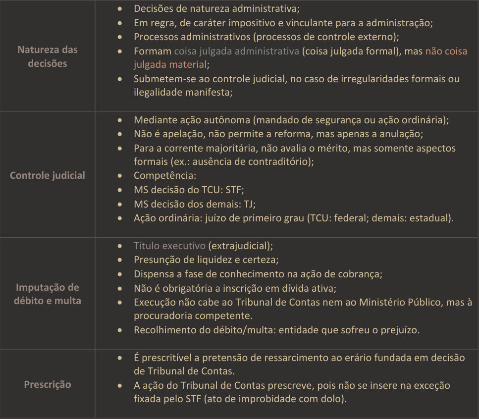

# **️1.Sistemas Administrativos:**

- **Contencioso administrativo/Sistema francês**: **Não é adotado no Brasil.**
- **Jurisdição única/Sistema inglês/Sistema judiciário/Sistema de controle judicial:** **Adotado no Brasil** e as decisões, em geral, **podem ser revistas pelo Judiciário.**
	-  Lembrar que **UNO** é **INGLÊS** e **não FRANCÊS (isso mesmo, lembre-se do famigerado automóvel Uno Way).**

# **2.Sistemas de controle e tribunais de contas no Brasil** 

- Recursos transferidos **voluntariamente** pela União (ex: art. 71, inc. VI, [[CF]]) → competência do TCU, pois o recurso é federal.
- Recursos transferidos **obrigatoriamente** pela União (ex: FPE, FPM) →  competência dos TCEs, pois o recurso é do estado/município.

Atualmente, temos **33 TCs**. A composição é assim:

- Tribunal de Contas da União (1)
- Tribunal de Contas do Distrito Federal (1)
- Tribunal de Contas do Estado (26)
- Tribunal de Contas DOS Municípios - **são órgãos estaduais** (3 - BA/PA/GO)
- Tribunal de Contas Municipal - **são órgãos municipais** (2 - RJ/SP)

# **3. Funções dos tribunais de contas no Brasil** 

- **Fiscalizadora:** verificar se há ilegalidades/irregularidades por meio de auditoria, inspeção, dentre outros.
- **Consultiva:** consiste na função de opinar do TC e, portanto, conhecida também como opinativa/consulta. Decorre dessa função, por exemplo, o parecer prévio sobre as contas de governo,
- **Judicante:** consiste no julgamento das contas dos gestores públicos ou daqueles que causarem prejuízo ao erário. Em algumas questões, essa função aparece com o nome de julgadora, jurisdicional ou contenciosa.
- **Sancionadora:** consiste em aplicar sanções (função sancionatória/punitiva). São exemplos:
    - multas;
    - inabilitação para exercício de cargo em comissão ou função de confiança;
    - declaração de inidoneidade para participar de licitações.
    - ⚠️Decretação de indisponibilidade dos bens e afastamento temporário do responsável são medidas mais atinentes à prevenção, logo, não entraria nessa função de sancionadora.
- **Corretiva:** consiste em determinar correção quando se identificar irregularidades/ilegalidades e em emitir recomendações. Exemplo clássico apresentado nas doutrinas: sustação de atos irregularidades.
- **Ouvidoria:** é exercida ao examinar denúncias e representações.
- **Informativa:** consiste em prestar informações, representar ao Poder competente sobre irregularidades, envio de relatório de atividades.
- **Pedagógica:** consiste em orientar os órgãos/administradores para melhorar a eficiência da máquina pública. Muitas bancas gostam de pontuar que a imposição de sanção também possui caráter pedagógico. Logo, não se espante se você se deparar com questões afirmando que a aplicação de sanções faz parte da função pedagógica. 
- **Normativa:** consiste na função de regulamentar, expedir instruções normativas, dentre outros.

# **4.Natureza jurídica dos Tribunais de Contas**

- Os TCs são **órgãos** técnicos-**administrativos** de cunho público pertencentes à **Administração Direta**. Como órgãos, **não têm personalidade jurídica própria**, vale dizer, **a sua personalidade jurídica é a personalidade do próprio ente** que ele integra.
- **Em regra, os TCs não possuem capacidade processual**, já que são órgãos (Teoria do Órgão estudada em DADM). Logo, quem figura em juízo não é o TC, mas sim, o ente federado ao qual ele pertence. No entanto, **existem situações em que se assegura ao Tribunal de Contas capacidade processual específica para a defesa de suas prerrogativas constitucionais**. 
    - Regra: não ter capacidade processual. Exceção: defender suas prerrogativas.
- TCs não são órgãos do judiciário.
- A doutrina majoritária e as Cortes superiores entendem que os TCs **não são órgãos do legislativo**, sendo órgãos autônomos e independentes, de baliza constitucional e que auxiliam as casas legislativas. Não há subordinação, portanto.
- O CNJ **não controla** o Tribunal de Contas da União, pois este não faz parte do Judiciário.

# **5. Natureza jurídica e eficácia das decisões dos TCs.**

- As decisões dos TCs possuem **natureza administrativa**. Em regra, elas possuem caráter **vinculante e impositivo**.
- Formam **coisa julgada administrativa (coisa julgada formal)**, mas não material (é possível, pelo princípio da inafastabilidade da tutela jurisdicional, recorrer-se ao judiciário quando se constatar irregularidade formal grave ou ilegalidade manifesta).
- Quando a decisão do TC imputa **débito e multa possuem a natureza de título executivo extrajudicial**, com presunção de liquidez e certeza. Vale ressaltar que **não são os TCs que executam esse título extrajudicial e nem os MPs**, mas sim a procuradoria competente. Ademais, **o recolhimento do débito/multa vai para a entidade que sofreu o prejuízo**!
    - ⚠️ STF (Tema 642): O Município prejudicado é o legitimado para a execução de crédito decorrente de multa aplicada por Tribunal de Contas estadual a agente público municipal, em razão de danos causados ao erário municipal. 
    - O Supremo também entendeu que o **estado-membro não tem legitimidade para promover execução judicial para cobrança de multa imposta por Tribunal de Contas estadual à autoridade municipal**, uma vez que a titularidade do crédito é do próprio ente público prejudicado, a quem compete a cobrança, por meio de seus representantes judiciais. Logo, o débito e a multa cabem ao próprio município. 
    - Leve para a prova os seguintes entendimentos:
        - **Multa proporcional ao dano ao erário** → deve ser executada pelo beneficiário da decisão (pacificado doutrina e Cortes superiores) e a ele pertencerá.
        - **Multa simples/comum** (decorre da inobservância das normas de direito financeiro ou outras infrações como o descumprimento de determinações, obstrução ao exercício do controle externo, dentre outros)  → deverá ser recolhida ao tesouro do ente político do qual o Tribunal de Contas faz parte, ainda que aplicado a agente público de outro ente da Federação (ainda não há pacificidade no tema)
   
   
- É **desnecessária** a inscrição do título executivo extrajudicial em dívida ativa.
- **Após a decisão do TC:** É **prescritível** a pretensão de ressarcimento ao erário fundada em decisão de Tribunal de Contas. A execução segue o rito previsto na **Lei de Execução Fiscal (Lei 6.830/1980)** **NÃO É DO CC/2002 e nem CPC/2015!**.  O prazo, no caso, será de **==cinco anos==**, para a cobrança do crédito fiscal e para a declaração da prescrição intercorrente. 
- **Antes da decisão do TC:** a ação do Tribunal de Contas, com o fito de responsabilizar determinado agente por dano ao erário, **está sujeita a prazo prescricional**. Embora não seja pacificado, o entendimento majoritário, atualmente, é o de que cada ente poderá legislar sobre o tema, podendo definir o prazo e o momento da contagem da prescrição.

# **6. Natureza das fiscalizações dos Tribunais de Contas**

- Os tipos de fiscalizações vêm da própria [[CF]]: **COFOP** (Contábil, Orçamentária, Financeira, Operacional e Patrimonial):
    - **Financeira**: arrecadação de receitas e execução de despesas;
    - **Orçamentária**: execução orçamentária (não é do planejamento);
    - **Contábil**: foco nos registros, nas demonstrações;
    - **Operacional**: foco na performance/desempenho (5Es - eficácia, eficiência, efetividade, economicidade e equidade)
    - **Patrimonial**: foco nos bens.

O Tribunal exerce o **controle da aplicação de subvenções**.  A Lei n° 4.320/1964) define:

- **subvenções sociais**, as que se destinem a instituições públicas ou privadas de caráter assistencial ou cultural, sem finalidade lucrativa;  
- **subvenções econômicas**, as que se destinem a empresas públicas ou privadas de caráter industrial, comercial, agrícola ou pastoril. 

# **7. Economicidade x eficiência x eficácia x efetividade** 

- **Economicidade:** é a minimização dos custos dos recursos utilizados na consecução de uma atividade, sem comprometimento dos padrões de qualidade. Logo, refere-se à capacidade de uma instituição gerir adequadamente os recursos financeiros colocados à sua disposição;
- **Eficiência:** é a relação entre os produtos (bens e serviços) gerados por uma atividade e os custos dos insumos empregados para produzi-los, em um determinado período de tempo, mantidos os padrões de qualidade. Assim, a eficiência trata do processo de transformação do insumo em produto;
- **Eficácia** é o grau de alcance das metas;
- **Efetividade:** trata do alcance dos resultados pretendidos, a médio e longo prazo.

# Questões

Corretiva = Corrigir
Sancionadora = punir

[[Controle Externo]]
[[Parecer Prévio]]
[[Responsabilização perante Tribunal de Contas]]
[[Eficiência, Eficácia, Efetividade e Economicidade]]
