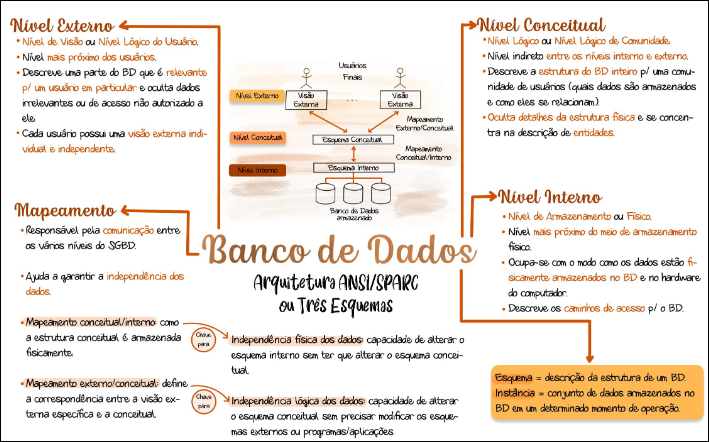
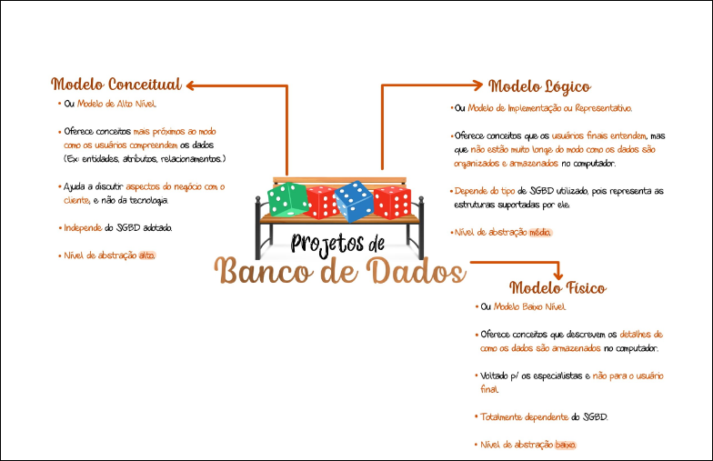

# 1. BD

Para a importância da integridade de dados na auditoria fiscal, veja: **[[99 - Conceitos Gerais/Auditoria Governamental]]**.

## 1.1 Conceitos

 Um <u>banco de dados</u> é uma **coleção de dados logicamente relacionados** que **representam algum aspecto do mundo real**, podendo ter qualquer tamanho e complexidade, e podendo ser manual ou computadorizado. Comumente representado por um cilindro.

Um **<u>sistema gerenciador de banco de dados</u>** é uma **coleção de programas** que permite aos usuários **criar e manter um banco de dados**, facilitando os processos de: 
- Definição 
- Construção
- Manipulação 
- Compartilhamento 
- Proteção 
- Manutenção

## 1.2 Características

- Autodescrição 
- Isolamento
- Suporte de múltiplas visões
- Compartilhamento de dados e processamento multiusuário

# 2.Transações

Uma transação é um programa em execução ou processo que inclui um ou mais acessos ao BD.

## 2.1 Atomicidade

Uma transação é uma unidade de processamento atômica que **deve ser executada integralmente até o fim ou não deve ser executada.** Se ocorrer tudo bem, devem ser confirmadas (COMMIT). Caso ocorra falha, devem ser desfeitas (ROLLBACK)

## 2.2 Consistência

A transação deve respeitar as **regras de integridade** dos dados, levando o banco de dados de um **estado consistente **para outro estado de consistência. <u>Estado de consistência é aquele que respeita todas as regras e restrições de integridade dos dados</u>.

## 2.3 Isolamento 

Essa propriedade evita que transações que ocorram simultaneamente interfiram uma nas outras. Para que uma transação leia os dados gravados por outra, é preciso que a outra esteja concluída

## 2.4 Durabilidade

Significa que os efeitos da transação são permanentes, isto é, que as alterações foram registradas e que somente poderão ser alteradas por outra transação bem-sucedida posterior

# 3. Arquitetura ANSI/SPARC (3 Esquemas)

- Esquema é a descrição da estrutura de um BD. 
- Instância é o conjunto de dados armazenados no BD em um determinado momento da operação. 

## 3.1 Nível Externo ou Visão 

Cada esquema externo descreve a **parte do banco de dados** que um dado grupo de usuários tem interesse e oculta o restante do banco de dados desse grupo

## 3.2 **Nível Conceitual**

Descreve a estrutura global do banco de dados como um todo, mas não fornece detalhes do modo como os dados estão fisicamente armazenados.

## 3.3 **Nível Interno**

Descreve a estrutura de **armazenamento físico** do banco de dados, utiliza um modelo de dados e descreve detalhadamente os dados armazenados e os caminhos de acesso ao banco de dados.

# Independência de dados

- **Independência LÓGICA de dados**: Capacidade de alterar o esquema conceitual sem ter de alterar os esquemas externos ou programas de aplicação
- Independência FÍSICA de dados: Capacidade de alterar o esquema interno sem ter de alterar o esquema conceitual.

## 🕸️ Grafo Local
