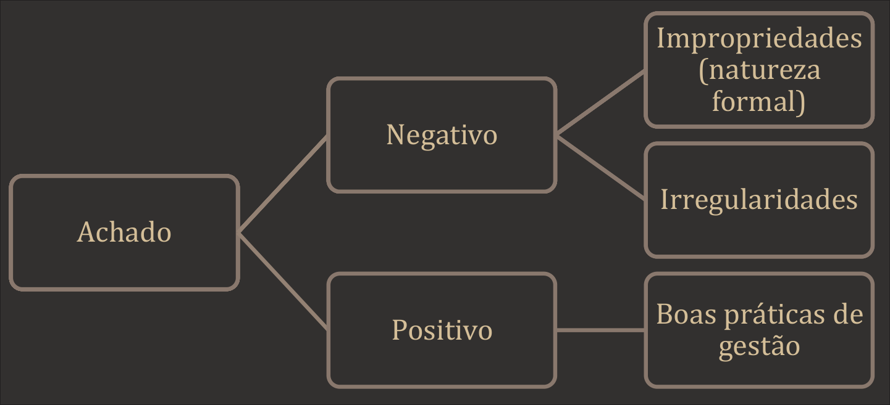
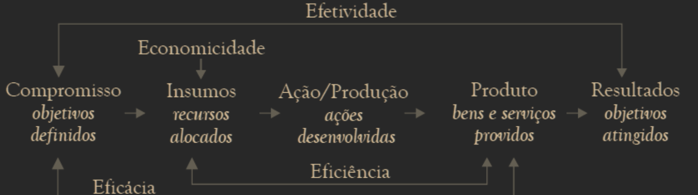

# 1. NORMAS DE AUDITORIA DO TCU – NAT

## 1.1. FUNDAMENTAÇÃO E JUSTIFICATIVA

- Baseadas na: [[CF]]/88, LO/TCU, RI/TCU, Código de Ética dos Servidores do TCU, Resoluções e Instruções Normativas e normas internacionais (ISSAI/INTOSAI).
- Objetivos:
    - Assegurar credibilidade e qualidade às auditorias.
    - Responsabilizar os auditores conforme normas geralmente aceitas.

## 1.2. BASES CONCEITUAIS

### 1.2.1 Accountability

- Obrigação de prestar contas pelos recursos e poderes recebidos.
- Dimensões:
    - **Informação**: transparência dos atos de gestão.
    - **Justificação**: explicação e motivação das ações.
    - **Sanção**: responsabilização por abuso de poder ou negligência.
- A auditoria atua como **instrumento** de governança para garantir accountability pública.

### 1.2.2 Conceito de Auditoria

- Definição geral: Auditoria é o processo sistemático, documentado e independente de se avaliar objetivamente uma situação ou condição para determinar a extensão na qual critérios são atendidos, obter evidências quanto a esse atendimento e relatar os resultados dessa avaliação a um destinatário predeterminado.
- **Características essenciais:**
    - **<u>Processo sistemático</u>:** a auditoria é um processo de trabalho planejado e **<u>metódico</u>**, pautado em avaliações e finalizado com a comunicação de seus resultados.
    - **<u>Processo documentado</u>:** o processo de auditoria deve ser **<u>fundado em documentos</u>** e padronizado por meio de procedimentos específicos, de modo a assegurar a sua revisão e a manutenção das evidências obtidas. Isso implica que a entidade de auditoria deve formalizar um método para executar suas auditorias, estabelecendo os padrões que elas deverão observar, incluindo regras claras quanto à documentação.
    - **<u>Processo independente</u>:** a auditoria deve ser **<u>realizada por pessoas com independência</u>** em relação às organizações, aos programas, aos processos, às atividades, aos sistemas e aos objetos examinados para assegurar a objetividade e a imparcialidade dos julgamentos.
    - **<u>Avaliação objetiva</u>**: os fatos devem ser avaliados com a **<u>mente livre de vieses</u>**. A avaliação objetiva leva a **<u>julgamentos imparciais</u>**, estritamente adequados às circunstâncias, precisos, e refletem na confiança no trabalho do auditor.
    - **Situação ou condição**: o estado ou a situação existente do objeto da auditoria, encontrado pelo auditor durante a execução do trabalho de auditoria.
    - **<u>Critério</u>**: _**<u>referencial</u>**_ a partir do qual o auditor faz seus julgamentos em relação à situação ou condição existente. Reflete com deveria ser a gestão. A eventual discrepância entre a situação existente e o critério originará o achado de auditoria.
    - **<u>Evidências</u>:** **<u>elementos de comprovação</u>** da discrepância (ou não) entre a situação ou condição encontrada e o critério de auditoria.
    - **<u>Relato de resultados</u>**: os resultados de uma avaliação de auditoria são **<u>relatados</u>** a um destinatário predeterminado, que normalmente não seja a parte responsável, por meio de um relatório, instrumento formal e técnico no qual o auditor comunica o objetivo, o escopo, a extensão e as limitações do trabalho, os achados de auditoria, as avaliações, opiniões e conclusões, conforme o caso, e encaminha suas propostas.

## 1.3. CLASSIFICAÇÃO DAS AUDITORIAS

- **Auditorias de** **regularidade** são as auditorias que objetivam examinar a _**<u>LEGALIDADE</u>**_ e a **<u>LEGITIMIDADE</u>** dos atos de gestão dos responsáveis sujeitos à jurisdição do Tribunal,
    - quanto aos aspectos contábil, financeiro, orçamentário e patrimonial.
        - Compõem as auditorias de regularidade as auditorias de **conformidade** e as auditorias **<u>contábeis</u>.**
- **Auditorias** **operacionais** objetivam examinar a _**<u>economicidade, eficiência, eficácia e efetividade</u>**_ de organizações, programas e atividades governamentais,
    - com a finalidade de avaliar o seu desempenho e de promover o aperfeiçoamento da gestão pública.

## 1.4. PLANEJAMENTO E EXECUÇÃO (Capítulo III)

### 1.4.1 Planejamento Geral das Auditorias

- De curto e longo prazo. (< 1 ano ^ > 1 ano)
- Integra ações de controle, capacitação e planos institucionais.
- Base em critérios: relevância, materialidade, risco, oportunidade.

### 1.4.2 Proposição de Auditorias

- Definir objetivo, escopo preliminar, recursos e prazos.
- Avaliação preliminar de riscos e controles.

### 1.4.3 Objetivos

- Avaliação de riscos relevantes, irregularidades e conformidade.

### 1.4.4 Alocação de Recursos

- Considerar **tempo, equipe e competências técnicas**.

### 1.4.5 Identificação e Avaliação de Objetivos, Riscos e Controles

- Obtenção de informações sobre o objeto auditado.
- Avaliação do controle interno com base em quatro objetivos:

| Objetivo do Controle Interno                      | Descrição                                              |
| ------------------------------------------------- | ------------------------------------------------------ |
| I. Eficiência, eficácia e efetividade operacional | Execução ética, ordenada e econômica.                  |
| II. Integridade e confiabilidade da informação    | Suporte à decisão e prestação de contas.               |
| III. Conformidade                                 | Obediência a leis, regulamentos e diretrizes.          |
| IV. Salvaguarda dos recursos                      | Prevenção contra perdas, danos e apropriação indevida. |

## 1.5. SUPERVISÃO, REVISÃO E COMUNICAÇÃO

### 1.5.1 Supervisão

- ==Deve ocorrer em== **todas** ==as fases==.
- **Independente** da competência individual do auditor.

### 1.5.2 Revisão

- Realizada por coordenador com perfil e competência adequados.
- Acompanha a finalização de cada etapa.

### 1.5.3 Comunicação Interna

- Troca constante entre equipe e supervisor.
- Relatar problemas, ameaças, sonegação de documentos ou riscos ao erário.

## 1.6. COMUNICAÇÃO COM O AUDITADO

- Informar a natureza e responsabilidades da auditoria.
- Requisição formal de documentos (via ofício, com prazo).
- Realizar reuniões formais com os responsáveis da entidade:

| Etapa            | Objetivo                                             |
| ---------------- | ---------------------------------------------------- |
| **Apresentação** | Informar escopo, objetivos e critérios da auditoria. |
| **Encerramento** | Apresentar verbalmente constatações preliminares.    |

- **Discussão prévia dos achados com o supervisor.**
- **Não incluir conclusões ou propostas no encerramento.**
- Achados são preliminares e sujeitos a modificação.

# [[1. PLANEJAMENTO]] E EXECUÇÃO DE AUDITORIAS - NAT

## 1.1. Credenciamento e Prerrogativas do Auditor

- Credenciamento: O auditor é formalmente credenciado para planejar, supervisionar, coordenar, executar e relatar auditorias mediante _Portaria de Fiscalização_.
- Prerrogativas (a partir da expedição da portaria e durante sua vigência):
    - **Livre ingresso** nas entidades jurisdicionadas.
        
    - **Acesso irrestrito** a processos, documentos, sistemas informatizados e quaisquer informações necessárias.
        
    - **Competência para requisitar documentos e informações**, com prazo razoável para atendimento.
        

## 1.2. Construção da Visão Geral do Objeto

- Objetivo: Obter compreensão inicial sobre o objeto da auditoria e seu contexto organizacional.
- Fontes de informação:
    - Legislação e normas específicas.
        
    - Organogramas, fluxogramas, rotinas e manuais.
        
    - Programas e ações gerenciadas pela entidade.
        
    - Planejamento estratégico e operacional.
        
    - Resultados de auditorias anteriores e diligências pendentes.
        
    - Contas de exercícios anteriores.
        
- Trabalhos prévios: Devem ser incorporadas informações obtidas em trabalhos de avaliação de objetivos, riscos e controles já realizados.
- Revisão posterior: A visão geral deve ser revisada ao final da execução para compor o relatório.
- **Conteúdo da visão geral:**
	I. Descrição do objeto da auditoria.  
	II. Legislação aplicável.  
	III. Objetivos institucionais.  
	IV. Setores responsáveis e suas competências.  
	V. Objetivos específicos e riscos associados, incluindo deficiências de controle interno.

## 1.3. Escopo da Auditoria

- Deve ser **suficiente para atender aos objetivos** do trabalho.
    
- **Componentes do escopo:**
    - Questões de auditoria.
        
    - Profundidade e detalhamento dos procedimentos.
        
    - Abrangência (universo auditável).
        
    - Extensão da amostra.
        
    - Oportunidade dos exames.
        
- **Identificação de fatos fora do escopo:**

	 1. **Relacionados ao objetivo e questão da auditoria:** pode-se alterar o planejamento (com aprovação do supervisor).
        
	2. **Relacionados ao objetivo, mas fora do escopo original:** avalia-se se vale a pena incluí-los (sem comprometer o trabalho).
        
	3. **Fatos incompatíveis com o objetivo ou natureza da auditoria:** possível nova ação de controle ou processo apartado.
        

## 1.4. Programas e Procedimentos de Auditoria

- **Plano de auditoria:**
    - Deve documentar o objetivo, escopo, prazo e alocação de recursos.
        
- **Programas de auditoria:**
    - Devem ser desenvolvidos com base nos objetivos definidos.
        
    - Devem conter:
        
        - Procedimentos, técnicas e critérios de auditoria.
            
        - Universo e amostra a serem examinados.
            
        - Informações requeridas e fontes.
            
        - Cronogramas.
            
        - Recursos necessários.
            
- **Instrumentos utilizados:**
    - Matrizes de planejamento.
        
    - Matrizes de achados.
        
- **Limitações de escopo:**
    - Devem ser registradas, principalmente se decorrerem de restrição de acesso a informações ou registros.

## 1.5. Desenvolvimento dos Achados

- Achado é um fato significativo, digno de relato, que possui 4 atributos essenciais:
    
- **Atributos dos achados:**

I. **Situação encontrada:** condição existente observada, com período de ocorrência.  
II. **Critério:** referencial normativo (legislação, contrato, jurisprudência, boas práticas, etc.).  
III. **Causa:** razão da discrepância entre situação e critério.  
IV. **Efeito:** consequência real ou potencial da discrepância.

- **Tipos de achado:**
    - **Negativo:**
        
        - **Impropriedade:** falha formal sem dano ao erário.
            
        - **Irregularidade:** ato ilegal, ilegítimo, antieconômico ou com dano ao erário.
            
    - **Positivo:** identifica boas práticas de gestão.
        
- **Requisitos de um bom achado:**
    - Relevância.
        
    - Fundamentação objetiva e baseada em evidências.
        
    - Consistência lógica.
	
        

## 1.6. Evidências de Auditoria

- **Requisitos para as evidências:**
    - **Suficientes**: quantidade e qualidade que sustentem as conclusões.
        
    - **Adequadas**: exatas, confiáveis e pertinentes.
        
    - **Pertinentes**: diretamente relacionadas aos achados.
        
    - **Autênticas**: válidas e legítimas.
        
- **Tipos de evidências:**
    - **Documentais:** mais confiáveis que orais.
        
    - **Testemunhais:** preferencialmente reduzidas a termo e corroboradas.
        
    - **Observacionais:** obtidas por inspeção direta.
        
    - **Analíticas:** resultantes de exames e cálculos.
        
- **Atributos das evidências:**

I. **Validade**: baseadas em informações precisas.  
II. **Confiabilidade**: resultados consistentes em auditorias repetidas.  
III. **Relevância**: conexão lógica com objetivos e critérios.  
IV. **Suficiência**: quantidade adequada conforme materialidade e risco.

## **1.7. Documentação da Auditoria**

- Registro de verificações, informações, procedimentos, achados e conclusões.
- Características esperadas: Clareza, organização, racionalidade e finalidade definida.
- Revisão detalhada pelo próprio auditor e por revisores independentes.
    
- Classificação ao final da auditoria:
    - Papéis Transitórios: utilizados pontualmente.
        
    - Papéis Permanentes: úteis para auditorias futuras.

# **1. UTILIZAÇÃO DO TRABALHO DE TERCEIROS**

## **1.1. Fontes externas de auditoria:**

- A equipe de auditoria pode utilizar trabalhos de **auditoria interna**, **outras EFS** ou **entidades de controle**.
- Podem auxiliar no:
    - Planejamento e execução da auditoria;
        
    - Definição de natureza, oportunidade e extensão dos procedimentos;
        
    - Corroboração de evidências;
        
    - Outros usos permitidos.
        

## **1.2. Responsabilidade da equipe de auditoria:**

- **Não se exime de responsabilidade ao utilizar trabalhos de terceiros.**
    
- Deve revisar as **evidências** dos outros auditores e **compartilhar das conclusões**.
    

## **1.3. Especialistas:**

- Podem **compor a equipe** ou serem **contratados como apoio técnico**.
    
- A **unidade técnica coordenadora** deve avaliar:
    
    - Competência profissional;
        
    - Imparcialidade;
        
    - Independência;
        
    - Compromisso com a **confidencialidade**;
        
    - Aderência às **NAT**.
        

# 2. COMUNICAÇÃO DOS RESULTADOS

## 2.1. **Relatório de Auditoria**

Instrumento técnico que comunica:

- Objetivo e questões de auditoria;
    
- Escopo e limitações;
    
- Metodologia;
    
- Achados, conclusões e propostas de encaminhamento.
    

**REQUISITOS DE QUALIDADE DOS RELATÓRIOS (NAT)**

✳️CLAREZA: produzir textos de fácil compreensão.

- Evitar **a erudição, o preciosismo, o jargão, a ambiguidade** e restringir ao máximo a utilização de expressões em outros idiomas, exceto quando se tratar de expressões que não possuam tradução adequada para o idioma português e que já se tornaram corriqueiras. Termos técnicos e siglas menos conhecidas devem ser utilizados desde que necessários e devidamente definidos em glossário. Quando possível, complementar os textos com ilustrações, figuras e tabelas.

✳️CONVICÇÃO: expor os achados e as conclusões com firmeza, demonstrando certeza da informação comunicada, evitando palavras ou expressões que denotem insegurança, possam ensejar dúvidas ou imprecisões no entendimento, tais como “SMJ”, “supõe-se”, “parece que”, “deduzimos”, “achamos”, “há indícios”, “talvez”, “entendemos”, “esta equipe de auditoria entende que...”, “foi informado a esta equipe de auditoria que...”, “ouvimos dizer”, “conforme declarações verbais”, “boa parte”, “alguns”, “diversos” “a maioria”, “muitas/vários/inúmeros”, “aparenta/aparentemente”;

✳️CONCISÃO: ir direto ao assunto, utilizando linguagem sucinta, transmitindo o máximo de informações de forma breve, exata e precisa. Dizer apenas o que é requerido, de modo econômico, isto é, eliminar o supérfluo, o floreio, as fórmulas e os clichês. 

✳️COMPLETUDE: apresentar toda a informação e todos os elementos necessários para satisfazer os objetivos da auditoria, permitir a correta compreensão dos fatos e situações relatadas. 

✳️EXATIDÃO: apresentar as necessárias evidências para sustentar seus achados, conclusões e propostas, procurando não deixar espaço para contra-argumentações. A exatidão é necessária para assegurar ao leitor que o que foi relatado é fidedigno e confiável. 

✳️RELEVÂNCIA: expor apenas aquilo que tem importância dentro do contexto e que deve ser levado em consideração em face dos objetivos da auditoria. 

✳️TEMPESTIVIDADE: emitir tempestivamente os relatórios de auditoria para que sejam mais úteis aos leitores destinatários, particularmente aqueles a quem cabem tomar as providências necessárias. Auditores devem cumprir o prazo previsto para a elaboração do relatório, sem comprometer a qualidade;

✳️OBJETIVIDADE: harmonizar o relatório em termos de conteúdo e tom. 

✅O relatório de auditoria pode reconhecer **os aspectos positivos do objeto auditado**, se aplicável aos objetivos da auditoria. 

- ✅Quando não seguirem as NAT na íntegra ou segui-las com restrições ou adaptações, como nas situações em que tiverem ocorrido limitações de escopo em função de restrições de acesso a registros oficiais do governo ou de outras condições específicas necessárias para conduzir a auditoria,
	- os auditores devem declarar no relatório
		- **os requisitos que não foram seguidos**,
		- **as razões** para não terem seguido e
		- como isso afetou ou pode ter afetado os objetivos, os resultados e as conclusões da auditoria.

## 2.2. ESTRUTURA DOS RELATÓRIOS

1. **Elementos obrigatórios:**
    
    - Deliberação que autorizou a auditoria;
        
    - Declaração de conformidade com as NAT;
        
    - Objetivo, questões de auditoria e escopo;
        
    - Metodologia (com destaque para amostragem, critérios e incertezas);
        
    - Visão geral do objeto auditado;
        
    - Achados, conclusões e propostas de encaminhamento;
        
    - Volume de recursos fiscalizados (VRF);
        
    - Benefícios estimados ou esperados;
        
    - Informações confidenciais (se houver).
        
2. **Visão Geral do Objeto:**
    
    - Apresenta contexto legal, institucional e operacional;
        
    - Elaborada no planejamento e **revisada na execução**.
        

# 3. APRESENTAÇÃO DOS ACHADOS

- **Elementos estruturantes (matriz de achados):**
    
    - Título, situação encontrada, objetos auditados, critérios, evidências, causas, efeitos, responsáveis, esclarecimentos, conclusão da equipe e proposta de encaminhamento.
        
- **Avaliação de impactos:**
    
    - Quantificação em número de casos, valores, impactos qualitativos;
        
    - Achados graves demandam **identificação de responsáveis** (rol no processo) e avaliação com **matriz de responsabilização**.
        
- **Impropriedade x Irregularidade:**
    
    - Impropriedade: falha formal ou ineficiência, **sem dano direto** ao erário.
        
    - Irregularidade: falha **material**, com potencial ou efetivo dano ao erário, ou que fere normas legais.
        

# 4. ESCLARECIMENTOS E COMENTÁRIOS

1. **Esclarecimentos dos responsáveis:**
    
    - Devem ser anexados aos achados;
        
    - Resultam de ofícios formais;
        
    - Devem ser analisados pela equipe.
        
2. **Comentários dos gestores:**
    
    - **Auditorias operacionais:** envio obrigatório;
        
    - **Demais auditorias:** envio obrigatório se houver achados de grande impacto, ou a critério do relator.
        
    - Comentários não configuram contraditório;
        
    - Devem ser enviados por ofício e incorporados **resumidamente**.
        

# 5. CONFIDENCIALIDADE E ANEXOS

- Informação sensível/confidencial: tratar como **sigilosa** mediante avaliação da unidade técnica.
    
- Anexos: conteúdos não essenciais ou de grande volume (ex: tabelas, gráficos, descrições técnicas).
    

# 6. CONCLUSÕES

1. **Conteúdo da seção de conclusão:**
    
    - Resposta à **questão fundamental da auditoria**;
        
    - Respostas às **questões de auditoria** do escopo;
        
    - Destaque de **pontos fortes e fracos**, **benefícios esperados**, **iniciativas dos gestores**;
        
    - **Generalização** dos resultados:
        
        - **Amostragem probabilística**: permite generalização com incerteza calculada;
            
        - **Não probabilística**: conclusões limitadas aos casos examinados.
            
2. **Força da conclusão:**
    
    - Baseada na **suficiência e adequação das evidências** e na **lógica da análise**.
        

# 7. PROPOSTAS DE ENCAMINHAMENTO

1. **Vinculação com achados e conclusões:**
    
    - Devem indicar **o que** deve ser feito (**==não como==**);
        
    - Enquadram-se como:
        
        - Recomendações;
            
        - Determinações;
            
        - Medidas saneadoras;
            
        - Medidas cautelares, entre outras.
            
2. **Boas práticas:**
    
    - Indicar parágrafos de origem;
        
    - Formular com base nas **causas**;
        
    - Recomendações específicas somente em casos justificados.
        

# 8. MONITORAMENTO DE DELIBERAÇÕES

- Determinações: **monitoramento obrigatório**.
    
- Recomendações: monitoramento a critério do Tribunal.
    
- Auditor deve priorizar **resolução dos problemas**, não mero cumprimento formal.
    

# 9. DISTRIBUIÇÃO E DIVULGAÇÃO DOS RELATÓRIOS

- Destinados aos **relatores e colegiados**.
    
- Divulgação somente após apreciação formal (ou autorização específica).
    
- Formas e conteúdo da divulgação variam conforme o público e a finalidade.

# 1. CARACTERÍSTICAS DA AUDITORIA OPERACIONAL

- Conceito: Exame independente e objetivo da economicidade, eficiência, eficácia e efetividade de organizações, programas e atividades governamentais, visando ao aperfeiçoamento da gestão pública.
- Características principais:
- Flexibilidade na escolha de temas, objetos, métodos e comunicação.
    - Utiliza métodos analíticos e das ciências sociais.
    - Requer **conhecimento especializado**, flexibilidade e capacidade analítica.
    - Envolve **gestores auditados** ao longo de todo o processo.
    - Relatórios mais **argumentativos**, com recomendações para melhorar a gestão.
    - Materialidade considerada de forma **qualitativa**, não apenas quantitativa.

# 2. DIMENSÕES DE DESEMPENHO

| Dimensão          | Foco principal | Descrição                                                                                                                  |
| ----------------- | -------------- | -------------------------------------------------------------------------------------------------------------------------- |
| **Economicidade** | Gastos         | Minimização dos custos mantendo qualidade. Usa bem os recursos disponíveis. CUSTO X QUALIDADE                              |
| **Eficiência**    | Produção       | Relação entre insumos e produtos gerados. Medida por custo unitário, tempo e recursos. OTIMIZAÇÃO DOS RECURSOS             |
| **Eficácia**      | Metas          | Grau de alcance das metas, **independente do custo**. Refere-se a **objetivos imediatos**. ALCANCE DAS METAS               |
| **Efetividade**   | Impacto        | Avaliação dos **efeitos de médio/longo prazo** na população-alvo (impacto real). IMPACTO X AÇÃO                            |
| **Equidade**      | Justiça social | Considera tratamento diferenciado como forma de justiça. Visa garantir o exercício de direitos civis, políticos e sociais. |

# 3. AUDITORIA OPERACIONAL X DE REGULARIDADE

| Aspectos               | Auditoria Operacional                        | Auditoria de Regularidade        |
| ---------------------- | -------------------------------------------- | -------------------------------- |
| Escolha de temas       | Flexível                                     | Padrões fixos                    |
| Objetivo               | Avaliar desempenho (4 Es + equidade)         | Conformidade com normas          |
| Relatório              | Analítico, interpretativo, com recomendações | Opinativo e padronizado          |
| Base metodológica      | Ciências sociais e outras áreas              | Normas contábeis, legais         |
| Materialidade          | Avaliação qualitativa e contextual           | Montantes financeiros envolvidos |
| Participação do gestor | Essencial em várias etapas                   | Menor interação direta           |

# 4. CICLO DA AUDITORIA OPERACIONAL

1. **Seleção de Tema**
    - Deve estar alinhada ao planejamento estratégico e anual.
    - Considera **materialidade, relevância, vulnerabilidade** e **agregação de valor**.
2. **Planejamento**
    - **Análise preliminar** do objeto de auditoria.
    - Definição de **objetivo**, **escopo** e **questões de auditoria**.
    - Elaboração da **matriz de planejamento**.
    - Validação, testes-piloto e elaboração do projeto.
3. **Execução**
    - Coleta e análise de dados.
    - Fundamentação dos achados, elaboração do relatório.
4. **Monitoramento**
    - Acompanhamento da implementação das recomendações.
    - Avaliação dos benefícios resultantes.

# 5. CRITÉRIOS DE SELEÇÃO DO OBJETO DE AUDITORIA

| Critério               | Descrição                                                             |
| ---------------------- | --------------------------------------------------------------------- |
| **Agregação de valor** | Geração de novos conhecimentos e perspectivas.                        |
| **Materialidade**      | Montantes financeiros, escopo do orçamento, possibilidade de impacto. |
| **Relevância**         | Interesse público, visibilidade social e política.                    |
| **Vulnerabilidade**    | Fragilidades do objeto auditado que indicam risco de falhas ou danos. |

# 6. PLANEJAMENTO: ETAPAS E ELEMENTOS

- **Análise preliminar**:
    - Levantamento de informações sobre o objeto.
    - Avaliação de controles internos e sistemas.
    - Identificação de riscos e pontos críticos.
- **Definição de objetivo e escopo**:
    - Objetivo: define o problema a investigar e justifica o tema.
    - Escopo: delimitação dos aspectos a serem analisados.
- **Questões de auditoria**:
    - Devem ser claras, específicas, mensuráveis e viáveis.
    - Fundamentam as decisões metodológicas e estruturam a auditoria.

# **1. TIPOS DE QUESTÃO DE AUDITORIA** 

- **Questões Descritivas**
    - Objetivo: **Obter informações detalhadas sobre a implementação ou operação de programas**.
    - Exemplo: “Como os executores locais estão operacionalizando os requisitos de acesso estabelecidos pelo programa?”
- **Questões Normativas**
    - Objetivo: **Comparar a situação atual com padrões, normas ou metas estabelecidas.**
    - Exemplo: “O programa tem alcançado as metas previstas?”
- **Questões Avaliativas (Impacto ou Causa e Efeito)**
    - Objetivo: **Avaliar a efetividade da intervenção governamental.**
    - Exemplo: “Em que medida os efeitos observados podem ser atribuídos ao programa?”
- **Questões Exploratórias**
    - Objetivo: **Explicar eventos específicos ou identificar causas de desvios.**
    - Exemplo: “Que fatores explicam o aumento nos gastos com auxílio-doença?”
        

# **2. CRITÉRIOS DE AUDITORIA**

- Definição: **Padrões de desempenho** que servem para medir economicidade, eficiência, eficácia e efetividade.
- Fontes: Normas legais, literatura especializada, boas práticas.
- Importância: **Viabilizam a comparação entre a situação existente (condição) e o que deveria ser (critério).**

# **3. MATRIZ DE PLANEJAMENTO**

- Função: Quadro-resumo que orienta o planejamento e a execução.
- Conteúdo: Problema, questões de auditoria, critérios, procedimentos, fontes e estratégias metodológicas.
- Validação:
    - Revisão pelo supervisor.
    - Painel de referência.
    - Apresentação e validação pelo gestor auditado.
# **4. EXECUÇÃO DA AUDITORIA**

- **Achado de Auditoria:** Resultado da comparação entre critério (o que deveria ser) e condição (o que é).
    - **Componentes:**
        - Critério
        - Condição
        - Causa
        - Efeito
- **Evidências**
    - **Definição:** Informações que fundamentam os achados.
    - **Requisitos:** Validade, confiabilidade, relevância e suficiência.

- **Características:**

- **Classificação:**

| **Obtenção de Evidência do Tipo:** | **Técnicas:**                                                                                                                                                      |
| ---------------------------------- | ------------------------------------------------------------------------------------------------------------------------------------------------------------------ |
| **Física**                         | Inspeção física e observação direta                                                                                                                                |
| **Documental**                     | Exame documental e circularização                                                                                                                                  |
| **Testemunhal**                    | Indagação escrita e oral (entrevista)                                                                                                                              |
| **Analítica**                      | Conferência de cálculos (recálculo), conciliação, análise de contas, revisão analítica, reexecução, extração eletrônica de dados e cruzamento eletrônico de dados. |

### **5. MATRIZ DE ACHADOS**

- Estrutura os achados e respectivas análises.
- Apoia a elaboração do relatório.
- Validação:
    - Painel de referência (2ª rodada).
    - Validação final pelos gestores auditados.

# **6. RELATÓRIO DE AUDITORIA**

- Instrumento formal e técnico por intermédio do qual a equipe comunica o objetivo e as questões de auditoria, a metodologia usada, os achados, as conclusões e a proposta de encaminhamento.
- O principal instrumento de apoio à elaboração do relatório de auditoria é a matriz de achados.

# **7. MONITORAMENTO**

- Finalidade: Verificar implementação das deliberações e seus efeitos.
- Importância:
    - Promove a efetividade da auditoria.
    - Atualiza diagnóstico.
    - Identifica barreiras à implementação.

## **Plano de Ação**

- Documento do gestor com cronograma, responsáveis e medidas.

## **Classificação da Situação das Deliberações:**

- Implementada
- Parcialmente implementada
- Em implementação
- Não implementada
- Não mais aplicável

# **8. CONTROLE DE QUALIDADE**

- Conjunto de políticas e procedimentos para garantir qualidade técnica e conformidade com normas.
- Tipos:
	- **Concomitante:** Durante a auditoria (orientação, revisões, painéis).
	- **A posteriori:** Revisões internas ou externas após a auditoria.
- Ferramentas:
	- Checklists
    - Cronograma
    - Matrizes de planejamento e achados
    - Painéis de referência
    - Comentários dos gestores

# **9. ESTRATÉGIAS METODOLÓGICAS**

- Conjunto de abordagens e métodos para investigar as questões de auditoria.
- **Principais Métodos:**
	- **Pesquisa Documental:** Registros administrativos, estatísticas, relatórios anteriores.
    - **Estudo de Caso:** Análise profunda e contextualizada de situação complexa.
    - **Pesquisa (Survey):** Quantitativa e/ou qualitativa. Pode ser amostral.
    - **Pesquisa Experimental:**
        - Grupos de controle e tratamento.
        - Seleção aleatória.
        - Alta confiabilidade causal.
    - **Pesquisa Quase-Experimental:**
        - Sem aleatoriedade.
        - Seleção por conveniência.
        - Aplicação de pré-teste para mitigar vieses.
    - **Pesquisa Não-Experimental:**
        - Observação sem controle de variáveis.
        - Informativa, mas não permite atribuição causal direta.

# **1. MATRIZ DE RESPONSABILIZAÇÃO**

## **1.1 Conceito e Finalidade**

- Ferramenta acessória ao controle de qualidade.
    
- Deve ser utilizada **exclusivamente** nos casos de **achados que configuram irregularidades**, com **propostas de audiência ou citação** de responsáveis.
    
- Finalidade: subsidiar a **fundamentação** das propostas de responsabilização e **analisar defesas** apresentadas.

## **1.2 Importância**

- Permite descrever condutas, vincular responsáveis aos resultados e estruturar um juízo de valor mais sólido.
    
- Instrumento essencial para:
    
    - Análise do **nexo de causalidade**.
        
    - Verificação de **culpabilidade**.
        
    - Julgamento de **mérito** de defesas.
        

## **1.3 Campos da Matriz de Responsabilização**

| CAMPO                    | DESCRIÇÃO                                                                                                                                                                                             |
| ------------------------ | ----------------------------------------------------------------------------------------------------------------------------------------------------------------------------------------------------- |
| **Responsável**          | Identificar nome, CPF, cargo, função, atribuições, etc.                                                                                                                                               |
| **Período de Exercício** | Delimitação temporal da irregularidade e da atuação do agente. Fundamenta a responsabilidade e dosimetria da pena.                                                                                    |
| **Conduta**              | Descrever o ato do responsável que causou a irregularidade, usando verbos no infinitivo (ex: “deixar de prestar contas”). Incluir a conduta correta esperada e, se aplicável, os normativos violados. |
| **Nexo de Causalidade**  | Relação entre a conduta e o resultado. Necessária demonstração de vínculo mínimo de culpa.                                                                                                            |
| **Culpabilidade**        | Juízo de censura sobre a conduta; reprovabilidade da omissão ou ação do agente que tinha o dever de agir.                                                                                             |

# **2. INSTRUMENTOS DE FISCALIZAÇÃO DO TCU**

#### **3. PLANO DE FISCALIZAÇÃO**

- Aplicável **somente** às auditorias, acompanhamentos e monitoramentos (**mnemônico: A.M.A.**).
    
- Elaboração:
    - Elaborado pela Presidência, consultando relatores.
        
    - Aprovado em sessão reservada do Plenário.
        

###  **Levantamentos e Inspeções**

- Realizados **independentemente de programação**, por decisão do Plenário, Câmara, Relator ou Presidente.

### **DICAS DE FIXAÇÃO**

- **Matriz de Responsabilização**: só é usada **em caso de irregularidade** com proposta de **audiência ou citação**.
    
- **Conduta ≠ Irregularidade**: descrever **o ato praticado**, não o resultado.
    
- **A.M.A.**: Auditoria, Monitoramento e Acompanhamento → seguem o plano de fiscalização.
 

- **Auditoria Regularidade x Auditoria Operacional**:
    
    - Regularidade → conformidade legal.
        
    - Operacional → eficiência, eficácia e economicidade.
        
- **Inspeção ≠ Levantamento**:
    
    - Inspeção → apuração pontual.
        
  
### Tipos de acompanhamento na auditoria
  
  - **Auditoria Contínua**: automação + integração + tecnologia da informação (não se limita apenas à área de TI nem depende de simplificar processos)
	- **Avaliação de riscos** de forma <u>contínua e automatizada</u>
	- **cobertura** de <u>100%</u> das operações
	- **definição** de <u>prioridades</u> por **indicadores** em <u>tempo real</u>      - Levantamento → mapeamento e análise prévia.
	- Priorização ocorre em "real time" com base nos indicadores calculados
	- Utilização de dados/informações correntes para identificação das necessidades de auditoria
- **Auditoria Tradicional**
	- **Testes cíclicos com base em dados históricos** (muitas vezes ocorrendo meses após as atividades acontecerem)
	- **Bases amostrais para análise**
	- Priorização ocorre semestralmente / anualmente, durante a elaboração do plano de Auditoria
	- Enforque voltado para revisão de documentação

[[Achado de Auditoria]]
[[Matriz de Achados]]
[[Relatório de Auditoria]]
[[Monitoramento de Deliberações]]
[[Auditoria Operacional]]
