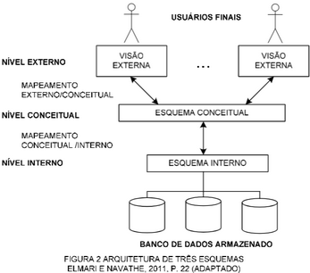

# **1.CONCEITO GENÉRICO DE BANCO DE DADOS**

- Um banco de dados (BD) (ou repositório de dados ou depósito de dados) é uma **coleção de dados relacionados** entre si com uma finalidade específica.

# **2. CONCEITO ESPECÍFICO DE BANCO DE DADOS**

Um banco de dados deverá possuir as seguintes características:

- Um banco de dados deve ser projetado, construído e populado com **dados logicamente coerente e com um determinado significado inerente**;
- Deve possuir um **conjunto predefinido de usuários e aplicações**;
- **Representar algum aspecto do mundo real**, o qual é chamado de “mini-mundo”. Qualquer alteração efetuada no mini-mundo é automaticamente refletida no banco de dados.

**Definição simplificada de Banco de Dados:**

_“Conjunto de dados integrados (logicamente relacionados) que tem por objetivo atender a uma comunidade de usuários (finalidade específica)”_

# **3. CONCEITO DE SISTEMA GERENCIADOR DE BANCO DE DADOS (SGBD)**

_“Software que incorpora as funções de definição, recuperação e alteração de dados em um banco de dados.”_

# **4. CONCEITO DE SISTEMA DE BANCO DE DADOS**

Um sistema de Banco de Dados é formado por:

1. Dados (banco de dados)
2. Hardware
3. Software (SGBD)
4. Pessoas (usuários e técnicos)

De maneira simplificada, podemos dizer que:

**Sistema de Banco de dados = Banco de dados + SGBD**

# **5. PRINCIPAIS CARACTERÍSTICAS DE UM BANCO DE DADOS**

Segundo Elmasri, 2011, as características abaixo podem distinguir a abordagem de banco de dados:

- Natureza de **autodescrição** de um sistema de banco de dados;
	- O banco de dados possui em seu sistema não só o conjunto de dados, mas também uma **definição/descrição completa** da sua **estrutura** e **restrições;**
- **Isolamento** entre programas e dados, e abstração de dados;
	- A estrutura dos arquivos de dados é armazenada no catálogo de dados, separada dos programas de acesso ( independência dos dados);
		- **Independência Lógica de Dados:** Refere-se à capacidade de mudar a estrutura lógica dos dados sem alterar os programas de aplicação. 
		- **Independência Física de Dados:** Refere-se à capacidade de mudar a estrutura física dos dados sem alterar a estrutura lógica ou os programas de aplicação. 
	- Segundo ELMASRI e NAVATHE (2011, p. 19), a abstração de dados “refere-se à supressão de detalhes da organização e armazenamento de dados, destacando recursos essenciais para um melhor conhecimento desses dados”;
	- Em outras palavras, é possível **descrever o banco de dados sem ater-se a especificidades de hardware e software;**
- Suporte de **múltiplas visões** dos dados;
	- Uma vez que o banco de dados pode possuir vários usuários, cada usuário pode ter uma **visão específica** do banco de dados;
	- Uma visão é uma **maneira de observação dos dados** do banco de dados, que pode ser um subconjunto ou conter dados virtuais que são derivados do banco de dados original;
- Compartilhamento de dados e processamento de transação **multiusuário**;
	- O sistema de banco de dados deve permitir o acesso **simultâneo** de vários usuários.

# **6. TRANSAÇÕES A.C.I.D. ou (D.I.C.A)**

ACID é um termo que descreve as propriedades que garantem a integridade das transações em um banco de dados:

- **A**tomicidade
	- Garante que as transações sejam <u>indivisíveis</u> (atômicas), ou seja, ou elas ocorrem em sua <u>totalidade</u>, ou <u>nenhuma</u> delas ocorrem.
	- **COMMIT:** operação utilizada quando a transação é <u>concluída com sucesso</u> (e os dados são alterados salvos em disco)
	- **ROLLBACK:** operação utilizada se <u>houver falha</u> nas operações da transação, o banco retornará ao estado anterior ao início da operação.
	- Responsável: Subsistema de controle de transações

- **C**onsistência
	- A transação deve respeitar as <u>regras de integridade</u> dos dados, levando o banco de dados de um <u>estado consistente</u> para outro estado de consistência.
	- Responsável: Subsistema de Controle de Integridade

- **I**solamento
	- Essa propriedade evita que transações que ocorram simultaneamente <u>interfiram uma nas outras</u>. Para que uma transação leia os dados gravados por outra, é preciso que a outra esteja concluída.
	- Responsável: Subsistema de Controle de Concorrência

- **D**urabilidade
	- Significa que os efeitos da transação são <u>permanentes</u>, isto é, que as alterações foram registradas e que somente poderão ser alteradas por outra transação bem-sucedida posterior.
	- Responsável: Subsistema de Recuperação

# **7. ARQUITETURA DE TRÊS ESQUEMAS**

Conceitos relevantes

- **Esquema** é a “descrição formal da estrutura de um banco de dados” (Heuser, 2004)
- “O conjunto de informações contidas em determinado banco de dados,em um dado momento, é chamado **instância** do banco de dados” (SILBERSCHATZ; KORTH;SUDARSHAN,1999,p.6).

A arquitetura de três esquemas ( **arquitetura ANSI/SPARC** ), é uma arquitetura para sistemas de banco de dados e tem o objetivo de separar as aplicações do usuário do banco de dados físico.

É organizada em **três níveis**:

- **Nível Externo ou Visão**: cada esquema externo descreve a **parte do banco de dados** que um dado grupo de usuários tem interesse e oculta o restante do banco de dados desse grupo.
- **Nível Conceitual:** descreve a estrutura global do banco de dados como um todo, mas não fornece detalhes do modo como os dados estão fisicamente armazenados.
- **Nível Interno**: descreve a estrutura de **armazenamento físico** do banco de dados, utiliza um modelo de dados e descreve detalhadamente os dados armazenados e os caminhos de acesso ao banco de dados.

# **8. INDEPENDÊNCIA DE DADOS**

É a capacidade de **mudar o esquema em um nível** do sistema de banco de dados **sem** que ocorram **alterações** do esquema no **próximo nível mais alto**.

(1) **Independência LÓGICA de dados** é a capacidade de alterar o esquema conceitual sem ter de alterar os esquemas externos ou programas de aplicação.

(2) **Independência FÍSICA de dados** é a capacidade de alterar o esquema interno sem ter de alterar o esquema conceitual.

|   modelo   | grau de abstração |              dependência              | compreensão pelo usuário final |      exemplo      |
| :--------: | :---------------: | :-----------------------------------: | :----------------------------: | :---------------: |
| conceitual |       alto        |                nenhum                 |             fácil              |        MER        |
|   lógico   |       médio       |    somente software (tipo do sgbd)    |             médio              | modelo relacional |
|   físico   |       baixo       | hardware e software (sgbd especifico) |            difícil             |  depende do sgbd  |

# 9. Balanceamento de Carga por Transação e princípio de failover

- O **balanceamento de carga** é utilizado em sistemas distribuídos para distribuir as requisições de usuários ou clientes entre diversos nós (servidores) do sistema. Isso é feito para **<u>evitar sobrecarga</u>** em um único nó e **<u>garantir que o sistema funcione de forma eficiente e ininterrupta</u>**.
- A **<u>replicação de dados</u>** é uma técnica usada para garantir **<u>alta disponibilidade e confiabilidade do sistema</u>**, onde os dados são copiados de um nó para outro. Existem diferentes níveis de replicação, incluindo replicação de nós e replicação de transações. **<u>A replicação de nó envolve copiar todos os dados de um nó para outro, enquanto a replicação de transação envolve copiar apenas as transações</u> (conjunto de operações realizadas em uma ou mais tabelas) que ocorreram em um nó para outro.**
- **<u>Failover</u>** é a capacidade de um sistema de computador alternar para uma solução de backup ou redundante em caso de falha ou indisponibilidade do sistema principal. É uma estratégia comum usada em sistemas críticos para **<u>manter a continuidade dos serviços e minimizar o tempo de inatividade</u>** em caso de falhas. Quando ocorre uma falha no sistema principal, _o failover automaticamente direciona o tráfego de rede e as operações para a solução de backup ou redundante, **garantindo assim a disponibilidade do serviço.**_

Essas **técnicas combinadas ajudam a garantir que o sistema distribuído tenha alta disponibilidade, tolerância a falhas e capacidade de lidar com grande carga de usuários.**