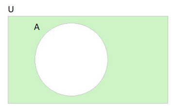

# **1. CONJUNTOS**

## **1.1 Teoria dos Conjuntos**

- Axioma da Extensão: Dois conjuntos são iguais se e somente se eles possuem os mesmo elementos
- Formas de representação:
    - Por **extensão**: enumeramos os elementos do conjunto, escrevendo-os entre chaves e separando-os por vírgula: **A = {a, e, i, o, u}**
    - Por **compreensão**: o conjunto será representado por meio de uma propriedade que caracteriza os seus elementos:
        - **A = {x | x foi jogador da seleção brasileira na Copa de 2014}** Leia-se: A é o conjunto dos elementos x tal que x é um jogador da seleção brasileira da Copa de 2014.
    - Por **diagramação**: utilizamos uma curva fechada e não-entrelaçada para representar o conjunto:

- Relação de pertinência: _**b ∈ A**_. Lemos: _b_ pertence a _A_;
- Relação de inclusão: _**{a, e} ⊂ A**_. Lemos: {_a_,_e_} está contido em _A_;
- **_A_ ⊅ {_a, e, f_}**. _A_ não contém {_a, e, f_}

## **1.2 União, Interseção, Diferença e Complementar**

- União: _**A**_ **∪** **_B_**_._ Será um conjunto contendo **todos** os elementos dos dois conjuntos.

- Interseção: _**C ∩ D**._ Será um conjunto contendo os elementos **comuns** aos dois conjuntos.

- Diferença: **_A - B_**_._ Será um conjunto com todos os elementos de A que **não são elementos de B**.

- Complementar: à_._ Tudo o que **está no conjunto universo mas não está em A**.

## **1.3 Número de Elementos**

- Número de elementos da união de **2 conjuntos**: n(A ∪ B) = n(A) + n(B) − n(A ∩ B)
- Número de elementos da união de **3 conjuntos**: n(A ∪ B ∪ C) = n(A) + n(B) + n(C) − n(A ∩ B) − n(A ∩ C) − n(B ∩ C) + n(A ∩ B ∩ C)

## **1.4 Conjuntos X Lógica**

| **Linguagem dos Conjuntos** | **Linguagem da Lógica Proposicional**               |
| --------------------------- | --------------------------------------------------- |
| **A ∪ B** (união)           | **A ou B** (disjunção inclusiva - conectivo "ou")   |
| **A ∩ B** (interseção)      | **A e B** (conjunção - conectivo "e")               |
| Ã (complementar)            | **Não A** (modificador - negação de uma proposição) |

- ⚠️Em boa parte das questões envolvendo conjuntos, você pode resolver através de diagramas (que é a forma mais fácil) ou usando as fórmulas a seguir:
    - Se o problema envolver dois conjuntos:
        - _**n(A∪B)=n(A)+n(B)−n(A∩B)**_
    - Se o problema envolver três:
        - **_n(A∪B∪C) = n(A) + n(B) + n(C) - n(A∩B) - n(A∩C) - n(B∩C) + n(A∩B∩C)_**

Neste vídeo, você pode ver como resolver as questões através dos diagramas de Venn:

_[https://www.youtube.com/watch?v=DHKa-tekYzY](https://www.youtube.com/watch?v=DHKa-tekYzY)_