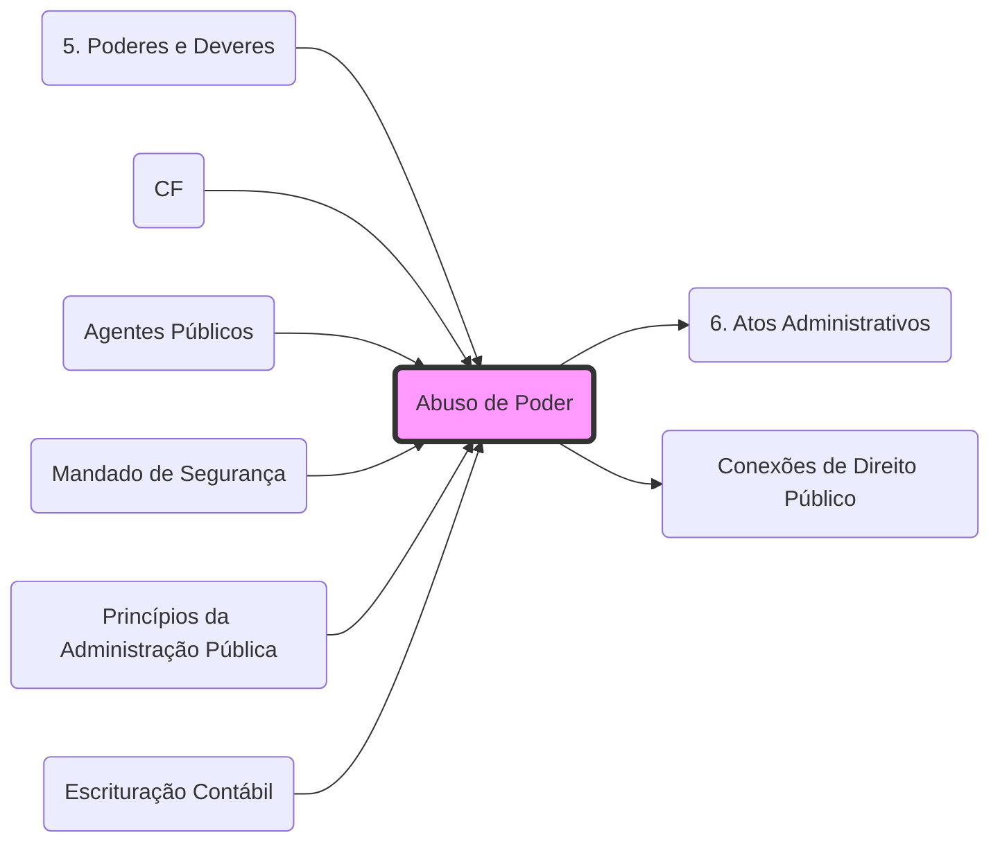

# **Abuso de Poder**
- **Conceito**: Gênero que ocorre quando o agente público atua fora dos limites de sua competência ou finalidade.
- **Espécies**: Ver **[[5. Poderes e Deveres#7. Abuso de Poder:|Poderes Administrativos]]**.
	1. **Excesso de Poder**: Vício de **Competência**. (O agente vai além do que a lei permitiu).
	2. **Desvio de Poder**: Vício de **Finalidade**. (O agente age dentro da competência, mas para fins pessoais ou diversos do interesse público).
- **Consequência**: Torna o **[[6. Atos Administrativos|Ato Administrativo]]** nulo e passível de controle via **[[4. DDIC 2#1.2 Direito à informação|Mandado de Segurança]]**.
- **Contexto**: Para a relação entre abuso e fiscalização, veja **[[Conexões de Direito Público]]**.

## Grafo Local
