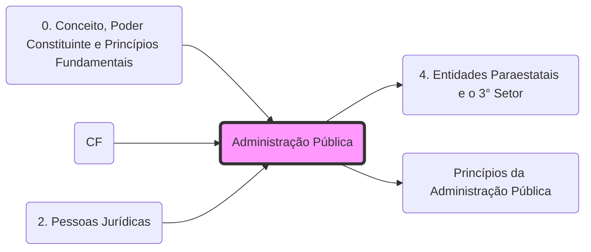

# **Administração Pública**
- **Direta**: Órgãos dos entes federados (U, E, DF, M).
- **Indireta**: Autarquias, Fundações, Empresas Públicas e Sociedades de Economia Mista.
- **[3° Setor](4. Entidades Paraestatais e o 3° Setor.md)**: Entidades paraestatais (OS, OSCIP, Sistema S.md).
- **Princípios**: Regida pelo **[LIMPE](Princípios da Administração Pública.md)**.

## Grafo Local
