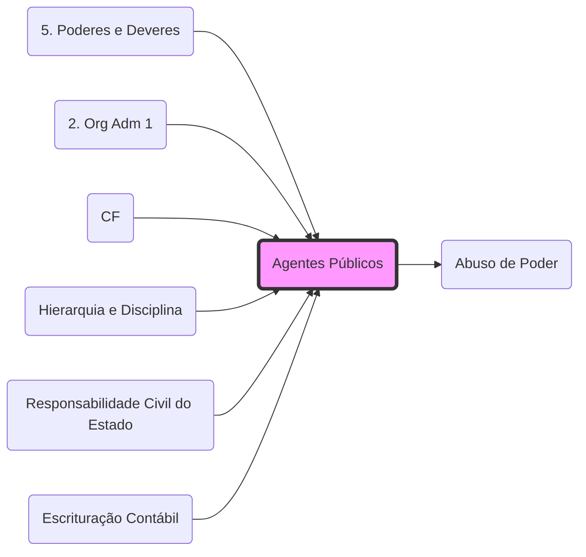

# **Agentes Públicos**
- **Gênero**: Toda pessoa que presta serviço ao Estado (estatutários, celetistas, temporários e políticos).
- **Regras Constitucionais (Art. 37-41)**:
	- **Concurso Público**: Regra para cargos e empregos.
	- **Acumulação**: Vedada, salvo as exceções constitucionais (2 de professor, 1 prof + técnico, 2 de saúde).
	- **Teto Salarial**: Subsídio dos Ministros do STF.
- **Responsabilidade**: Respondem civil, penal e administrativamente (**[[Abuso de Poder]]**).

## Grafo Local
