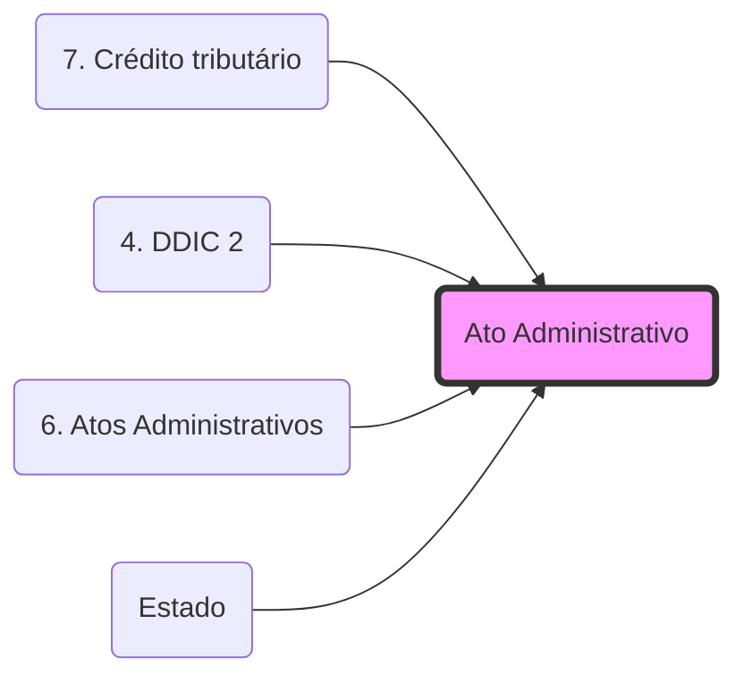

# **Ato Administrativo**

- **Conceito**: Manifestação unilateral de vontade do Estado que produz efeitos jurídicos imediatos, sob regime de direito público.
---
- **Elementos (Requisitos)**:
- Competência,
- Finalidade,
- Forma,
- Motivo e 
- Objeto.
---
- **Atributos**: 
- Presunção de Legitimidade, 
- Imperatividade, 
- Autoexecutoriedade e 
- Tipicidade.
---
- **Controle**: Pode ser anulado pela própria Administração (Autotutela) ou pelo Judiciário (Inafastabilidade de Jurisdição).

## 🕸️ Grafo Local
