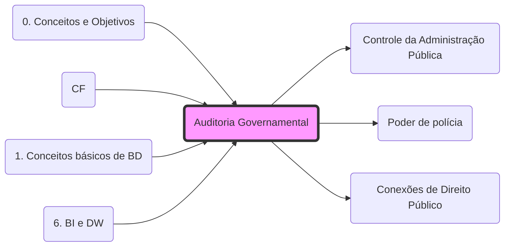

# **Auditoria Governamental**
- **Finalidade**: Avaliar a gestão pública (**[Eficiência e Economicidade](5. Poderes e Deveres#1. Definições:.md)**.md).
- **Controle**: É a ferramenta operacional do **[Controle Interno e Externo](Controle da Administração Pública.md)**.
- **Poder de Polícia**: O Auditor Fiscal, ao realizar a auditoria direta no contribuinte, exerce o **[Poder de Polícia](fisco/Conceitos/Poder de polícia.md)** administrativo.
- **Integração**: Para a relação entre Auditoria e Lançamento, veja: **[Conexões de Direito Público](Conexões de Direito Público.md)**.

## Grafo Local
