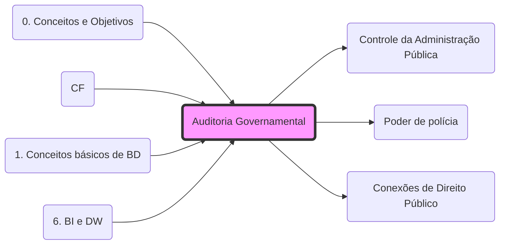

# **Auditoria Governamental**
- **Finalidade**: Avaliar a gestão pública (**[[5. Poderes e Deveres#1. Definições:|Eficiência e Economicidade]]**).
- **Controle**: É a ferramenta operacional do **[[Controle da Administração Pública|Controle Interno e Externo]]**.
- **Poder de Polícia**: O Auditor Fiscal, ao realizar a auditoria direta no contribuinte, exerce o **[[fisco/Conceitos/Poder de polícia|Poder de Polícia]]** administrativo.
- **Integração**: Para a relação entre Auditoria e Lançamento, veja: **[[Conexões de Direito Público]]**.

## 🕸️ Grafo Local
