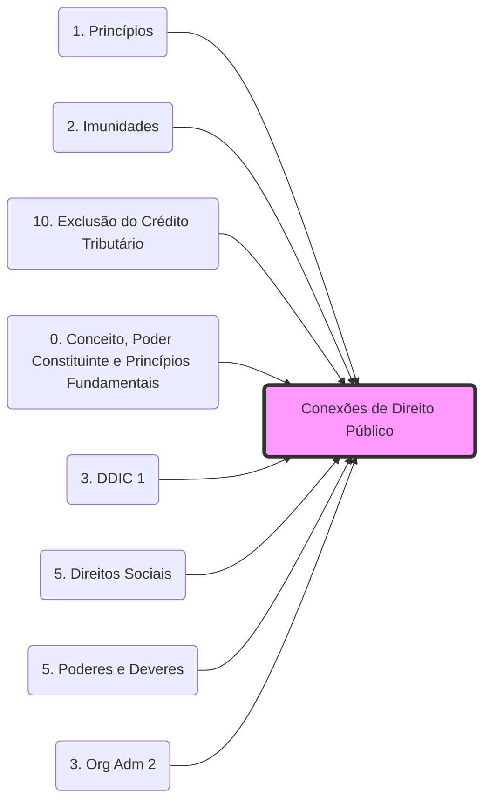

# **Conexões de Direito Público (CONST, ADM, TRIB)**

Esta nota serve como ponte conceitual entre os ramos do Direito Público, integrando temas recorrentes em provas fiscais (FGV, CEBRASPE, FCC).

## **1. Poder de Polícia e Tributação**
O exercício do **[[5. Poderes e Deveres#**6. Poder de polícia:|Poder de Polícia]]** (Direito Administrativo.md) é o fato gerador para a instituição de **Taxas** (Direito Tributário.md).
- **Referência:** Art. 78 do CTN e Art. 145, II, da CF/88.
- **Conexão:** A taxa de polícia exige o exercício efetivo ou potencial do poder fiscalizatório.

## **2. Princípio da Legalidade**
A **[[Princípios da Administração Pública#Expressos (Art. 37, CF|Legalidade Administrativa]].md)** (Art. 37, CF.md) reflete-se no **[[1. Princípios#1.1 Princípio da legalidade|Princípio da Legalidade Tributária]]** (Art. 150, I, CF.md).
- **Tributário:** Exige lei em sentido estrito para criar ou aumentar tributos.
- **Administrativo:** O administrador só pode fazer o que a lei autoriza.
- **Exceções:** Atenção às exceções de legalidade em Tributário (II, IE, IPI, IOF.md) que permitem alteração de alíquotas por ato do Executivo (decretos.md), o que se conecta ao **[[5. Poderes e Deveres#5. Poder regulamentar ou normativo:|Poder Regulamentar]]**.

## **3. Organização do Estado e Competências**
A **[[0. Conceito, Poder Constituinte e Princípios Fundamentais#3. Princípios Fundamentais|Organização do Estado]]** define as competências dos entes federados (União, Estados, DF e Municípios.md).
- **Pacto Federativo:** Protegido pela **[[2. Imunidades#1. Imunidades Tributárias|Imunidade Recíproca]]**, que veda a tributação de impostos sobre patrimônio, renda ou serviços entre os entes.
- **Autonomia FAP:** A autonomia Financeira, Administrativa e Política dos entes (Art. 18, CF) é sustentada pela sua competência tributária própria.

## **4. Controle de Constitucionalidade e Matéria Tributária**
As normas tributárias estão sujeitas ao **Controle de Constitucionalidade**.
- **Exemplo:** O STF utiliza o controle para definir o alcance de princípios como a **Anterioridade** e o **Não-Confisco**.
- **Conexão:** Normas que violam as **Limitações ao Poder de Tributar** são materialmente inconstitucionais.

## **5. Direitos Fundamentais e o Contribuinte**
O Art. 150 da CF/88 traz as "Garantias Fundamentais do Contribuinte", que são desdobramentos dos **[[0. Conceito, Poder Constituinte e Princípios Fundamentais#3. Elementos das Constituições (segundo José Afonso da Silva|Direitos Fundamentais]].md)** (Elementos Limitativos.md).
- **Irretroatividade:** Proteção da segurança jurídica e do ato jurídico perfeito.
- **Capacidade Contributiva:** Desdobramento do Princípio da Igualdade (Isonomia).

## Grafo Local
