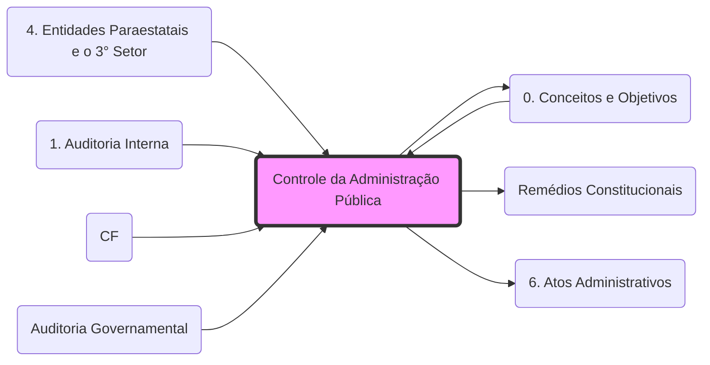

# **Controle da Administração Pública**
- **Controle Interno**: Exercido pelo próprio Poder (Ex: Auditoria Interna da SEFAZ.md). Ver **[Auditoria Governamental](fisco/AUD/0. Conceitos e Objetivos.md)**.
- **Controle Externo**: Exercido pelo Legislativo com auxílio do **[Tribunal de Contas (TCU/TCE.md)](fisco/D CONST/0. Conceito, Poder Constituinte e Princípios Fundamentais#3. Princípios Fundamentais.md)**.
- **Controle Judicial**: Focado na legalidade. Utiliza os **[Remédios Constitucionais](Remédios Constitucionais.md)** (Ex: **[Mandado de Segurança](fisco/D CONST/4. DDIC 2#1.2 Direito à informação.md)**.md).
- **Autotutela**: **[Súmula 473 STF](6. Atos Administrativos.md)** - Administração anula atos ilegais e revoga atos inoportunos.

## Grafo Local
