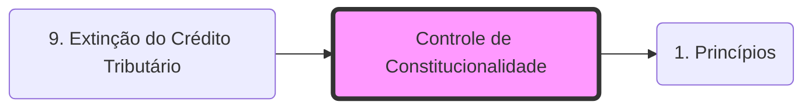

# **Controle de Constitucionalidade**

O Controle de Constitucionalidade é o mecanismo que garante a supremacia da Constituição, invalidando normas infraconstitucionais que a contrariem.

## **1. Pressupostos**
- **Constituição Rígida**: Exige processo legislativo especial para alteração (como a CF/88).
- **Supremacia Constitucional**: A Constituição é o fundamento de validade de todo o ordenamento jurídico (**Pirâmide de Kelsen**).

## **2. Momentos de Controle**
- **Preventivo**: Realizado **antes** da norma entrar em vigor.
    - **Político**: CCJ (Legislativo) e Veto Jurídico (Executivo).
    - **Judicial**: Excepcional (Mandado de Segurança por parlamentar devido a vício no processo legislativo).
- **Repressivo**: Realizado **após** a entrada em vigor da norma.
    - **Judiciário** (Regra).
    - **Político** (Excepcional, ex: sustação de atos do Executivo pelo Congresso).

## **3. Modelos de Controle Repressivo Judicial**

### **3.1 Controle Difuso (Aberto)**
- **Competência**: Qualquer juiz ou tribunal.
- **Forma**: Via de exceção (incidente), analisado em um caso concreto.
- **Efeitos**: Regra geral, *inter partes* e *ex tunc* (retroativo).
- **Cláusula de Reserva de Plenário (Art. 97, CF)**: A inconstitucionalidade só pode ser declarada pelo voto da maioria absoluta dos membros do tribunal ou do seu órgão especial.

### **3.2 Controle Concentrado (Abstrato)**
- **Competência**: STF (para leis federais/estaduais em face da CF/88) ou TJ (para leis estaduais/municipais em face da CE).
- **Forma**: Via de ação direta (principal), analisado em tese.
- **Efeitos**: *Erga omnes* (para todos), vinculante e, em regra, *ex tunc*.

## **4. Principais Ações do Controle Concentrado**
1. **ADI (Ação Direta de Inconstitucionalidade)**: Contra leis federais ou estaduais que violam a CF/88.
2. **ADC (Ação Declaratória de Constitucionalidade)**: Para confirmar a validade de lei federal que possui controvérsia judicial relevante.
3. **ADO (Ação Direta de Inconstitucionalidade por Omissão)**: Quando a falta de regulamentação torna inviável o exercício de um direito constitucional.
4. **ADPF (Arguição de Descumprimento de Preceito Fundamental)**: Caráter subsidiário, utilizada quando não couber ADI ou ADC (ex: leis municipais ou leis pré-constitucionais).

---
**Foco Fiscal:** O controle de constitucionalidade é frequentemente utilizado para contestar a criação ou majoração de tributos que violam os **[[1. Princípios|Princípios Constitucionais Tributários]]**.

## Grafo Local
