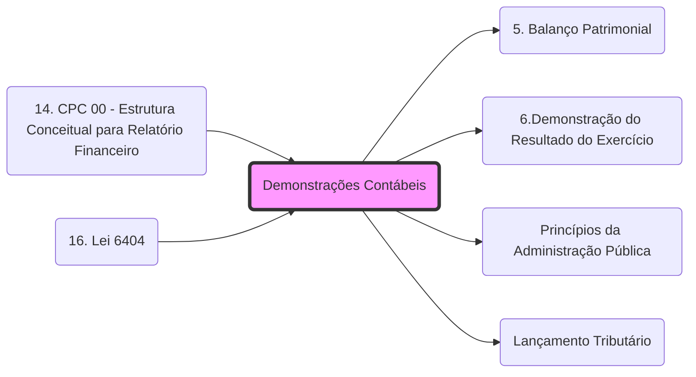

# **Demonstrações Contábeis**
- **Conjunto**: **[[5. Balanço Patrimonial|BP]]**, **[[6.Demonstração do Resultado do Exercício|DRE]]**, **[[9. Demonstração das Mutações do Patrimônio Líquido|DMPL]]**, etc.
- **Objetivo**: Transparência e prestação de contas (Reflexo do **[[Princípios da Administração Pública|Princípio da Publicidade]]**).
- **Uso Fiscal**: São os documentos principais analisados no **[[Lançamento Tributário]]** por homologação.

## 🕸️ Grafo Local
