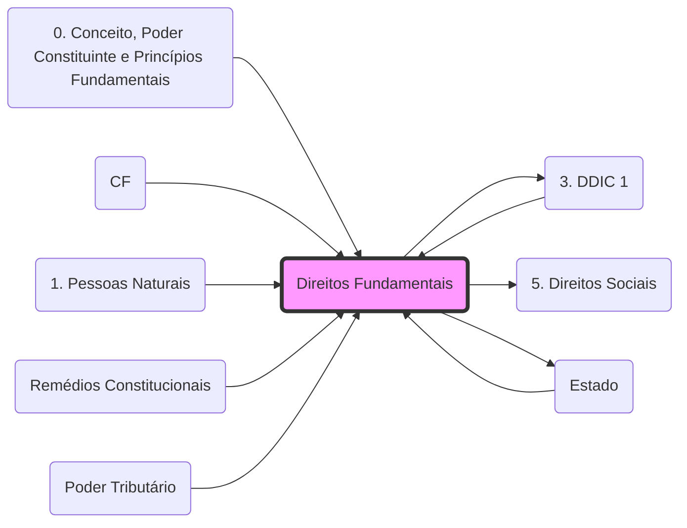

# **Direitos Fundamentais**
- **Titulares**: Pessoas físicas (brasileiros/estrangeiros) e pessoas jurídicas.
- **Gerações**:
	- **1ª Geração**: Liberdades negativas (Direitos Civis e Políticos). Ex: **[[3. DDIC 1|Art. 5º]]**.
	- **2ª Geração**: Liberdades positivas (Direitos Sociais, Econômicos e Culturais). Ex: **[[5. Direitos Sociais|Art. 6º]]**.
- **Eficácia**: Aplicam-se na vertical (**[[Estado]]** x Particular) e na horizontal (Particular x Particular).

## 🕸️ Grafo Local
