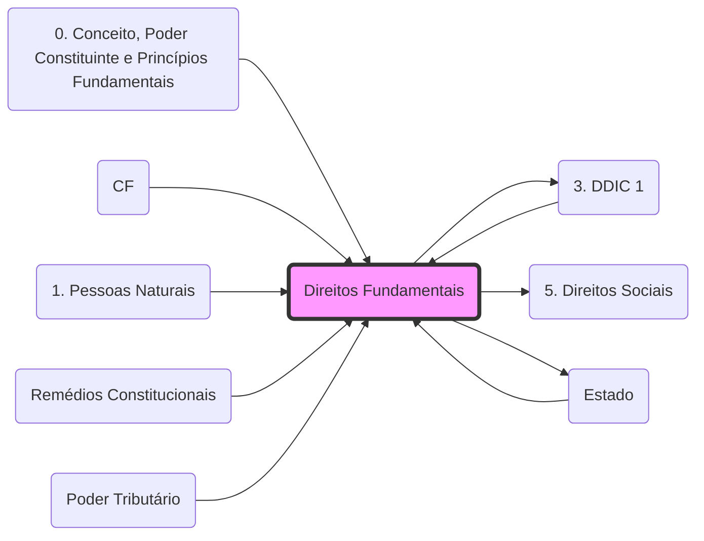

# **Direitos Fundamentais**
- **Titulares**: Pessoas físicas (brasileiros/estrangeiros) e pessoas jurídicas.
- **Gerações**:
	- **1ª Geração**: Liberdades negativas (Direitos Civis e Políticos.md). Ex: **[Art. 5º](3. DDIC 1.md)**.
	- **2ª Geração**: Liberdades positivas (Direitos Sociais, Econômicos e Culturais.md). Ex: **[Art. 6º](5. Direitos Sociais.md)**.
- **Eficácia**: Aplicam-se na vertical (**[Estado](Estado.md)** x Particular.md) e na horizontal (Particular x Particular.md).

## Grafo Local
