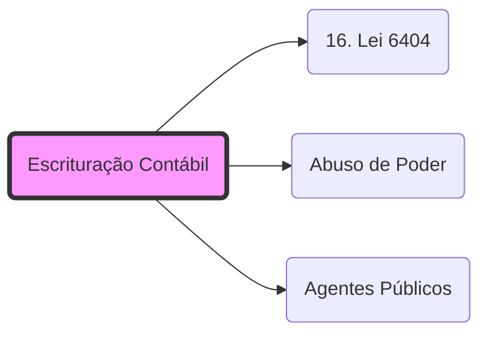

# **Escrituração Contábil**
- **Conceito**: Registro sistemático dos fatos patrimoniais.
- **Base Legal**: Art. 177 da **[[16. Lei 6404|Lei 6.404/76]]**.
- **Foco Fiscal**: Serve de base para a apuração do Lucro Real (IRPJ/CSLL) e para a verificação de omissão de receitas.
- **Vínculo**: A falsificação da escrituração configura crime contra a ordem tributária e **[[Abuso de Poder]]** se praticada por **[[Agentes Públicos]]** para ocultar ilícitos.

## 🕸️ Grafo Local
