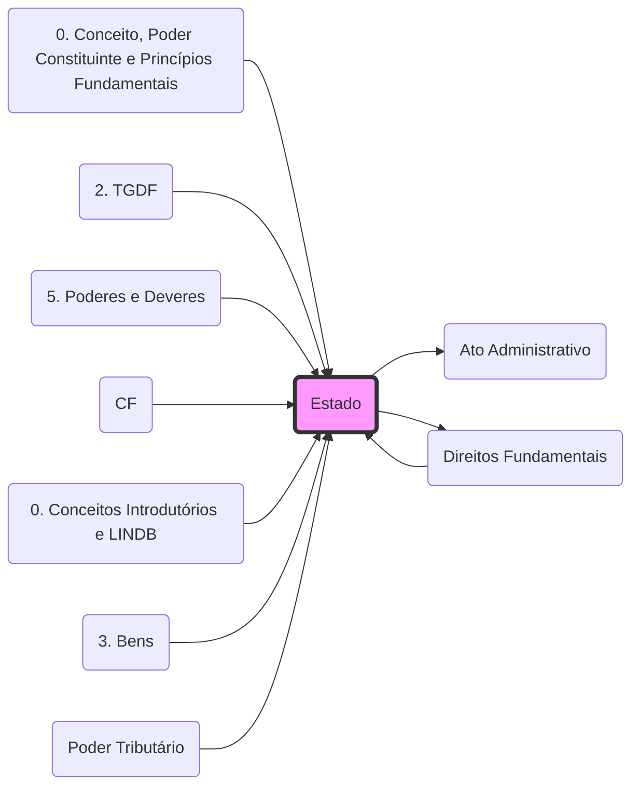

# **Estado**
- **Conceito**: Ente soberano composto por Povo, Território e Governo Soberano.
- **Forma de Estado**: [[0. Conceito, Poder Constituinte e Princípios Fundamentais#Panorama Brasileiro Atual:|Federação]] (entes possuem autonomia FAP).
- **Atuação**: Manifesta sua vontade por meio de **[[Ato Administrativo]]** e é limitado pelos **[[Direitos Fundamentais]]**.

## Grafo Local
