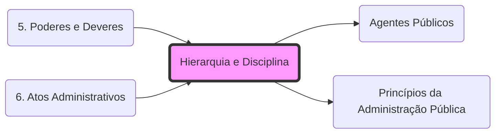

# **Hierarquia e Disciplina**
- **Poder Hierárquico**: Prerrogativa de ordenar, coordenar, rever e delegar/avocar atos.
- **Poder Disciplinar**: Faculdade de punir internamente infrações dos **[[Agentes Públicos]]** ou particulares com vínculo específico.
- **Limitação**: O Judiciário não pode rever o mérito (conveniência), apenas a legalidade e a **[[Princípios da Administração Pública|Proporcionalidade]]** da pena.

## 🕸️ Grafo Local
