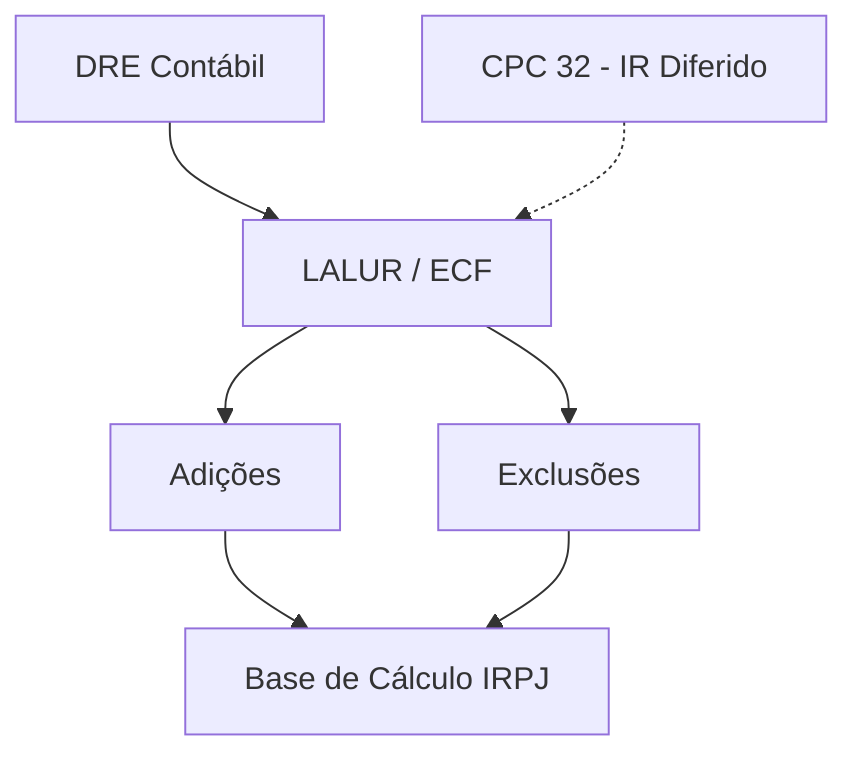

# **LALUR e Lucro Real: A Ponte Fiscal-Contábil**

Esta é a nota-chave para entender a integração entre **[[04 - Contabilidade Geral (MOC)|Contabilidade]].md** e **[[07 - Legislação Tributária (MOC)|Legislação Tributária]].md**. FGV e Cebraspe adoram cobrar o ajuste, não apenas o cálculo.

---

## 1. O Conceito de LALUR/LACS
O **LALUR** (Livro de Apuração do Lucro Real.md) e o **LACS** (Livro de Apuração da CSLL.md) são instrumentos de escrituração fiscal (hoje digitais via **[[SPED - Sistema Público de Escrituração Digital|ECF - Escrituração Contábil Fiscal]]**.md) onde se ajusta o resultado contábil para chegar à base de cálculo dos tributos.

$$ 	ext{Lucro Real} = 	ext{Lucro Líquido} + 	ext{Adições} - 	ext{Exclusões} $$

## 2. Tipos de Ajustes (Onde a banca te pega)

### A. Adições (Aumentam o Imposto)
Despesas registradas na contabilidade que o Fisco **não aceita** como dedutíveis, ou receitas não registradas que o Fisco exige tributar.
- **Brindes e Doações:** Dedutíveis na contabilidade, **indedutíveis** no fiscal → Adição.
- **Multas não compensatórias:** Indedutíveis → Adição.
- **CSLL:** A despesa de CSLL é indedutível para o IRPJ → Adição.
- **Provisões (Regra Geral):** Contabilidade exige (Prudência), Fisco veda (salvo 13º, Férias e Téc. de Perdas Estimadas específicas) → Adição.

### B. Exclusões (Diminuem o Imposto)
Receitas registradas que o Fisco diz "não precisa tributar agora" ou incentivos.
- **Lucros/Dividendos Recebidos:** Receita na contabilidade, mas não tributável (para evitar bitributação) → Exclusão.
- **Prejuízo Fiscal Anterior:** Pode abater até 30% do Lucro Real ajustado antes da compensação.

## 3. Diferenças Temporárias vs. Permanentes

| Tipo | Descrição | Exemplo | Efeito no CPC 32 (IR Diferido) |
| :--- | :--- | :--- | :--- |
| **Permanente** | O Fisco nunca vai aceitar a despesa ou nunca vai tributar a receita. | Multas fiscais, Brindes, Dividendos. | Afeta a Alíquota Efetiva, mas **não gera** Ativo/Passivo Fiscal Diferido. |
| **Temporária** | O Fisco não aceita *agora*, mas aceitará *no futuro* (ou vice-versa). | Provisão p/ Contingências, Depreciação Acelerada Incentivada. | **Gera** Ativo ou Passivo Fiscal Diferido. |

> [!tip] Dica de Prova
> Se a questão falar em "Depreciação Fiscal maior que a Societária", temos uma exclusão agora (paga menos imposto hoje) e uma adição no futuro (reversão). Isso gera um **Passivo Fiscal Diferido**.

---

## 4. Integração com Auditoria
A auditoria fiscal cruza o LALUR com a **DRE**.
- **Teste de Adição:** Verificar se todas as despesas indedutíveis (ex: alimentação de sócios) foram adicionadas.
- **Teste de Exclusão:** Verificar se a compensação de prejuízos respeitou a trava de 30%.

## Grafo Local

Ver também: [[Demonstrações Contábeis|Demonstrações Contábeis]], [[Regime de Competência|Regime de Competência]], [[05 - Contabilidade Avançada (MOC)|05 - Contabilidade Avançada (MOC.md)]].md
