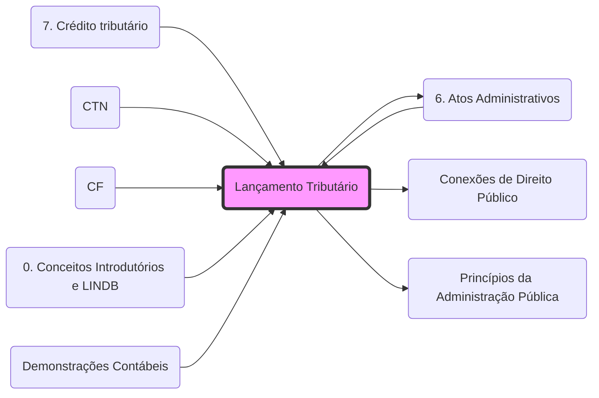

# **Lançamento Tributário**
- **Natureza Jurídica**: **[[6. Atos Administrativos|Ato administrativo]]** vinculado e obrigatório ([[07 - Legislação Tributária/CTN#^ctn142|Art. 142 CTN]]).
- **Vínculo**: É a formalização da obrigação tributária em crédito. Para a integração entre Lançamento e competências administrativas, veja: **[[Conexões de Direito Público]]**.
- **Controle**: Por ser um **[[6. Atos Administrativos|Ato Administrativo]]**, submete-se à **[[Princípios da Administração Pública|Legalidade]]** estrita e ao controle judicial (**[[4. DDIC 2#1.4 Inafastabilidade de jurisdição|Inafastabilidade de Jurisdição]]**).
- **Tipos**: **[[7. Crédito tributário#LANÇAMENTO DE OFÍCIO - ex officio|De Ofício]]**, **[[7. Crédito tributário#LANÇAMENTO POR DECLARAÇÃO - misto|Por Declaração]]** e **[[7. Crédito tributário#LANÇAMENTO POR HOMOLOGAÇÃO|Por Homologação]]**.

## 🕸️ Grafo Local
