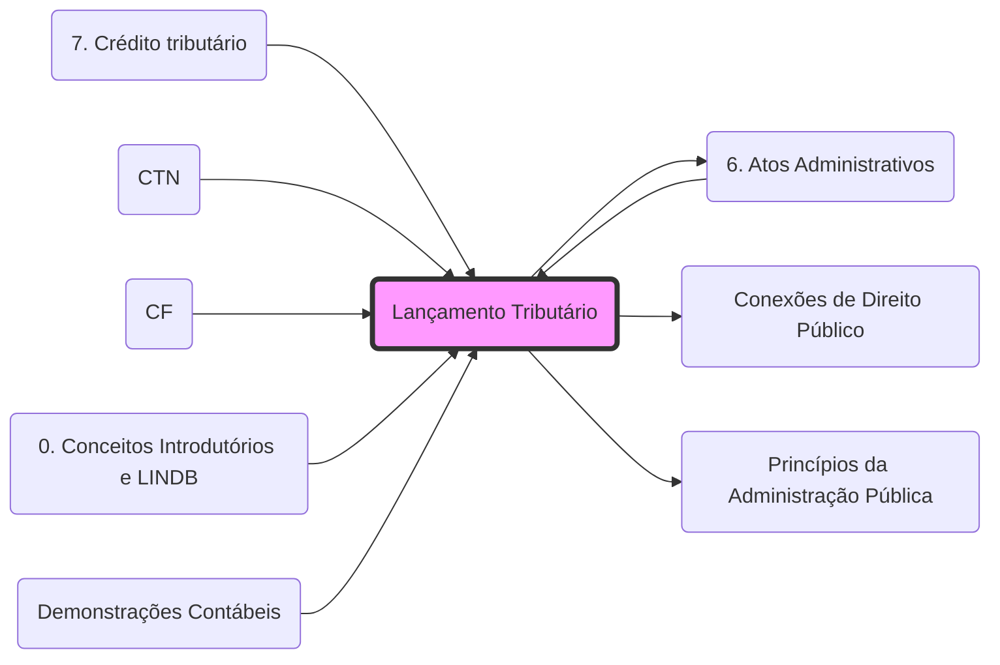

# **Lançamento Tributário**
- **Natureza Jurídica**: **[Ato administrativo](6. Atos Administrativos.md)** vinculado e obrigatório ([Art. 142 CTN](07 - Legislação Tributária/CTN#^ctn142.md).md).
- **Vínculo**: É a formalização da obrigação tributária em crédito. Para a integração entre Lançamento e competências administrativas, veja: **[Conexões de Direito Público](Conexões de Direito Público.md)**.
- **Controle**: Por ser um **[Ato Administrativo](6. Atos Administrativos.md)**, submete-se à **[Legalidade](Princípios da Administração Pública.md)** estrita e ao controle judicial (**[Inafastabilidade de Jurisdição](4. DDIC 2#1.4 Inafastabilidade de jurisdição.md)**.md).
- **Tipos**: **[De Ofício](7. Crédito tributário#LANÇAMENTO DE OFÍCIO - ex officio.md)**, **[Por Declaração](7. Crédito tributário#LANÇAMENTO POR DECLARAÇÃO - misto.md)** e **[Por Homologação](7. Crédito tributário#LANÇAMENTO POR HOMOLOGAÇÃO.md)**.

## Grafo Local
