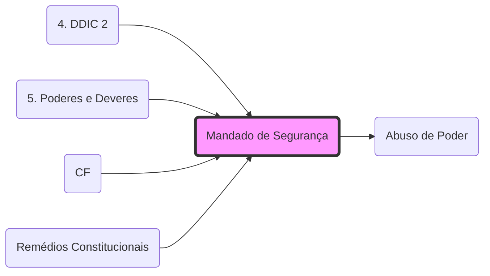

# **Mandado de Segurança**
- **Previsão**: Art. 5º, LXIX e LXX, CF.
- **Finalidade**: Proteger **direito líquido e certo**, não amparado por *habeas corpus* ou *habeas data*.
- **Pressuposto**: Ilegalidade ou **[[Abuso de Poder]]** praticado por autoridade pública ou agente de pessoa jurídica no exercício de atribuições do Poder Público.
- **Prazo decadencial**: 120 dias.

## 🕸️ Grafo Local
