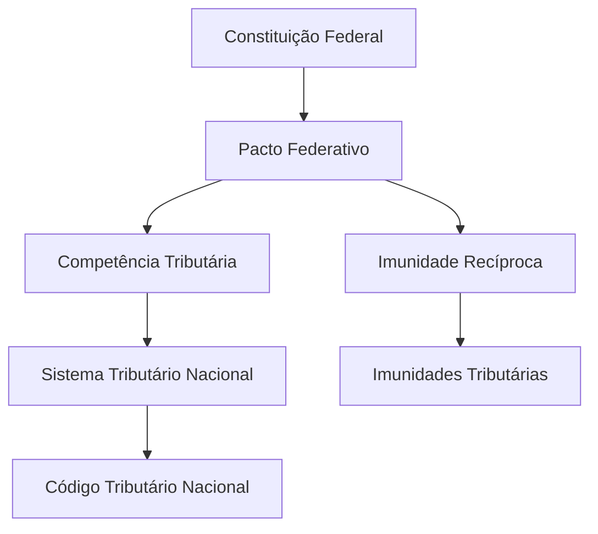

# **Pacto Federativo e Tributação**

Esta nota explora a intersecção entre a **[[0. Conceito, Poder Constituinte e Princípios Fundamentais#3. Princípios Fundamentais|Organização do Estado]]** (Direito Constitucional) e a **[[Poder Tributário|Competência Tributária]]** (Direito Tributário).

---

## **1. Autonomia Financeira e Competência Tributária**
A autonomia dos entes federativos (União, Estados, DF e Municípios), estabelecida pelo **Art. 18 da CF/88**, depende diretamente da sua capacidade de instituir e arrecadar tributos próprios.
- **Competência Privativa:** A CF atribui a cada ente impostos específicos (ex: ISS para Municípios, ICMS para Estados).
- **Competência Concorrente:** Matéria de legislação sobre direito tributário e financeiro (**Art. 24, I, CF**).

## **2. Limitações ao Poder de Tributar como Garantia do Pacto**
As limitações constitucionais ao poder de tributar protegem a harmonia entre os entes:
- **[[2. Imunidades#1. Imunidades Tributárias|Imunidade Recíproca]] (Art. 150, VI, 'a', CF):** Veda que um ente tribute o patrimônio, renda ou serviços de outro, preservando a autonomia política.
- **Uniformidade Geográfica (Art. 151, I, CF):** Veda à União instituir tributo que não seja uniforme em todo o território nacional, evitando privilégios regionais.

## **3. Repartição de Receitas Tributárias**
O Federalismo Fiscal brasileiro é caracterizado pela descentralização da arrecadação e centralização da distribuição:
- **FPE e FPM:** Fundos de Participação dos Estados e Municípios, fundamentais para o equilíbrio regional.
- **Conexão:** Art. 157 a 162 da CF/88.

## **4. Conflitos de Competência**
Resolvidos obrigatoriamente por **Lei Complementar** (**Art. 146, I, CF**), que no Brasil é papel do **[[CTN]]**.

---

## **Grafo de Conexão**

Ver também: [[Conexões de Direito Público]], [[Poder Tributário]], [[Estado]]
