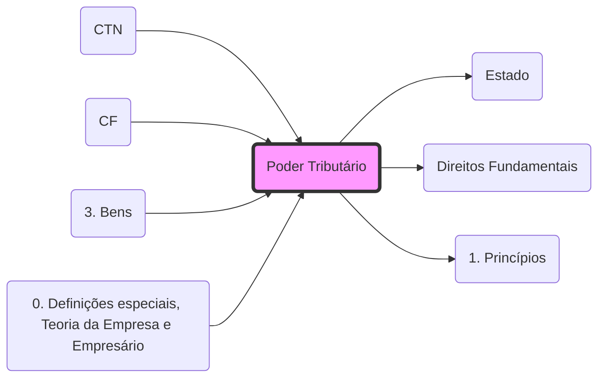

# **Poder Tributário**
- **Conceito**: Faculdade do **[[Estado]]** de instituir, fiscalizar e arrecadar tributos.
- **Limites**: O poder de tributar não é absoluto, encontrando limites nos **[[Direitos Fundamentais]]** e nos **[[1. Princípios|Princípios Constitucionais Tributários]]**.
- **Poder de Polícia Tributário**: Manifesta-se na fiscalização (obrigação acessória). O exercício efetivo do **[[Poder de Polícia]]** fundamenta a cobrança de Taxas.

## 🕸️ Grafo Local
