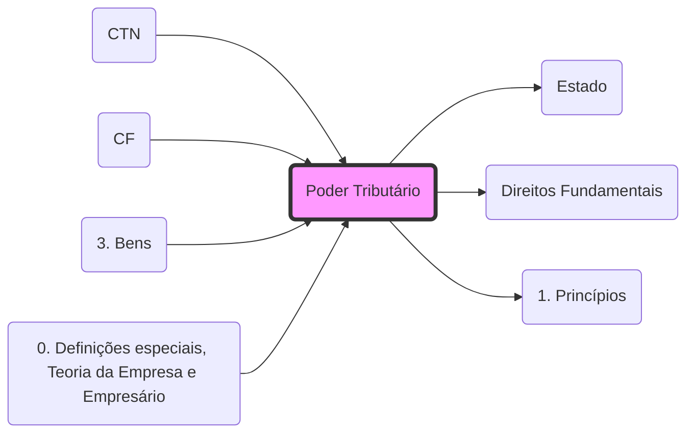

## **Poder Tributário**
- **Conceito**: Faculdade do **[[Estado]]** de instituir, fiscalizar e arrecadar tributos.
- **Limites**: O poder de tributar não é absoluto, encontrando limites nos **[[Direitos Fundamentais]]** e nos **[[1. Princípios|Princípios Constitucionais Tributários]]**.
- **Poder de Polícia Tributário**: Manifesta-se na fiscalização (obrigação acessória). O exercício efetivo do **[[Poder de Polícia]]** fundamenta a cobrança de Taxas.

---

## **Competência vs. Capacidade Tributária**
A distinção é essencial para provas fiscais:

| Característica | **Competência Tributária** | **Capacidade Tributária Ativa** |
| :--- | :--- | :--- |
| **Natureza** | Política e Legislativa | Administrativa e Executiva |
| **Poder** | Criar/Instituir o tributo | Arrecadar e Fiscalizar |
| **Delegabilidade** | **Indelegável** (Art. 7º CTN) | **Delegável** para outras PJ de Direito Público |
| **Fundamento** | Constituição Federal (Rígida) | Lei Ordinária ou Ato Administrativo |

> [!tip] Conexão com Administrativo
> A delegação da **Capacidade Tributária Ativa** é um exemplo de **Descentralização Administrativa**, onde a PJ política delega a execução a uma PJ administrativa (ex: autarquia).

## Grafo Local
