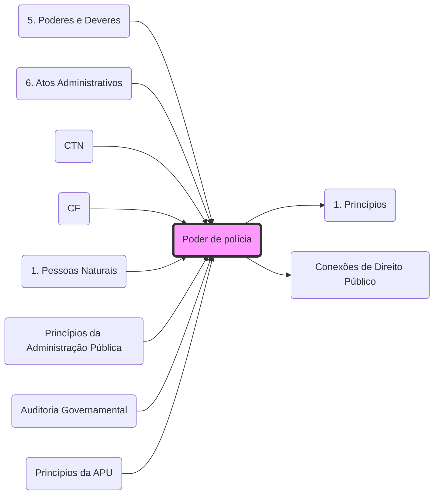

# **Poder de Polícia**
- **Conceito**: Condicionamento ou restrição do exercício de direitos e atividades em benefício do interesse público. Ver: **[Poderes Administrativos](5. Poderes e Deveres#6. Poder de polícia:.md)**.
- **Ciclo de Polícia**: 
	1. Ordem; 2. Consentimento; 3. Fiscalização; 4. Sanção.
- **Atributos**: **[CDA](5. Poderes e Deveres#6.1 Atributos do poder de polícia:.md)** (Discricionariedade, Autoexecutoriedade e Coercitividade.md).
- **Taxas**: O exercício do Poder de Polícia é fato gerador de **[Taxas](1. Princípios.md)** (Art. 145, II, CF.md). Veja integração em: **[Conexões de Direito Público](Conexões de Direito Público.md)**.
- **Vínculo**: Relaciona-se com a **[Eficácia Vertical](2. TGDF#▶️ Eficácia horizontal x Eficácia vertical.md)** dos direitos fundamentais.

## Grafo Local
