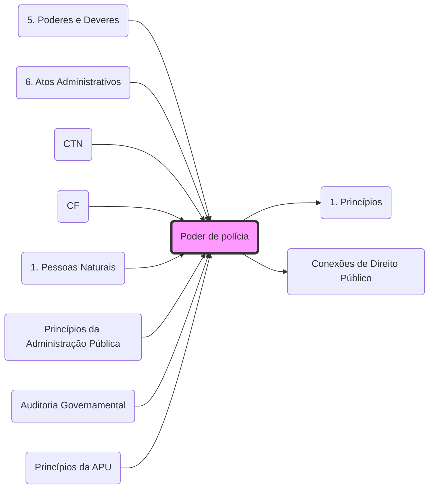

# **Poder de Polícia**
- **Conceito**: Condicionamento ou restrição do exercício de direitos e atividades em benefício do interesse público. Ver: **[[5. Poderes e Deveres#6. Poder de polícia:|Poderes Administrativos]]**.
- **Ciclo de Polícia**: 
	1. Ordem; 2. Consentimento; 3. Fiscalização; 4. Sanção.
- **Atributos**: **[[5. Poderes e Deveres#6.1 Atributos do poder de polícia:|CDA]]** (Discricionariedade, Autoexecutoriedade e Coercitividade).
- **Taxas**: O exercício do Poder de Polícia é fato gerador de **[[1. Princípios|Taxas]]** (Art. 145, II, CF). Veja integração em: **[[Conexões de Direito Público]]**.
- **Vínculo**: Relaciona-se com a **[[2. TGDF#▶️ Eficácia horizontal x Eficácia vertical|Eficácia Vertical]]** dos direitos fundamentais.

## 🕸️ Grafo Local
