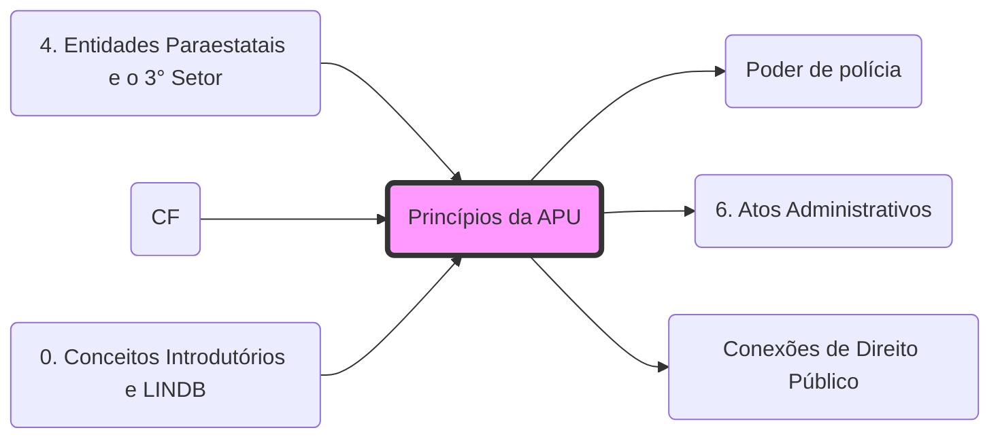

# **Princípios da Administração Pública**

## **1. Princípios Expressos (Art. 37, CF/88)**
Bizu: **LIMPE**

- **Legalidade**: A administração só pode fazer o que a lei permite (vinculação positiva). Para o particular, vale a autonomia da vontade (faz tudo que a lei não proíbe).
- **Impessoalidade**:
    - Finalidade pública (não favorecer/prejudicar ninguém);
    - Vedação à promoção pessoal (obras levam nome do órgão, não do prefeito).
- **Moralidade**: Ética, honestidade e boa-fé. Ação deve ser legal E moral.
- **Publicidade**: Transparência dos atos (regra). Sigilo é exceção (segurança da sociedade/Estado).
- **Eficiência**: (Incluído pela EC 19/98). Busca por resultados, presteza, perfeição e rendimento funcional.

## **2. Princípios Implícitos**
- **Supremacia do Interesse Público**: O Estado tem prerrogativas sobre o particular (ex: **[desapropriação](fisco/D CONST/3. DDIC 1#1.17 Direito de propriedade.md)**, **[Poder de polícia](Poder de polícia.md)**.md).
- **Indisponibilidade do Interesse Público**: O agente não é dono da coisa pública, apenas gestor.
- **Autotutela**: A administração pode anular seus atos ilegais e revogar os inoportunos (**[Súmula 473 STF](6. Atos Administrativos.md)**.md).

Para a integração com Direito Tributário, consulte: **[Conexões de Direito Público](Conexões de Direito Público.md)**.

## Grafo Local
