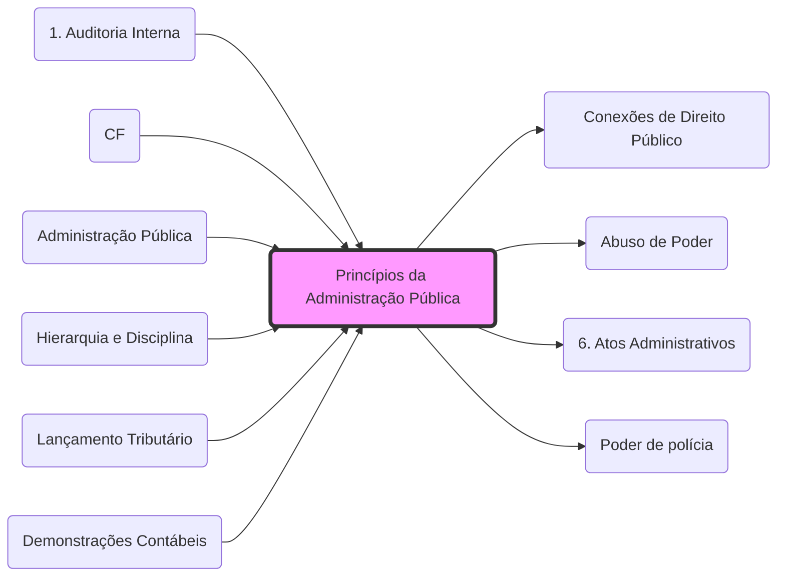

# **Princípios da Administração Pública**

Para a aplicação destes princípios no âmbito tributário (como a legalidade e impessoalidade), veja: **[[Conexões de Direito Público]]**.

## **Expressos (Art. 37, CF)**:
- **Legalidade**: (ver **[[1. Princípios#1.1 Princípio da legalidade|Legalidade Tributária]]**)
- **Impessoalidade**: (ver **[[1. Princípios#1.3 Princípio da Anterioridade e Anterioridade Nonagesimal:|Capacidade Contributiva]]**)
- **Moralidade**: (ver **[[Abuso de Poder|Desvio de Finalidade]]**)
- **Publicidade**: (ver **[[fisco/D CONST/4. DDIC 2#1.2 Direito à informação|Direito à Informação]]**)
- **Eficiência**: (ver **[[5. Poderes e Deveres#1. Definições:|Dever de Eficiência]]**)

## **Implícitos**:
- **Autotutela**: (ver **[[6. Atos Administrativos|Anulação e Revogação]]**)
- **Supremacia do Interesse Público**: (ver **[[Poder de polícia]]**)
- **Razoabilidade**: (ver **[[fisco/D CONST/1. Aplicação das Normas Constitucionais e Interpretação Constitucional#4. Princípios da Interpretação Constitucional|Interpretação Constitucional]]**)

## Grafo Local
