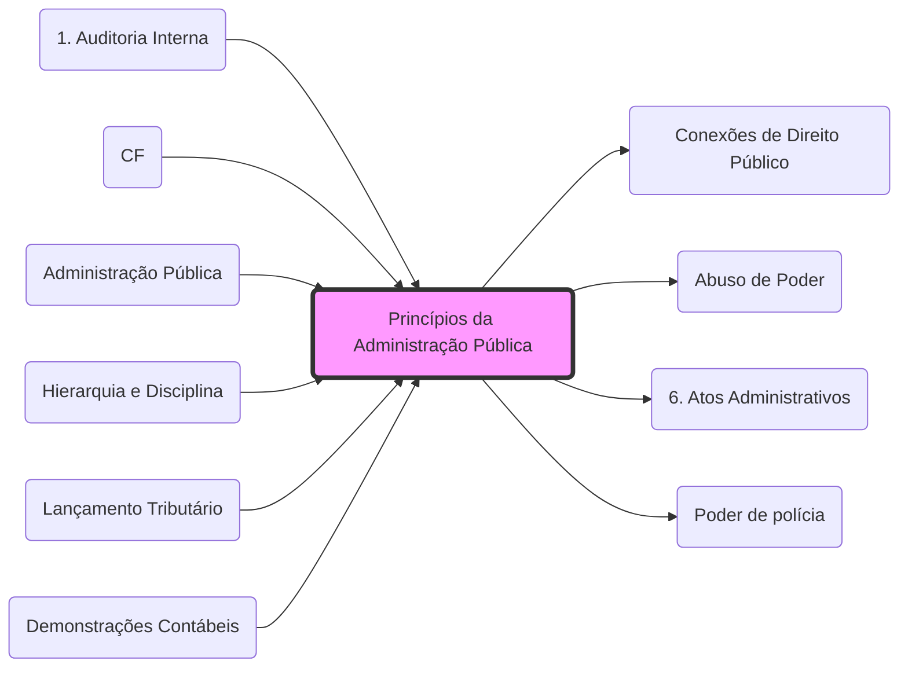

# **Princípios da Administração Pública**

Para a aplicação destes princípios no âmbito tributário (como a legalidade e impessoalidade.md), veja: **[Conexões de Direito Público](Conexões de Direito Público.md)**.

## **Expressos (Art. 37, CF)**:
- **Legalidade**: (ver **[Legalidade Tributária](1. Princípios#1.1 Princípio da legalidade.md)**.md)
- **Impessoalidade**: (ver **[Capacidade Contributiva](1. Princípios#1.3 Princípio da Anterioridade e Anterioridade Nonagesimal:.md)**.md)
- **Moralidade**: (ver **[Desvio de Finalidade](Abuso de Poder.md)**.md)
- **Publicidade**: (ver **[Direito à Informação](fisco/D CONST/4. DDIC 2#1.2 Direito à informação.md)**.md)
- **Eficiência**: (ver **[Dever de Eficiência](5. Poderes e Deveres#1. Definições:.md)**.md)

## **Implícitos**:
- **Autotutela**: (ver **[Anulação e Revogação](6. Atos Administrativos.md)**.md)
- **Supremacia do Interesse Público**: (ver **[Poder de polícia](Poder de polícia.md)**.md)
- **Razoabilidade**: (ver **[Interpretação Constitucional](fisco/D CONST/1. Aplicação das Normas Constitucionais e Interpretação Constitucional#4. Princípios da Interpretação Constitucional.md)**.md)

## Grafo Local
