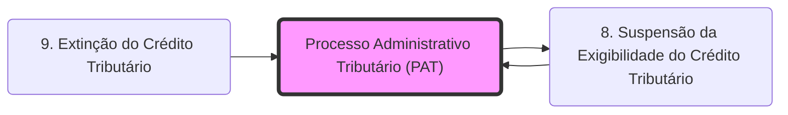

# **Processo Administrativo Tributário (PAT)**
- **Finalidade**: Garantir o contraditório e a ampla defesa ao contribuinte antes da inscrição em Dívida Ativa.
- **Efeito**: As reclamações e recursos no PAT são causas de **[[8. Suspensão da Exigibilidade do Crédito Tributário|Suspensão da Exigibilidade]]** (Art. 151, III, CTN).
- **Controle**: Manifestação da **Autotutela** da Administração, permitindo a revisão de atos ilegais.

## Grafo Local
