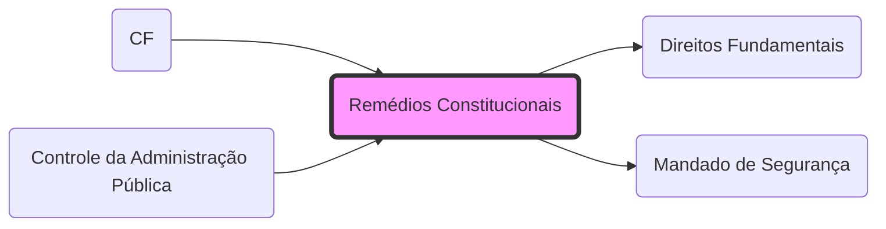

# **Remédios Constitucionais**
- **Conceito**: Instrumentos para proteger os **[Direitos Fundamentais](Direitos Fundamentais.md)**.
- **Espécies**:
	- **[Mandado de Segurança](Mandado de Segurança.md)**: Direito líquido e certo.
	- **[Habeas Data](Habeas Data.md)**: Informação pessoal.
	- **[Ação Popular](Ação Popular.md)**: Patrimônio público e moralidade.
	- **[Ação Civil Pública](Ação Civil Pública.md)**: Interesses difusos e coletivos.

## Grafo Local
