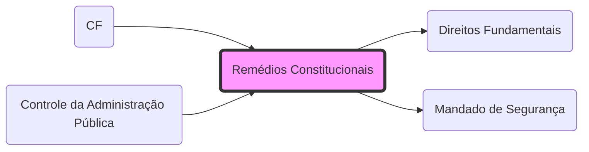

# **Remédios Constitucionais**
- **Conceito**: Instrumentos para proteger os **[[Direitos Fundamentais]]**.
- **Espécies**:
	- **[[Mandado de Segurança]]**: Direito líquido e certo.
	- **[[Habeas Data]]**: Informação pessoal.
	- **[[Ação Popular]]**: Patrimônio público e moralidade.
	- **[[Ação Civil Pública]]**: Interesses difusos e coletivos.

## 🕸️ Grafo Local
