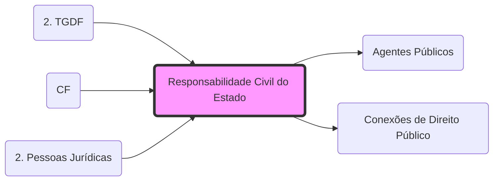

# **Responsabilidade Civil do Estado**
- **Regra**: Responsabilidade **Objetiva** (Teoria do Risco Administrativo) - Art. 37, §6º CF.
- **Elementos**: Conduta + Dano + Nexo Causal (Dispensa dolo ou culpa da administração).
- **Vínculo**: Fundamenta-se na **[Eficácia Vertical](2. TGDF#▶️ Eficácia horizontal x Eficácia vertical.md)** dos direitos fundamentais contra o Estado.
- **Ação de Regresso**: O Estado processa o **[Agente](Agentes Públicos.md)** em caso de dolo ou culpa.
- **Integração**: Veja a relação com danos fiscais em: **[Conexões de Direito Público](Conexões de Direito Público.md)**.

## Grafo Local
